## Objetivos de la clase

Al finalizar la clase deberíamos poder:

- reconocer las principales familias arquitectónicas
- entender qué sesgo inductivo incorpora cada una
- explicar cómo opera una CNN sobre imágenes;
- entender por qué U-Net fue decisiva en imagen médica
- introducir atención y Transformers
- relacionar arquitectura con problemas concretos de Física Médica


## El recorrido de hoy

```{mermaid}
%%| echo: false

flowchart LR
    A(MLP) -->
    B(CNN) -->
    C(Autoencoder) -->
    D(U-Net) -->
    E(Transformer) -->
    F(State Space Models) -->
    G(Mamba) 
```

No es una historia de reemplazos.

Es una historia de **nuevas formas de organizar el flujo de información**.


## ¿Qué es una arquitectura?

Una arquitectura define:

- qué operaciones se realizan;
- qué conexiones existen;
- cómo circula la información;
- qué información puede interactuar;
- qué estructura del problema incorporamos al modelo.

$$
\hat y=f_\theta(x)
$$

La pregunta no es solamente **qué aprende $\theta$**, sino:

:::{.question}
¿cómo construimos $f_\theta$?
:::

## Sesgo inductivo

Una arquitectura contiene supuestos sobre el problema.

:::: {.columns}
::: {.column width="48%"}
### Ejemplos

- CNN → localidad espacial
- U-Net → información multiescala
- Transformer → interacción flexible
- Mamba → memoria selectiva
:::

::: {.column width="48%"}
### En Física Médica

Nuestros datos no son vectores genéricos:

- imágenes 2D
- volúmenes 3D
- series temporales
- multimodalidad
:::
::::

# Bloque 1 · Multi Layer Perceptron {.section-slide}

## Redes multicapa: MLP

{width=60%}

## ¿Qué significa *feedforward*?

::::{.columns}
::: {.column width="48%"}

{width=90%}

:::
::: {.column width="48%"}
Durante el *forward pass*:

$$
x \rightarrow h^{(1)} \rightarrow h^{(2)} \rightarrow \hat y
$$

La información avanza hacia la salida, sin ciclos internos.
:::
::::

## Muchas capas lineales no alcanzan

Supongamos:

$$
h=W_1x
$$

y luego:

$$
y=W_2h
$$

Entonces:

$$
y=W_2W_1x=Wx
$$

Dos transformaciones lineales siguen siendo una transformación lineal.

:::{.callout-important}
# La profundidad por sí sola no produce no linealidad.
:::

## Funciones de activación

La activación permite que la red represente relaciones complejas:

$$
h=\phi(Wx+b)
$$

## Sigmoide

$$
\sigma(x)=\frac{1}{1+e^{-x}}
$$

Puede saturarse.

{width=80%}

## $\tanh$

$$
\tanh(x)
=
\frac{e^x-e^{-x}}{e^x+e^{-x}}
$$

Salida entre -1 y 1.

{width=80%}

## ReLU

$$
\operatorname{ReLU}(x)=\max(0,x)
$$

- simple;
- barata;
- muy utilizada en CNNs;

{width=80%}

## Leaky ReLU

$$
\operatorname{LeakyReLU}(x)=
\begin{cases}
x & x>0\\
\alpha x & x\leq0
\end{cases}
$$

Mantiene gradiente para $x<0$.

{width=40%}


## ¿Por qué un MLP es incómodo para imágenes?

Una imagen CT de:

$$
512\times512
$$

tiene:

$$
262\,144
$$

píxeles de entrada.

Cada una de las 1000 neuronas necesita un peso para cada píxel:

$$
\underbrace{262\,144}_{\text{entradas}}
	\times
\underbrace{1000}_{\text{neuronas}}
\approx
262\text{ millones de pesos}
$$

Los $262\,144$ son datos de entrada, no pesos.

Y además perderíamos explícitamente la estructura espacial.

## Antes de seguir: A jugar

[TensorFlow Playground](https://playground.tensorflow.org)


# Bloque 2 · Convolutional Neural Networks {.section-slide}

## La idea central de una CNN

{width=60%}

## Filtros convolucionales

{width=60%}

## En Deep Learning los filtros se aprenden

{width=60%}

## Canales y *feature maps*

Después de una convolución la red ya no representa solo intensidades.

{width=60%}


## Kenel, Stride y padding

{width=60%}

## Kenel, Stride y padding

{width=60%}

## Kenel, Stride y padding

### Entrada: 7, Kernel:3 y Stride: 3

{width=60%}

## Campo receptivo

{width=60%}

## Max pooling

{width=60%}

## Batch Normalization

{width=60%}

## Un bloque CNN clásico


{width=60%}

## ¿Por qué redes más profundas?

Más profundidad puede permitir:

- campos receptivos mayores;
- composiciones más complejas;
- representaciones jerárquicas.

Pero entrenar redes muy profundas introduce dificultades de optimización.

Una respuesta histórica: **conexiones residuales**.

## Ejemplos de CNN

{width=60%}

## Conexiones residuales

{width=60%}

# Bloque 3 · Autoencoders {.section-slide}

## Autoencoder: comprimir y reconstruir
{width=60%}

## ¿Qué aprende el espacio latente?

Podemos entrenar minimizando:

$$
\mathcal{L}=\|x-\hat{x}\|^2
$$

La representación $z$ debe conservar información útil.

Aplicaciones:

- reducción de dimensionalidad;
- denoising;
- anomalías;
- reconstrucción;
- preentrenamiento;
- modelos generativos.

# Bloque 4 · U-Net {.section-slide}

## U-Net

{width=60%}

## El encoder: ganar contexto

{width=60%}


## El problema: perdemos localización

Para segmentar no alcanza con saber **qué** estructura está presente.

Necesitamos saber:

> **¿dónde está exactamente cada borde?**

El *downsampling* elimina resolución espacial.


## Skip connections de U-Net

{width=60%}

## 3D U-Net

La idea se extiende a:

$$
C\times D\times H\times W
$$

Aplicaciones:

- órganos en riesgo;
- tumores;
- lesiones;
- anatomía en MRI;
- CT y CBCT.

El gran limitante práctico es la **memoria**.

## ResUNet

{width=60%}


## Attention U-Net y U-Net++

{width=60%}

## Patches y ventanas deslizantes

{width=60%}

# Bloque 5 · Transformers {.section-slide}

## Una limitación de las CNN

Una convolución $3\times3$ empieza preguntando:

> ¿qué ocurre cerca de esta posición?

Para relacionar regiones muy distantes necesitamos:

- profundidad;
- downsampling;
- dilataciones;
- kernels mayores.

¿Podemos construir interacciones globales más directas?

## ¿Qué es un Token?

### El transformer procesa una secuencia de elementos llamados *tokens*.

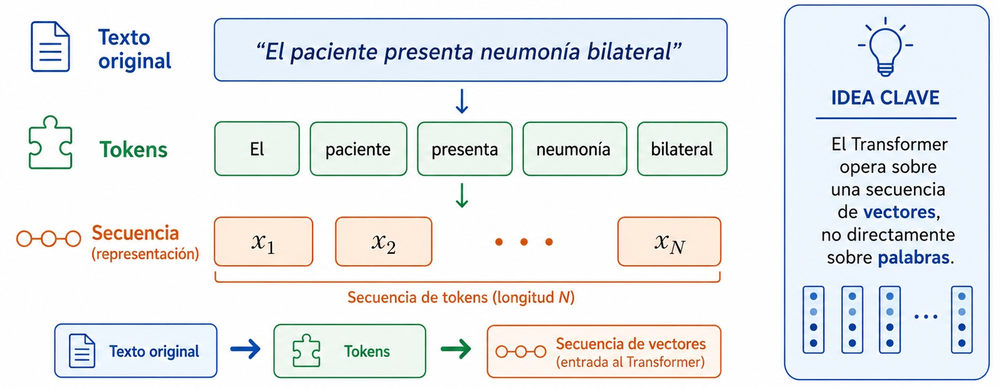{width=60%}


## De Tokens a Embeddings

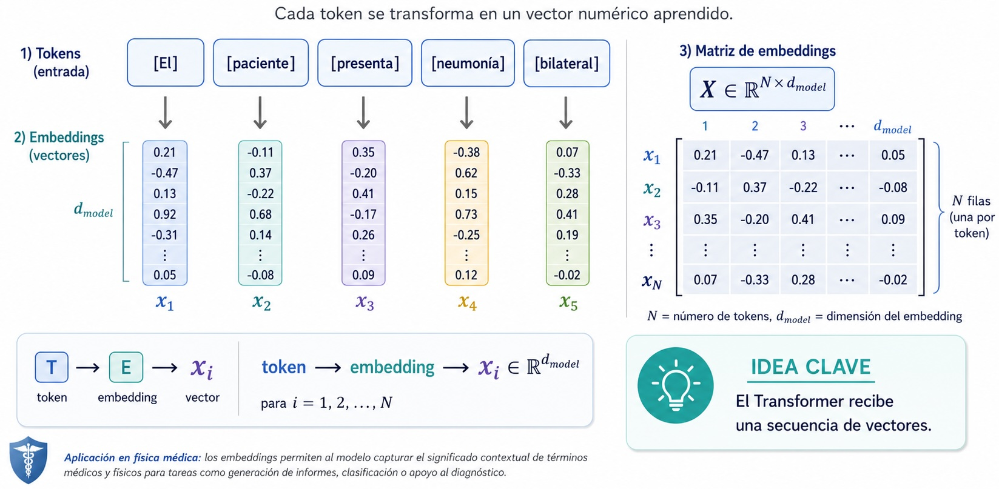{width=60%}

## La posición importa

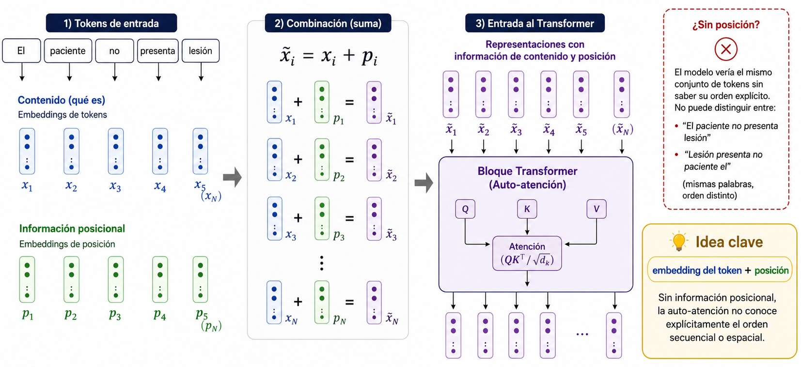{width=60%}

## ¿Por qué usar embeddings de posición?

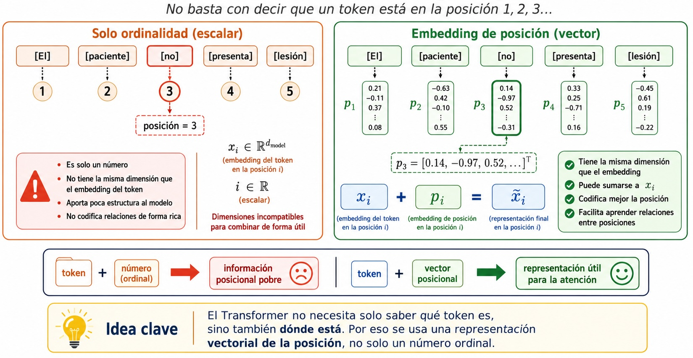{width=60%}


## La intuición de atención

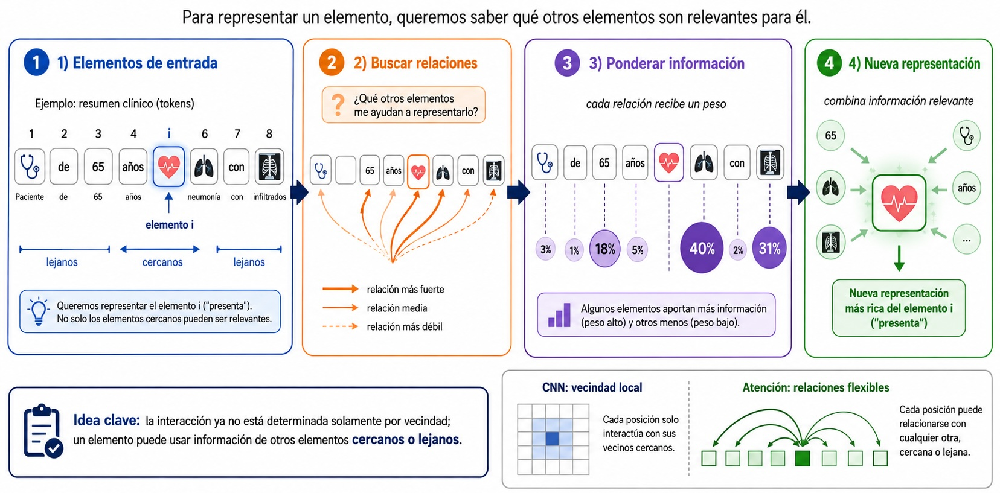{width=60%}


## Query, Key y Value

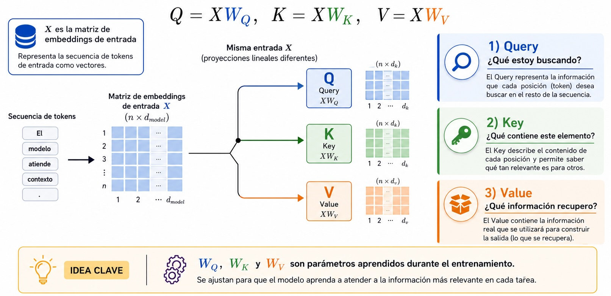{width=60%}

## De token a atención

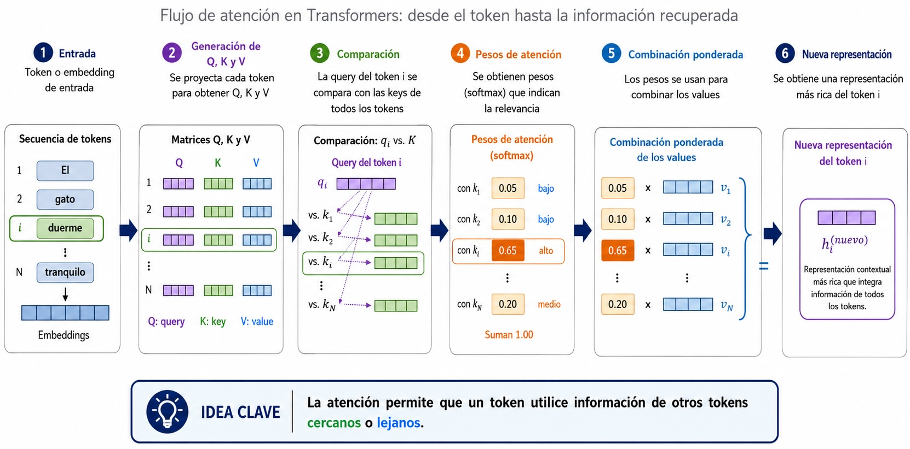{width=60%}

## De Q, K a pesos de atención

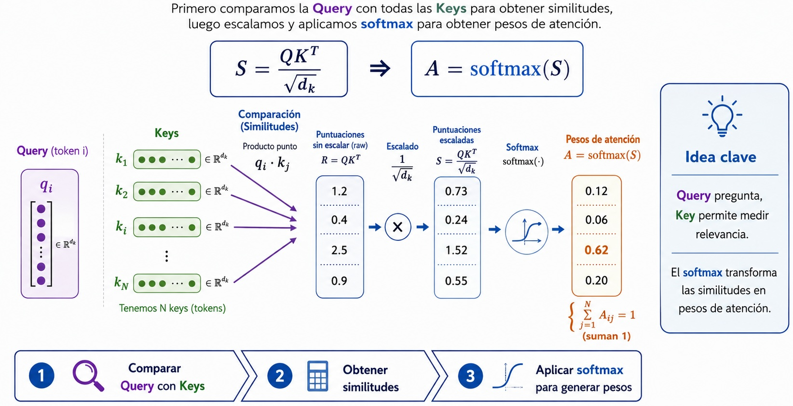{width=60%}

## Self-attention

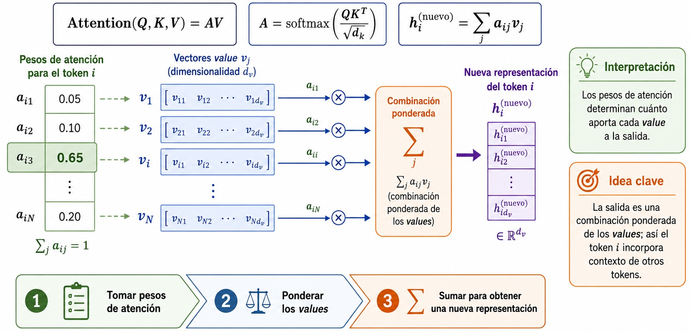{width=60%}

## Multi-head attention 

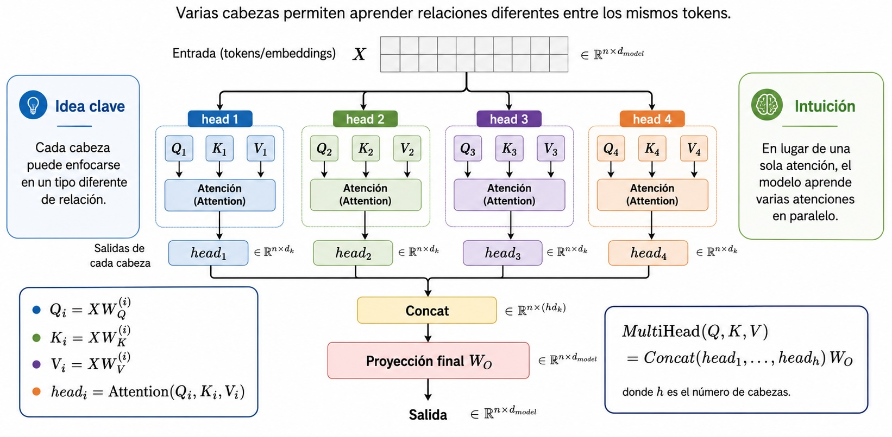{width=60%}


## El bloque Transformer

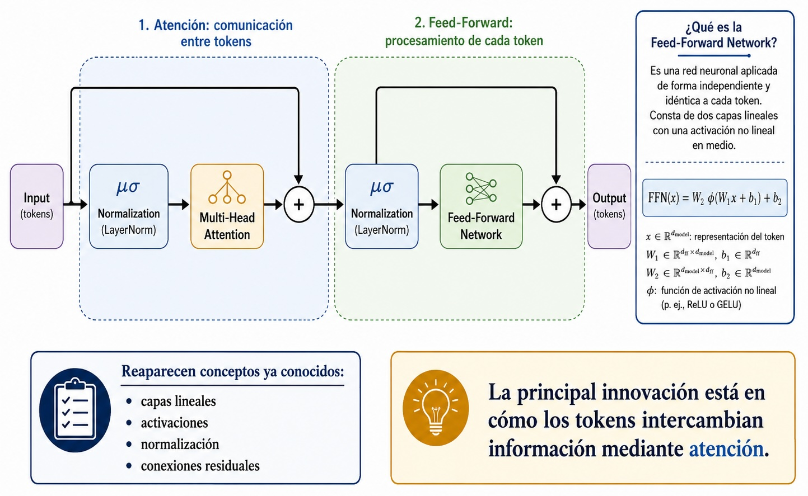{width=60%}

## ¿Por qué hay una FFN después de la atención?

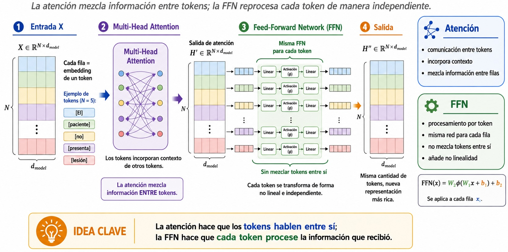{width=60%}

## Vision Transformer

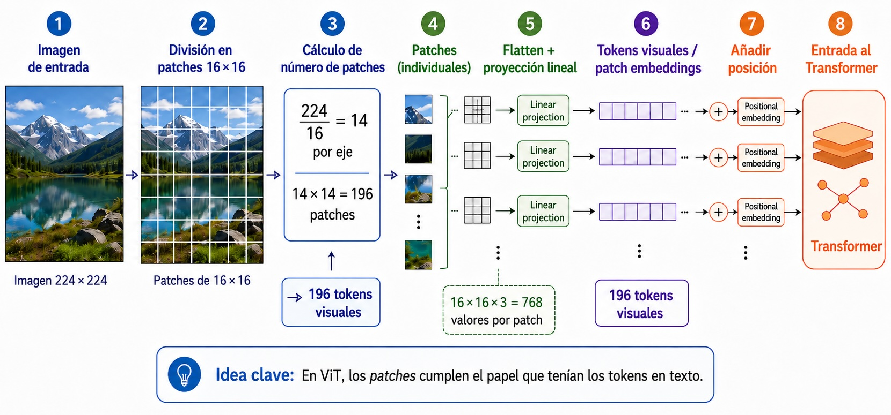{width=60%}


## CNN vs Transformer

| CNN | Transformer |
|---|---|
| interacción local | interacción flexible |
| fuerte sesgo espacial | menor sesgo local |
| kernels compartidos | atención |
| jerarquía natural | requiere diseño de escala |
| muy eficiente localmente | atención global costosa |

No existe un ganador universal.


## ¿Qué puede aportar atención en imagen médica?

Puede ser útil cuando la decisión depende de:

- relaciones anatómicas distantes;
- simetría;
- contexto global;
- múltiples regiones;
- información multimodal.

Esto es especialmente atractivo en volúmenes 3D.


## UNETR

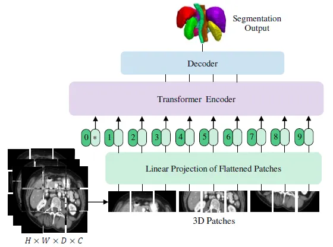{width=60%}

[UNETR: Transformers for 3D Medical Image Segmentation](https://openaccess.thecvf.com/content/WACV2022/papers/Hatamizadeh_UNETR_Transformers_for_3D_Medical_Image_Segmentation_WACV_2022_paper.pdf)

## UNETR
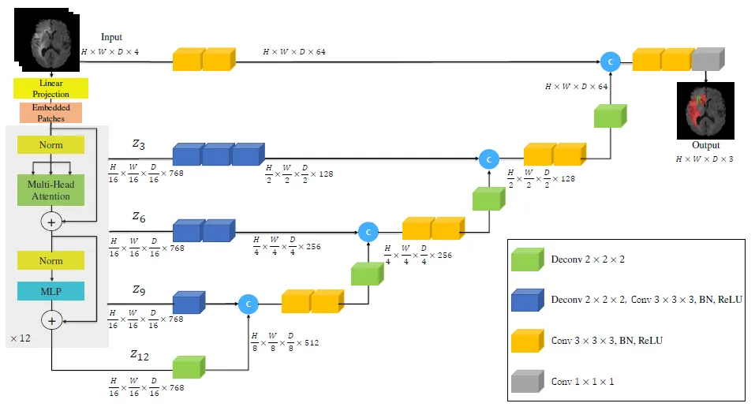{width=60%}

[UNETR: Transformers for 3D Medical Image Segmentation](https://openaccess.thecvf.com/content/WACV2022/papers/Hatamizadeh_UNETR_Transformers_for_3D_Medical_Image_Segmentation_WACV_2022_paper.pdf)

## Swin Transformer

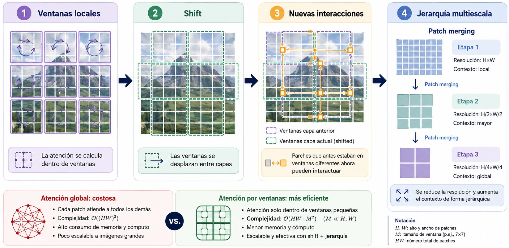{width=60%}

## Swin UNETR

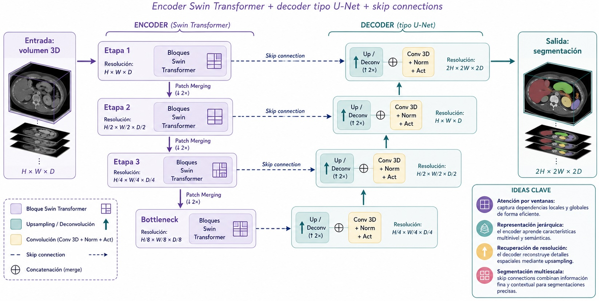{width=60%}


## El costo de la atención

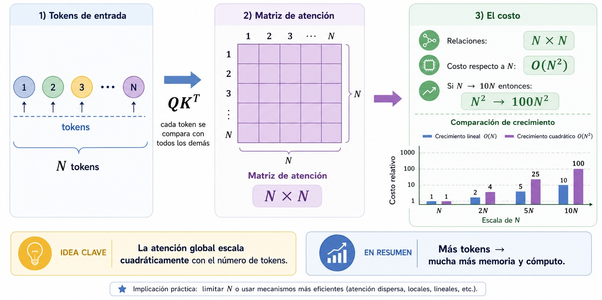{width=60%}


## ¿Por qué esto es crítico en 3D?

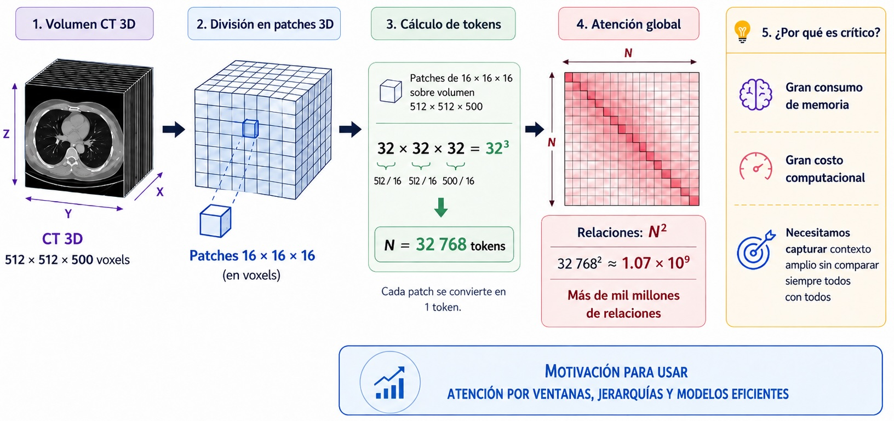{width=60%}


## Un mismo problema, distintos sesgos

| Arquitectura | Idea central | Sesgo principal |
|---|---|---|
| MLP | conectividad densa | poca estructura explícita |
| CNN | convolución local | localidad |
| Autoencoder | compresión | representación latente |
| U-Net | multiescala + skip | localización |
| Transformer | atención | relaciones flexibles |
| Mamba | estado selectivo | contexto largo eficiente |


## ¿Qué usaría para cada problema?

:::: {.columns}
::: {.column width="48%"}
### Datos tabulares

- regresión;
- árboles;
- MLP.

### Clasificación de imágenes

- CNN;
- ViT;
- CNN(ViT) + SVM.
:::

::: {.column width="48%"}
### Segmentación 3D

- U-Net;
- UNETR;
- Swin UNETR;
:::
::::

La arquitectura debe responder al problema, no a la moda.


## La arquitectura no es el modelo completo

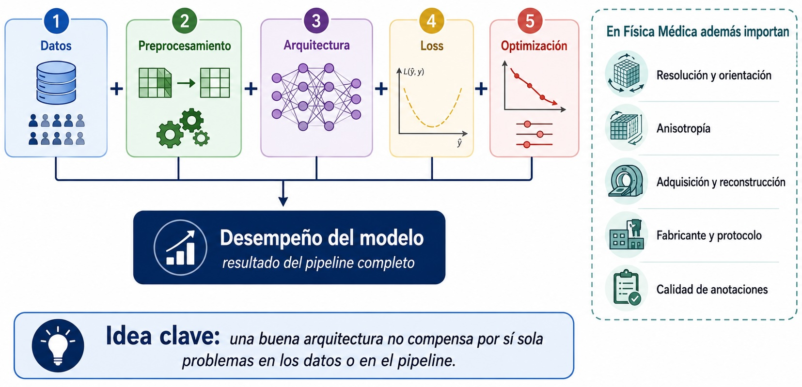{width=60%}

## Cuatro ideas para llevarse

1. La arquitectura incorpora un **sesgo inductivo**.
2. Las CNN explotan **localidad y estructura espacial**.
3. U-Net combina **contexto + precisión espacial**.
4. Transformers permiten **interacciones flexibles y de largo alcance**.

> La mejor arquitectura es la que introduce el flujo de información adecuado para el problema.