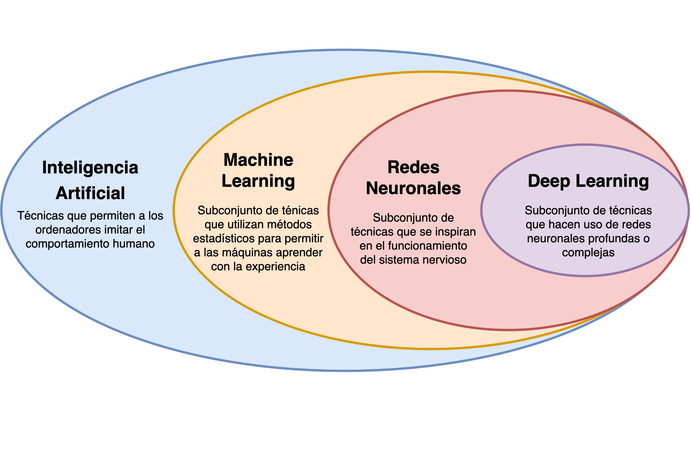
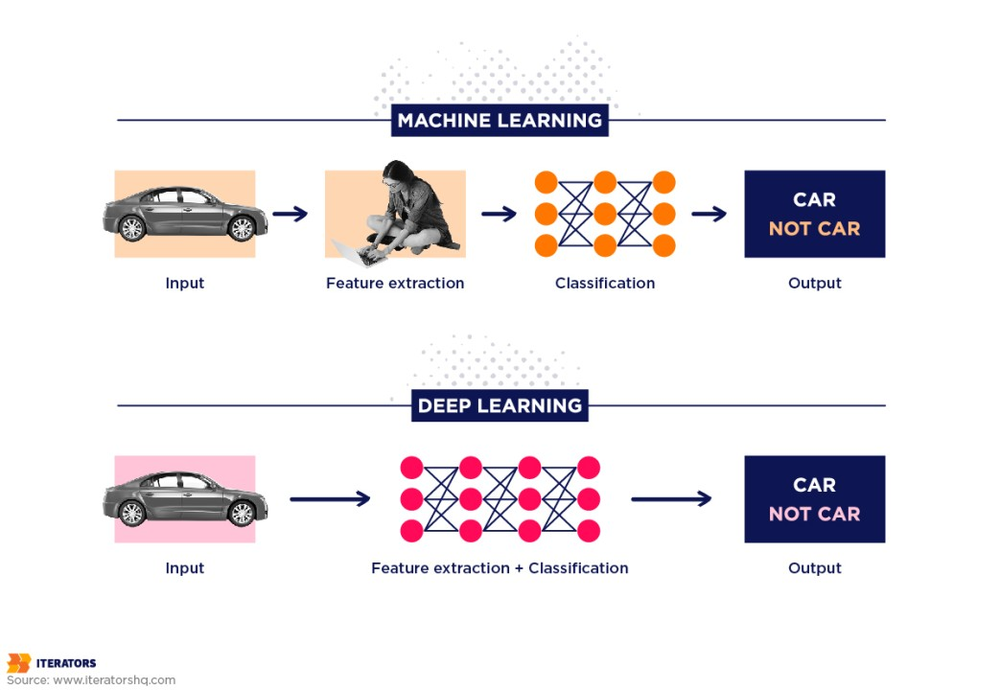
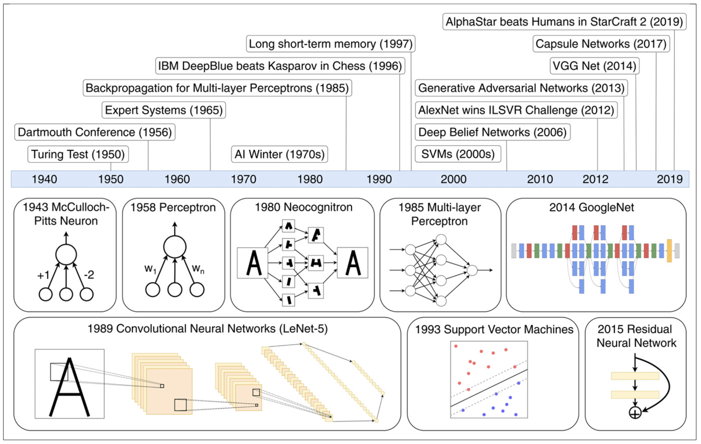
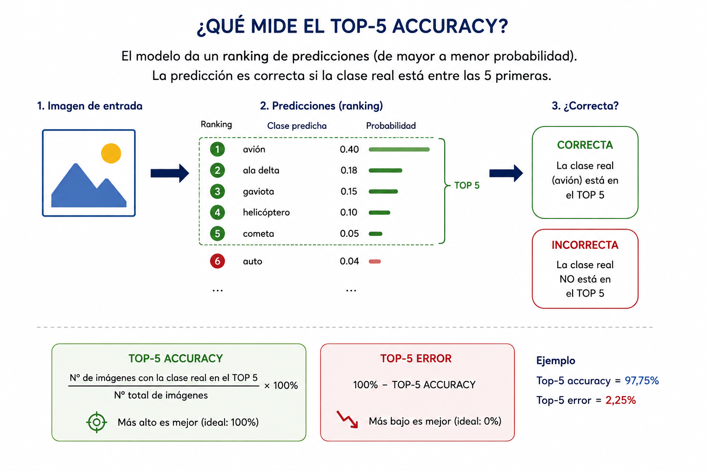
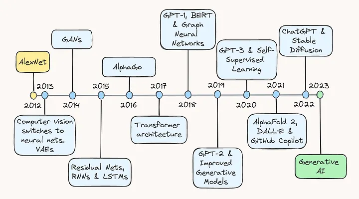

::: {.callout-note}
**Descarga:** [obtener estas notas en PDF](notas.pdf)
:::

# 1. ¿Por qué empezar por lo clásico?

Antes de introducir las redes neuronales profundas, conviene entender los métodos que dominaron —y que siguen dominando en muchos contextos clínicos— el análisis de datos médicos.

Los modelos clásicos tienen ventajas importantes:

* requieren, en muchos casos, cantidades relativamente pequeñas de datos;
* pueden ser fáciles de interpretar;
* permiten incorporar conocimiento experto;
* suelen tener costos computacionales bajos;
* pueden ser más sencillos de validar y documentar;
* y, dependiendo del problema, pueden ofrecer un desempeño excelente.

En aplicaciones clínicas y de Física Médica, además, la trazabilidad y la validación tienen una importancia particular.

::: {.callout-important title="Regla de oro"}
Un modelo de Deep Learning no debería evaluarse aisladamente. Todo pipeline de Deep Learning en física médica debería compararse, cuando corresponda, con un **baseline clásico apropiado y correctamente ajustado**.

El baseline puede ser una regresión lineal o logística, un árbol decisiones, Random Forest, SVM, un método estadístico convencional o incluso un modelo físico o clínico utilizado habitualmente.

Si un modelo profundo no ofrece una mejora relevante respecto de una solución mucho más sencilla, su complejidad adicional puede no estar justificada.
:::

Una idea importante que aparecerá a lo largo del curso es:

> **Un modelo más complejo no es necesariamente un modelo mejor.**

La elección del modelo depende del problema, de los datos disponibles, de los objetivos y del costo asociado a su desarrollo, validación y utilización.

# 2. Los paradigmas del aprendizaje automático

Podemos organizar una gran parte de los métodos de aprendizaje automático según la información disponible durante el entrenamiento.

| Paradigma          | Información disponible          | Objetivo                            |
| ------------------ | ------------------------------- | ----------------------------------- |
| **Supervisado**    | $(\mathbf{x},y)$                | Aprender a predecir $y$             |
| **No supervisado** | $\mathbf{x}$                    | Descubrir estructura en los datos   |
| **Por refuerzo**   | Estados, acciones y recompensas | Aprender una estrategia de decisión |

Existe además una categoría particularmente importante en los desarrollos recientes:


> **Aprendizaje auto-supervisado (*self-supervised learning*)**

En este caso, las etiquetas utilizadas para entrenar el modelo se construyen automáticamente a partir de los propios datos. Esto permite aprovechar grandes cantidades de datos sin etiquetar y será especialmente importante al estudiar modelos fundacionales y modelos de lenguaje.

---

# 3. Aprendizaje supervisado

Dado un conjunto de datos

$$
\mathcal{D} = {(\mathbf{x}_i,y_i)}_{i=1}^{N}
$$

con

$$
\mathbf{x}_i \in \mathbb{R}^d
$$

y $y_i$ como variable objetivo, el fin del aprendizaje supervisado es encontrar una función

$$
f_\theta:\mathbb{R}^d\rightarrow\mathcal{Y}
$$

que produzca buenas predicciones.

Las características $\mathbf{x}$ pueden ser, por ejemplo:

* características radiómicas[^1];
* edad;
* parámetros dosimétricos;
* características clínicas;
* variables fisiológicas;
* parámetros de adquisición;
* medidas obtenidas de imágenes.

[^1]: Las *features* radiómicas son medidas cuantitativas extraídas de imágenes médicas (CT, MRI, PET) que describen la textura, forma y estadística de regiones de interés. Son ampliamente usadas en oncología para caracterizar tumores y predecir respuesta a tratamientos.

y la variable objetivo $y$ puede ser continua o categórica, por ejemplo: 

* una magnitud física (por ejemplo, dosis absorbida);
* una probabilidad de toxicidad;
* una clasificación binaria (por ejemplo, lesión benigna o maligna);
* una clasificación multiclase (por ejemplo, tipo de tejido);
* una secuencia de acciones (por ejemplo, un plan de tratamiento). 


El modelo se entrena minimizando una función de pérdida:

$$
\hat{\theta}
=
\arg\min_{\theta}
\left[
\frac{1}{N}
\sum_{i=1}^{N}
\mathcal{L}
\left(
f_\theta(\mathbf{x}_i),y_i
\right)
+
\lambda\Omega(\theta)
\right].
$$

Donde el primer término mide el error cometido sobre los datos de entrenamiento y $\Omega(\theta)$ representa un término de regularización.

El parámetro $\lambda$ controla cuánto penalizamos la complejidad del modelo.


# 4. Aprendizaje no supervisado

En el aprendizaje no supervisado partimos de un conjunto de datos

$$
\mathcal{D}={\mathbf{x}_i}_{i=1}^{N},
$$

donde cada

$$
\mathbf{x}_i\in\mathbb{R}^d
$$

contiene las características observadas de un caso, pero **no tenemos una variable objetivo $y_i$ conocida**.

El objetivo depende del problema. Podemos buscar, por ejemplo:

* grupos de datos similares;
* representaciones de menor dimensionalidad;
* anomalías;
* estructuras latentes;
* representaciones útiles de los datos.

No existe una única función de pérdida para todos los problemas no supervisados. La función objetivo depende de qué estructura queremos aprender.

Por ejemplo, en *clustering* puede buscarse una partición de los datos en grupos internamente similares. En reducción de dimensionalidad puede buscarse una representación de menor dimensión que conserve la mayor cantidad posible de información relevante.

La diferencia fundamental con el aprendizaje supervisado es que:

> **no le indicamos al algoritmo cuál es la respuesta correcta.**

El modelo debe descubrir regularidades presentes en los datos.

Por ejemplo, dado un conjunto de imágenes de tumores sin etiquetas, un algoritmo podría identificar grupos de pacientes con características radiológicas similares sin que previamente le hayamos indicado cuáles son esos grupos.

Esto introduce una cuestión fundamental:

> **¿Los patrones encontrados son reales y clínicamente relevantes, o son simplemente estructuras particulares de nuestra muestra?**

Por eso, también en aprendizaje no supervisado es necesario evaluar la estabilidad y reproducibilidad de los resultados.

## Aplicaciones

En Física Médica, el aprendizaje no supervisado puede utilizarse para:

* exploración de datos;
* segmentación;
* reducción de dimensionalidad;
* detección de anomalías;
* identificación de subgrupos de pacientes;
* análisis exploratorio de imágenes;
* aprendizaje de representaciones.

Encontrar una estructura matemática en los datos no implica necesariamente encontrar una estructura con significado clínico.

---

# 5. Aprendizaje por refuerzo

En el aprendizaje por refuerzo el problema es diferente.

En lugar de aprender a partir de ejemplos $(\mathbf{x}_i,y_i)$, tenemos un **agente** que interactúa con un **entorno**.

En cada instante $t$:

1. el agente observa un estado $s_t$;
2. selecciona una acción $a_t$;
3. recibe una recompensa $r_t$;
4. el entorno evoluciona hacia un nuevo estado $s_{t+1}$.

Podemos representarlo como:

$$
s_t
\xrightarrow{\;a_t\;}
(r_t,s_{t+1}).
$$

El objetivo es aprender una política

$$
\pi_\theta(a_t|s_t)
$$

que maximice la recompensa acumulada esperada:

$$
\hat{\theta}
=
\arg\max_{\theta}
\mathbb{E}*{\pi*\theta}
\left[
\sum_{t=0}^{T}
\gamma^t r_t
\right]
$$

El parámetro $\gamma\in[0,1]$ es el **factor de descuento**, que determina cuánto valoramos las recompensas futuras.

El agente aprende mediante interacción y prueba y error.

Una dificultad fundamental es el compromiso entre:

* **exploración:** probar acciones nuevas;
* **explotación:** utilizar acciones que sabemos que funcionan.

En Física Médica, podemos imaginar un problema de optimización de un plan de tratamiento. El estado podría describir el plan actual y sus características dosimétricas, una acción podría modificar determinados parámetros y la recompensa podría combinar la cobertura tumoral y la protección de órganos sanos.

El agente intentaría aprender una estrategia que maximice la calidad del plan.

::: {.callout-warning title="La función de recompensa importa"}

Un agente de aprendizaje por refuerzo optimiza aquello que definimos como recompensa.

Si la recompensa no representa correctamente el objetivo clínico, el agente puede encontrar estrategias que optimicen matemáticamente la recompensa pero que no sean clínicamente apropiadas.

:::

En síntesis:

> **El aprendizaje supervisado aprende a predecir; el no supervisado aprende a descubrir estructura; el aprendizaje por refuerzo aprende a tomar decisiones.**

---

# 6. Modelos clásicos de aprendizaje automático

Los distintos algoritmos incorporan diferentes **sesgos inductivos**: supuestos sobre la estructura de los datos que hacen que determinadas soluciones sean más fáciles de aprender que otras.

| Modelo              | Uso típico                        | Ventaja                        | Limitación                             |
| ------------------- | --------------------------------- | ------------------------------ | -------------------------------------- |
| Regresión lineal    | Predicción de variables continuas | Simple e interpretable         | Solo relaciones lineales               |
| Regresión logística | Clasificación                     | Simple y probabilística        | Frontera lineal                        |
| Árbol de decisión   | Clasificación y regresión         | Fácil de interpretar           | Puede sobreajustar                     |
| Random Forest       | Clasificación y regresión         | Captura relaciones no lineales | Menor interpretabilidad                |
| SVM                 | Clasificación                     | Eficaz en alta dimensión       | Sensible a elección de kernel y escala |
| k-NN                | Clasificación y regresión         | Simple y no paramétrico        | Costoso en inferencia                  |
| PCA                 | Reducción de dimensionalidad      | Simple y eficiente             | Captura estructura lineal              |

No existe un modelo universalmente mejor.

La pregunta correcta no es:

> "¿Qué algoritmo es el mejor?"

sino:

> **"¿Qué modelo es adecuado para este problema y estos datos?"**

# Riesgo esperado y riesgo empírico

Este concepto es fundamental para entender el aprendizaje automático.

El **riesgo esperado** o **riesgo real** de un modelo es:

$$
R(f)
=
\mathbb{E}_{(\mathbf{x},y)\sim P}
\left[
\mathcal{L}(f(\mathbf{x}),y)
\right],
$$

donde $P(\mathbf{x},y)$ representa la distribución de probabilidad que genera los datos.

En palabras simples: es el error promedio que esperamos obtener sobre nuevos ejemplos provenientes de la población de interés.

El problema es que **no conocemos $P$**.

Solo disponemos de una muestra finita:

$$
\mathcal{D}
=
{(\mathbf{x}_ i,y_i)}_{i=1}^{N}
$$

Por lo tanto, podemos calcular el **riesgo empírico**:

$$
\hat R(f)
=
\frac{1}{N}
\sum_{i=1}^{N}
\mathcal{L}
\left(
f(\mathbf{x}_i),y_i
\right).
$$

El riesgo empírico es nuestro estimador del riesgo esperado.

### Una analogía

Supongamos que queremos conocer la altura promedio de todos los adultos de Argentina.

No podemos medir a toda la población. Podemos seleccionar una muestra de 1.000 personas y calcular su altura promedio.

El promedio de esas 1.000 personas es una estimación del promedio poblacional.

La calidad de esa estimación dependerá, entre otras cosas, de cómo fue seleccionada la muestra.

Lo mismo ocurre con un modelo de aprendizaje automático:

> **entrenamos y evaluamos sobre una muestra, pero queremos que el modelo funcione sobre una población más amplia.**

## Generalización y sobreajuste

Un modelo puede obtener un error extremadamente bajo sobre los datos de entrenamiento sin necesariamente generalizar bien a nuevos datos.

Esto es el **sobreajuste (*overfitting*)**.

Conceptualmente:

$$
\text{bajo error de entrenamiento}
\not\Rightarrow
\text{bajo error en datos nuevos}.
$$

Un modelo puede aprender patrones genuinos de la población, pero también puede aprender características particulares de la muestra de entrenamiento que no se repiten posteriormente.

::: {.callout-important title="Idea central"}

El objetivo del aprendizaje automático no es memorizar los datos disponibles.

El objetivo es **aprender regularidades que permitan realizar buenas predicciones sobre datos que todavía no hemos visto**.

:::

Esto explica por qué necesitamos separar los datos utilizados para ajustar el modelo de aquellos utilizados para evaluar su capacidad de generalización.

Una división habitual es:

* **training set:** utilizado para ajustar los parámetros;
* **validation set:** utilizado para seleccionar modelos e hiperparámetros;
* **test set:** reservado para una evaluación final.

En aplicaciones médicas, esta separación debe realizarse cuidadosamente para evitar *data leakage*.

Por ejemplo, si tenemos múltiples imágenes del mismo paciente, no deberíamos distribuir aleatoriamente esas imágenes entre entrenamiento y test. De lo contrario, el modelo podría encontrarse durante el test con información muy relacionada con algo que ya vio durante el entrenamiento.

---

## Generalización en Física Médica

En Física Médica, la generalización tiene una dificultad adicional.

Un modelo puede funcionar correctamente sobre nuevos pacientes del mismo centro y, sin embargo, degradar su desempeño cuando cambia:

* el hospital;
* el fabricante del equipo;
* el modelo del tomógrafo;
* el protocolo de adquisición;
* la población de pacientes;
* el tratamiento;
* la reconstrucción de imágenes;
* o las características demográficas.

Este problema se conoce genéricamente como **dataset shift** o **domain shift**.

Por lo tanto:

> Generalizar no significa solamente funcionar sobre una imagen que el modelo nunca vio. También significa funcionar cuando cambian las condiciones bajo las cuales se generan los datos.

Esta cuestión será especialmente importante al estudiar Deep Learning aplicado a imágenes médicas.

---

# 7. Regresión lineal y logística

La regresión lineal y la regresión logística son dos modelos fundamentales de aprendizaje supervisado.

Ambos reciben un vector de características $\mathbf{x}$ y calculan una combinación lineal:

$$
z=\mathbf{w}^{\top}\mathbf{x}+b.
$$

Aquí:

* $\mathbf{w}$ son los pesos;
* $b$ es el término independiente o *bias*.

El **bias** permite desplazar la salida del modelo independientemente de los valores de entrada.

La diferencia entre ambos modelos está en qué hacemos con esta combinación lineal y qué tipo de variable queremos predecir.

## Regresión lineal

Se utiliza cuando la variable objetivo $y$ es continua.

El modelo predice directamente:

$$
\hat y
=
\mathbf{w}^{\top}\mathbf{x}+b.
$$

Por ejemplo, podríamos utilizar características relacionadas con un haz de radiación para predecir una magnitud dosimétrica continua.

Los parámetros $\mathbf{w}$ y $b$ pueden ajustarse minimizando el error cuadrático medio (*Mean Squared Error*, MSE):

$$
\mathcal{L}_{\mathrm{MSE}}
=
\frac{1}{N}
\sum_{i=1}^{N}
(y_i-\hat y_i)^2.
$$

El modelo busca una combinación de las características que produzca predicciones lo más cercanas posible a los valores observados.

## Regresión logística

Se utiliza para clasificación. En el caso binario queremos distinguir, por ejemplo, entre una lesión benigna y una maligna.

Partimos de la misma combinación lineal:

$$
z=\mathbf{w}^{\top}\mathbf{x}+b
$$

pero aplicamos la función sigmoide:

$$
\hat p
=
\sigma(z)
=
\frac{1}{1+e^{-z}}.
$$

La sigmoide transforma cualquier número real en un valor entre 0 y 1.

Podemos interpretar:

$$
\hat p=P(y=1|\mathbf{x})
$$

como la probabilidad estimada de pertenecer a la clase positiva.

Para entrenar el modelo utilizamos habitualmente la entropía cruzada binaria (*Binary Cross-Entropy*, BCE):

$$
\mathcal{L}_{\mathrm{BCE}}
=
-\frac{1}{N}
\sum_{i=1}^{N}
\left[
y_i\log(\hat p_i)
+
(1-y_i)\log(1-\hat p_i)
\right].
$$

La clasificación final puede obtenerse aplicando un umbral:

$$
\hat y=
\begin{cases}
1 & \text{si } \hat p\geq 0.5,\\
0 & \text{si } \hat p<0.5.
\end{cases}
$$

El valor 0.5 es una elección habitual, pero no necesariamente óptima en aplicaciones clínicas. El umbral puede modificarse dependiendo del costo relativo de falsos positivos y falsos negativos.

---

## El puente hacia las redes neuronales

La regresión logística contiene una idea que volveremos a encontrar en las redes neuronales.

Primero calculamos:

$$
z=\mathbf{w}^{\top}\mathbf{x}+b,
$$

y luego aplicamos una función de activación:

$$
\hat p=\sigma(z).
$$

Podemos pensar esta operación como una **unidad neuronal simple**.

Las redes neuronales parten de esta idea y la extienden utilizando muchas unidades organizadas en capas. Al combinar sucesivamente estas operaciones, la red puede representar relaciones cada vez más complejas entre las variables de entrada y la salida.

Este punto será central cuando estudiemos el Perceptrón.

---

# 8. ¿Qué significa que un modelo sea lineal?

En un problema de clasificación binaria, un modelo lineal define una frontera de decisión mediante:

$$
\mathbf{w}^{\top}\mathbf{x}+b=0.
$$

En dos dimensiones, esta ecuación representa una recta.

En tres dimensiones representa un plano.

En dimensiones mayores hablamos de un **hiperplano**.

Por lo tanto, un clasificador lineal puede separar las clases únicamente mediante un hiperplano.

Esto conduce a un concepto fundamental:

> **Dos clases son linealmente separables si existe un hiperplano que las separe perfectamente.**

La regresión logística, por ejemplo, produce una frontera de decisión lineal aunque la salida del modelo sea una probabilidad.

Esto plantea una pregunta:

> ¿Qué ocurre cuando los datos no pueden separarse mediante una frontera lineal?

La respuesta nos lleva directamente al Perceptrón.


## Ejemplo práctico: comparación de fronteras de decisión

```{python}
#| label: fig-comparacion-clasica
#| fig-cap: "Fronteras de decisión de modelos clásicos sobre un dataset sintético (ej. dos features radiómicas)"

import numpy as np
import matplotlib.pyplot as plt
from sklearn.datasets import make_moons
from sklearn.linear_model import LogisticRegression
from sklearn.svm import SVC
from sklearn.tree import DecisionTreeClassifier
from sklearn.neighbors import KNeighborsClassifier

np.random.seed(42)
X, y = make_moons(n_samples=300, noise=0.25, random_state=42)

modelos = {
    "Regresión Logística": LogisticRegression(),
    "SVM (kernel RBF)": SVC(kernel="rbf", gamma=2),
    "Árbol de decisión": DecisionTreeClassifier(max_depth=4),
    "k-NN (k=5)": KNeighborsClassifier(n_neighbors=5),
}

xx, yy = np.meshgrid(np.linspace(X[:,0].min()-0.5, X[:,0].max()+0.5, 300),
                      np.linspace(X[:,1].min()-0.5, X[:,1].max()+0.5, 300))

fig, axes = plt.subplots(1, 4, figsize=(18, 4.2))

for ax, (nombre, modelo) in zip(axes, modelos.items()):
    modelo.fit(X, y)
    Z = modelo.predict(np.c_[xx.ravel(), yy.ravel()]).reshape(xx.shape)
    ax.contourf(xx, yy, Z, alpha=0.3, cmap="coolwarm")
    ax.scatter(X[:,0], X[:,1], c=y, cmap="coolwarm", edgecolor="k", s=20)
    ax.set_title(nombre, fontsize=11)
    ax.set_xticks([]); ax.set_yticks([])

plt.tight_layout()
plt.show()
```

Se puede observar cómo cada modelo impone un **sesgo inductivo** distinto sobre la forma de la frontera de decisión: lineal (regresión logística), suave y global (SVM-RBF), o local y fragmentada (árbol, k-NN). 

---

# Introducción al Deep Learning: breve historia

## ¿Qué es el Deep Learning?

El **Deep Learning** (aprendizaje profundo) es una subfamilia del aprendizaje automático basada en **redes neuronales artificiales con múltiples capas**, capaces de aprender representaciones jerárquicas de los datos directamente desde datos crudos (píxeles, señales), sin necesidad de ingeniería manual de *features*.

{#fig-dl-ml-ai width=50%}

Matemáticamente, un modelo profundo se puede expresar como una composición de funciones paramétricas:

$$
f_\theta(\mathbf{x}) = f^{(L)} \circ f^{(L-1)} \circ \cdots \circ f^{(1)}(\mathbf{x})
$$

donde cada $f^{(l)}$ es una transformación (capa) con parámetros propios $\theta^{(l)}$.

La diferencia central respecto de los modelos clásicos es que **las representaciones intermedias se aprenden automáticamente** a partir de los datos, en lugar de ser diseñadas a mano por un experto (lo que en machine learning clásico se llama *feature engineering*).

{#fig-ml-vs-dl width=50%}

## Línea de tiempo histórica

{#fig-timeline width=80%}

La historia del Deep Learning no fue una línea recta: tuvo dos períodos de estancamiento —los llamados "inviernos de la IA"— separados por avances puntuales, y un resurgimiento sostenido a partir de 2012 que se extiende hasta hoy. Repasamos primero esos inviernos y luego, con más detalle, la década que va de AlexNet (2012) a la actualidad.

## Los "dos inviernos" de la IA neuronal

1. **Primer invierno (post-1969):** Minsky y Papert demuestran que el perceptrón simple no puede resolver problemas no linealmente separables (el caso paradigmático: la función XOR, que analizaremos en detalle más adelante). Esto reduce drásticamente el financiamiento a la investigación en redes neuronales durante casi dos décadas.
2. **Segundo invierno (fines de los 90s-2000s):** a pesar del backpropagation (1986), la falta de datos masivos y de poder de cómputo, sumada al auge de las SVMs y los métodos de *ensemble*, relega nuevamente a las redes neuronales.
3. **El resurgimiento (2006-2012):** la disponibilidad de GPUs, de grandes bases de datos etiquetadas (ImageNet) y de mejoras algorítmicas (ReLU, dropout, mejor inicialización) permite entrenar redes verdaderamente profundas. **AlexNet (2012)** es el punto de inflexión que marca el inicio de la era moderna del Deep Learning.

## ImageNet y el auge de las CNNs

El **ImageNet Large Scale Visual Recognition Challenge (ILSVRC)** fue una competencia anual iniciada en 2010 para evaluar y comparar algoritmos de reconocimiento visual a gran escala, sobre un subconjunto de ImageNet de aproximadamente 1.000 clases. Se convirtió en el benchmark de referencia para medir el progreso en clasificación de imágenes, y su evolución durante la década de 2010 resume, en una sola tabla, la revolución de las CNNs:

- **2010:** el modelo ganador, basado en SVM y características tradicionales (HoG, LBP), obtuvo 71,8% de top-5 accuracy (28,2% de error).
- **2011:** otro modelo basado en SVM con Fisher Vectors alcanzó 74,2% de accuracy (25,0% de error).
- **2012:** **AlexNet**, una CNN profunda, produjo un salto abrupto: 84,7% de accuracy (≈15,3% de error) — casi 10 puntos de mejora respecto del año anterior.
- **2013:** las CNNs se consolidan como la estrategia dominante; los modelos siguientes superan el 90% de accuracy.
- **2014:** arquitecturas como GoogLeNet y VGGNet llevan el desempeño a 93-94% de accuracy.
- **2015:** **ResNet** alcanza 96,4% de accuracy (≈3,6% de error), superando por primera vez el desempeño humano estimado en esta tarea.
- **2016:** CUImage, un *ensemble* de seis redes, roza el 3% de error.
- **2017:** **SENet** alcanza el mejor resultado de la competencia: 97,75% de accuracy (2,25% de error). Los organizadores consideran el benchmark esencialmente resuelto y anuncian el final de la competencia.

En síntesis: entre 2010 y 2017 el error top-5 cayó de 28,2% a 2,25%. El salto más importante ocurrió en 2012 con AlexNet, y marca el comienzo de la expansión acelerada del deep learning en visión por computadora — el mismo AlexNet que abre la línea de tiempo que sigue a continuación.



## Los últimos años: modelos fundacionales y la IA generativa

Desde AlexNet en 2012, el ritmo de avances no hizo más que acelerarse. A continuación repasamos, año a año, los hitos que llevaron del "renacimiento" del deep learning en visión por computadora a los modelos fundacionales y agénticos actuales, con aplicaciones clínicas cada vez más concretas en diagnóstico asistido, segmentación automática y predicción de resultados.

{#fig-recent width=80%}

### 2013 — AlexNet y los Autoencoders Variacionales

2013 es considerado el año de "mayoría de edad" del deep learning, consolidando el impacto de AlexNet un año antes. En paralelo surgen los **VAEs (Autoencoders Variacionales)**, modelos generativos que aprenden una representación comprimida (espacio latente) de los datos para luego generar nuevas muestras, abriendo camino a aplicaciones en arte, diseño y videojuegos.

### 2014 — Redes Generativas Adversarias (GANs)

Ian Goodfellow presenta las **GANs**: dos redes —generadora y discriminadora— entrenadas en un esquema competitivo, donde una intenta crear datos sintéticos convincentes y la otra intenta detectarlos. Se convirtieron rápidamente en una herramienta central para generar imágenes, video, música y arte, e impulsaron el aprendizaje no supervisado —hasta entonces un área poco desarrollada— al demostrar que era posible producir datos de alta calidad sin depender de etiquetas.

### 2015 — ResNets y avances en NLP

Kaiming He introduce las **ResNets**, redes con conexiones residuales que "saltean" capas para resolver el desvanecimiento del gradiente, permitiendo entrenar redes mucho más profundas de lo que se creía posible (visto en la tabla de ImageNet más arriba). En paralelo, las **RNNs y LSTMs** —existentes desde los años 90— empiezan a rendir gracias a más datos, más cómputo y mejores mecanismos de *gating*, mejorando traducción automática, generación de texto y análisis de sentimiento: las bases de los LLMs actuales.

### 2016 — AlphaGo

**AlphaGo**, de DeepMind, derrota al campeón mundial de Go Lee Sedol, casi dos décadas después de la caída de Kasparov ante Deep Blue en ajedrez. Combinando aprendizaje por refuerzo profundo con búsqueda Monte Carlo Tree Search, el sistema evaluó millones de posiciones para tomar decisiones que superaron la intuición humana en un juego considerado, hasta entonces, demasiado complejo para las máquinas.

### 2017 — Arquitectura Transformer

El año más determinante de la década. Vaswani y colegas publican *"Attention Is All You Need"*, introduciendo la **arquitectura Transformer**, basada en auto-atención: en vez de procesar palabras en orden fijo, examina toda la secuencia en simultáneo, asignando puntajes de relevancia entre palabras. El diseño encoder-decoder resuelve el problema de las dependencias de largo alcance que limitaba a las RNNs, y se convierte en el componente base de todo el desarrollo posterior en NLP y, más adelante, en visión (Unidad siguiente).

### 2018 — GPT-1, BERT y Graph Neural Networks

**OpenAI** lanza **GPT-1**, demostrando la efectividad de pre-entrenar de forma no supervisada y luego hacer *fine-tuning* en tareas específicas. Meses después, **Google** presenta **BERT**, que representa el contexto de cada palabra en ambas direcciones simultáneamente (no solo hacia adelante, como GPT-1), superando el estado del arte en múltiples benchmarks de NLP. Ese mismo año, las **Graph Neural Networks (GNNs)** ganan tracción aplicando *message-passing* sobre datos en forma de grafo, con avances en redes sociales, sistemas de recomendación y descubrimiento de fármacos.

### 2019 — GPT-2 y modelos generativos mejorados

**GPT-2** alcanza desempeño de estado del arte en múltiples tareas de NLP y genera texto notablemente coherente, anticipando lo que vendría en los años siguientes. En generación de imágenes, **BigGAN** (DeepMind) y **StyleGAN** (NVIDIA) elevan drásticamente la calidad y el control sobre las imágenes sintéticas.

### 2020 — GPT-3 y aprendizaje auto-supervisado

**GPT-3** representa un salto de escala mayúsculo: de 117 millones de parámetros (GPT-1) a 1.500 millones (GPT-2) y **175.000 millones** en GPT-3. Esto le permite generar texto coherente en una enorme variedad de tareas —completado, preguntas y respuestas, escritura creativa— sin *fine-tuning* específico, poniendo de relieve el valor del **aprendizaje auto-supervisado**: entrenar sobre grandes volúmenes de datos no etiquetados logra una comprensión amplia del lenguaje de forma mucho más económica que el entrenamiento supervisado tradicional.

### 2021 — AlphaFold 2, DALL·E y GitHub Copilot

**AlphaFold 2** (DeepMind) resuelve el problema del plegado de proteínas extendiendo la arquitectura Transformer, prediciendo la estructura 3D de una proteína a partir de su secuencia de aminoácidos — con enorme potencial para el descubrimiento de fármacos y la biología estructural. **DALL·E** (OpenAI) combina modelos de lenguaje estilo GPT con generación de imágenes a partir de texto, mientras que **GitHub Copilot** (con el modelo Codex) lleva la asistencia de IA a la programación cotidiana.

### 2022 — ChatGPT y Stable Diffusion

**ChatGPT** (OpenAI, noviembre) lleva los LLMs al público masivo: conversación fluida, explicaciones, código, distintos estilos de escritura, todo desde una interfaz simple. Su adopción cruza rápidamente del ámbito técnico a prácticamente todas las profesiones. En paralelo, **Stable Diffusion** (Stability AI) genera imágenes fotorrealistas desde texto operando en un espacio latente de menor dimensión. Juntos, disparan una ola masiva de inversión en IA generativa multimodal.

### 2023 — LLMs y bots por todas partes

Cadencia vertiginosa de lanzamientos: **LLaMA** (Meta, febrero) supera a GPT-3 con muchos menos parámetros; **GPT-4** (OpenAI, marzo) llega multimodal y con capacidades muy superiores; **Alpaca** (Stanford) y **Bard**/**PaLM-2** (Google) completan un panorama de competencia intensa entre laboratorios, mientras la adopción empresarial se acelera (Duolingo Max, Slack GPT, Shopify, Bing con GPT-4).

### 2024 — La era del razonamiento y la multimodalidad nativa

**OpenAI lanza o1** (septiembre), el primer modelo de "razonamiento": entrenado con RL a gran escala para pensar paso a paso antes de responder, con saltos notables en matemática y programación. **GPT-4o** aporta multimodalidad nativa (texto, imagen y audio en un solo modelo), y OpenAI muestra **Sora**, capaz de generar video fotorrealista desde texto. Google presenta **Gemini** y Meta libera **Llama 3**. En el plano regulatorio, la Unión Europea promulga la **AI Act**, primer marco normativo integral del mundo para IA.

### 2025 — Razonamiento abierto y el ascenso de los agentes

**DeepSeek-R1** (enero) iguala el desempeño de o1 con una fracción del costo de entrenamiento, consolidando a China como competidor de primer nivel en modelos abiertos. OpenAI responde con **o3**, y los laboratorios grandes (Google, Anthropic, Meta, Alibaba) lanzan sus propias familias de modelos de razonamiento. El foco se desplaza de "modelos que responden" a **agentes que actúan**: Claude 4/4.5 y herramientas como Claude Code o Cursor permiten delegar tareas de programación completas. Google presenta **Gemini 3**, primer modelo en superar 1500 Elo en LMArena.

### 2026 — El ascenso de China

China se posiciona como líder global en investigación y desarrollo de IA, con avances importantes en modelos de lenguaje, visión por computadora y sistemas de razonamiento. La inversión estatal y el ecosistema empresarial local aceleran la innovación, consolidando al país como un actor central en la evolución de la inteligencia artificial. **Kimi K3**, un modelo de pesos abiertos desarrollado por **Moonshot AI** con cerca de 3 billones de parámetros (arquitectura *mixture-of-experts*), se posiciona al mismo nivel que GPT-5 o Gemini 3 en varios benchmarks — un nuevo capítulo en la democratización de la inteligencia artificial.

## ¿Por qué "profundo" y por qué ahora es relevante en Física Médica?

- **Datos:** las imágenes médicas (CT, RM, PET, mamografía) son datos de alta dimensionalidad donde el Deep Learning —en particular las CNNs— sobresale.
- **Cómputo:** las GPUs/TPUs permiten entrenar modelos con millones de parámetros en tiempos razonables.
- **Representaciones jerárquicas:** en imágenes médicas, las capas iniciales aprenden bordes y texturas; las capas intermedias, estructuras anatómicas; las capas profundas, patrones patológicos complejos (una analogía directa con la vía visual biológica).

::: {.callout-tip title="Aplicaciones actuales en Física Médica"}
- Segmentación automática de órganos en riesgo (OARs) y tumores
- Reducción de dosis en CT mediante *denoising* con redes profundas
- Reconstrucción de imágenes PET/RM aceleradas
- Detección asistida de nódulos, lesiones y contornos tumorales
- Control de calidad automatizado y predicción de *outcomes* clínicos
:::

---

# Redes neuronales simples: el algoritmo del Perceptrón

## La neurona biológica como inspiración

McCulloch y Pitts (1943) propusieron un modelo matemático simplificado de la neurona: recibe señales de entrada, las pondera y produce una salida binaria si supera un umbral. Con ese modelo mostraron que una red de neuronas simples podía implementar cualquier función lógica booleana. Rosenblatt (1958) retomó esa idea y la convirtió en un **algoritmo de aprendizaje** capaz de ajustar los pesos automáticamente a partir de ejemplos: el Perceptrón.

## Definición formal

Dado un vector de entrada $\mathbf{x} = (x_1, x_2, \dots, x_d) \in \mathbb{R}^d$, el perceptrón calcula:

$$
z = \sum_{j=1}^{d} w_j x_j + b = \mathbf{w}^\top \mathbf{x} + b
$$

$$
\hat{y} = \phi(z) = 
\begin{cases}
1 & \text{si } z \geq 0 \\
0 \text{ (ó } -1) & \text{si } z < 0
\end{cases}
$$

donde $\phi$ es la **función de activación escalón (Heaviside)**, $\mathbf{w}$ es el vector de pesos sinápticos y $b$ el sesgo (*bias*).

Geométricamente, el perceptrón define un **hiperplano separador** en $\mathbb{R}^d$: $\mathbf{w}^\top \mathbf{x} + b = 0$. Todo lo que quede de un lado del hiperplano se clasifica como $+1$; todo lo que quede del otro lado, como $-1$ (o $0$). Esta lectura geométrica es la clave para entender, en la próxima sección, qué puede y qué no puede aprender un único perceptrón.

## El algoritmo de aprendizaje del Perceptrón

Dado un conjunto de entrenamiento $\{(\mathbf{x}_i, y_i)\}_{i=1}^N$ con $y_i \in \{-1, +1\}$, el algoritmo actualiza los pesos **solo cuando comete un error**:

**Algoritmo (Rosenblatt, 1958):**

1. Inicializar $\mathbf{w} \leftarrow \mathbf{0}$, $b \leftarrow 0$
2. Repetir hasta convergencia (o número máximo de épocas):
   Para cada $(\mathbf{x}_i, y_i)$:
   - Calcular $\hat{y}_i = \text{sign}(\mathbf{w}^\top \mathbf{x}_i + b)$
   - Si $\hat{y}_i \neq y_i$:
     $$
     \mathbf{w} \leftarrow \mathbf{w} + \eta \, y_i \, \mathbf{x}_i, \qquad b \leftarrow b + \eta \, y_i
     $$

donde $\eta > 0$ es la tasa de aprendizaje (*learning rate*).

::: {.callout-important title="Teorema de convergencia del Perceptrón"}
Si los datos son **linealmente separables**, el algoritmo del perceptrón converge en un número finito de pasos a una solución que clasifica correctamente todo el conjunto de entrenamiento (Novikoff, 1962). Si los datos **no** son linealmente separables, el algoritmo **nunca converge** y oscila indefinidamente. La siguiente sección muestra ambos casos en la práctica.
:::

## Implementación desde cero

```{python}
#| label: perceptron-impl

import numpy as np

class Perceptron:
    def __init__(self, lr=0.1, n_epochs=50):
        self.lr = lr
        self.n_epochs = n_epochs

    def fit(self, X, y):
        n_samples, n_features = X.shape
        self.w = np.zeros(n_features)
        self.b = 0.0
        self.errores_por_epoca = []

        for epoca in range(self.n_epochs):
            errores = 0
            for xi, yi in zip(X, y):
                y_pred = np.sign(np.dot(self.w, xi) + self.b)
                y_pred = 1 if y_pred >= 0 else -1
                if y_pred != yi:
                    self.w += self.lr * yi * xi
                    self.b += self.lr * yi
                    errores += 1
            self.errores_por_epoca.append(errores)
            if errores == 0:
                break
        return self

    def predict(self, X):
        z = X @ self.w + self.b
        return np.where(z >= 0, 1, -1)
```

## Ejemplo: separación de dos clases sintéticas (linealmente separables)

```{python}
#| label: fig-perceptron-separable
#| fig-cap: "Convergencia del Perceptrón sobre datos linealmente separables"

import matplotlib.pyplot as plt
from sklearn.datasets import make_blobs

X, y = make_blobs(n_samples=100, centers=2, cluster_std=1.0, random_state=7)
y = np.where(y == 0, -1, 1)

modelo = Perceptron(lr=0.1, n_epochs=30).fit(X, y)

fig, axes = plt.subplots(1, 2, figsize=(11, 4.2))

# Frontera de decisión
xx, yy = np.meshgrid(np.linspace(X[:,0].min()-1, X[:,0].max()+1, 200),
                      np.linspace(X[:,1].min()-1, X[:,1].max()+1, 200))
Z = modelo.predict(np.c_[xx.ravel(), yy.ravel()]).reshape(xx.shape)
axes[0].contourf(xx, yy, Z, alpha=0.3, cmap="coolwarm")
axes[0].scatter(X[:,0], X[:,1], c=y, cmap="coolwarm", edgecolor="k")
axes[0].set_title("Frontera de decisión aprendida")

# Curva de convergencia
axes[1].plot(modelo.errores_por_epoca, marker="o", color="darkred")
axes[1].set_xlabel("Época")
axes[1].set_ylabel("N° de errores de clasificación")
axes[1].set_title("Convergencia del algoritmo")
axes[1].grid(alpha=0.3)

plt.tight_layout()
plt.show()
```

## De funciones lógicas simples a XOR: qué separa un perceptrón y qué no

Antes de llegar al límite del perceptrón conviene ver, en detalle, en qué tipo de problemas sí funciona — y por qué. La forma más simple de probar un clasificador binario con dos entradas es pedirle que aprenda una **función lógica booleana**: AND, OR, NAND, NOR y, finalmente, XOR. Todas ellas toman dos entradas $x_1, x_2 \in \{0,1\}$ y devuelven una salida binaria, y todas caben en un plano de dos dimensiones — lo que las vuelve ideales para visualizar qué significa "ser linealmente separable".

### AND, OR, NAND, NOR: linealmente separables

Las siguientes tablas de verdad definen las funciones AND, OR, NAND y NOR:

| $x_1$ | $x_2$ | AND | OR | NAND | NOR |
|---|---|---|---|---|---|
| 0 | 0 | 0 | 0 | 1 | 1 |
| 0 | 1 | 0 | 1 | 1 | 0 |
| 1 | 0 | 0 | 1 | 1 | 0 |
| 1 | 1 | 1 | 1 | 0 | 0 |

Para cada una de estas funciones existe un hiperplano (en este caso, una recta en $\mathbb{R}^2$) que separa perfectamente los puntos de salida $1$ de los de salida $0$. Basta con encontrar $w_1, w_2, b$ adecuados. Algunos ejemplos que un perceptrón puede encontrar (no son los únicos posibles):

- **AND:** $w_1 = w_2 = 1$, $b = -1.5$ → solo $(1,1)$ supera el umbral de $z \geq 0$.
- **OR:** $w_1 = w_2 = 1$, $b = -0.5$ → cualquier entrada con al menos un $1$ supera el umbral.
- **NAND** (NOT AND): $w_1 = w_2 = -1$, $b = 1.5$ → el negado exacto de AND.
- **NOR** (NOT OR): $w_1 = w_2 = -1$, $b = 0.5$ → el negado exacto de OR.

El siguiente código entrena un perceptrón real —el mismo implementado más arriba— sobre cada una de estas funciones, y confirma que converge sin errores en las cuatro:

```{python}
#| label: fig-compuertas-logicas
#| fig-cap: "El perceptrón simple aprende AND, OR, NAND y NOR: todas son linealmente separables"

X_bool = np.array([[0,0],[0,1],[1,0],[1,1]])
compuertas = {
    "AND":  np.array([-1,-1,-1, 1]),
    "OR":   np.array([-1, 1, 1, 1]),
    "NAND": np.array([ 1, 1, 1,-1]),
    "NOR":  np.array([ 1,-1,-1,-1]),
}

fig, axes = plt.subplots(1, 4, figsize=(16, 4))
xx_b, yy_b = np.meshgrid(np.linspace(-0.5, 1.5, 200), np.linspace(-0.5, 1.5, 200))

for ax, (nombre, y_gate) in zip(axes, compuertas.items()):
    modelo_gate = Perceptron(lr=0.5, n_epochs=50).fit(X_bool, y_gate)
    Z = modelo_gate.predict(np.c_[xx_b.ravel(), yy_b.ravel()]).reshape(xx_b.shape)
    ax.contourf(xx_b, yy_b, Z, alpha=0.3, cmap="coolwarm")
    ax.scatter(X_bool[:,0], X_bool[:,1], c=y_gate, cmap="coolwarm", s=150, edgecolor="k")
    convergio = "sí" if modelo_gate.errores_por_epoca[-1] == 0 else "no"
    ax.set_title(f"{nombre} (converge: {convergio})", fontsize=11)
    ax.set_xticks([0,1]); ax.set_yticks([0,1])

plt.tight_layout()
plt.show()
```

En los cuatro casos aparece una recta que separa limpiamente ambas clases, y el algoritmo converge en pocas épocas — tal como predice el teorema de Novikoff.

### El límite fundamental: el problema XOR

La función **XOR** (OR exclusivo) es la excepción:

| $x_1$ | $x_2$ | XOR |
|---|---|---|
| 0 | 0 | 0 |
| 0 | 1 | 1 |
| 1 | 0 | 1 |
| 1 | 1 | 0 |

A diferencia de AND/OR/NAND/NOR, aquí las dos clases están **entrelazadas geométricamente**: los puntos $(0,0)$ y $(1,1)$ pertenecen a una clase, mientras que $(0,1)$ y $(1,0)$ —sus "vecinos" más cercanos en el plano— pertenecen a la otra. No existe ninguna recta capaz de dejar a $(0,0)$ y $(1,1)$ de un lado y a $(0,1)$ y $(1,0)$ del otro: cualquier línea que separe correctamente dos de los cuatro puntos, deja mal clasificado a algún tercero.

```{python}
#| label: fig-xor
#| fig-cap: "El perceptrón simple no puede separar el problema XOR (no linealmente separable)"

X_xor = np.array([[0,0],[0,1],[1,0],[1,1]])
y_xor = np.array([-1, 1, 1, -1])  # XOR

modelo_xor = Perceptron(lr=0.1, n_epochs=100).fit(X_xor, y_xor)

plt.figure(figsize=(4.5,4.5))
plt.scatter(X_xor[:,0], X_xor[:,1], c=y_xor, cmap="coolwarm", s=150, edgecolor="k")
for i, (x1, x2) in enumerate(X_xor):
    plt.annotate(f"({x1},{x2})", (x1, x2), textcoords="offset points", xytext=(10,10))
plt.title(f"XOR — errores finales: {modelo_xor.errores_por_epoca[-1]} (no converge a 0)")
plt.xlim(-0.5, 1.5); plt.ylim(-0.5, 1.5)
plt.grid(alpha=0.3)
plt.show()
```

A diferencia de las compuertas anteriores, aquí el número de errores **nunca llega a cero**: el algoritmo sigue "empujando" la recta de un lado a otro sin encontrar jamás una posición que satisfaga a los cuatro puntos simultáneamente. Este resultado —señalado críticamente por Minsky y Papert en 1969— es precisamente lo que causó el primer "invierno de la IA".

### La solución: combinar perceptrones

La salida de XOR se puede reescribir en términos de las compuertas que sí sabemos resolver:

$$
\text{XOR}(x_1, x_2) = \text{OR}(x_1, x_2) \;\land\; \text{NAND}(x_1, x_2)
$$

Es decir: XOR es verdadero cuando *al menos una entrada es 1* (OR) **y**, al mismo tiempo, *no son ambas 1* (NAND). Verifiquen en la tabla de verdad que esta combinación reproduce exactamente la columna de XOR.

| $x_1$ | $x_2$  | OR | NAND |OR $\land$ NAND  |
|---|---|---|---|---|
| 0 | 0  | 0 | 1 | 0 |
| 0 | 1  | 1 | 1 | 1 |
| 1 | 0  | 1 | 1 | 1 |
| 1 | 1  | 1 | 0 | 0 |

Esto sugiere la solución estructural: si un perceptrón calcula OR, otro calcula NAND, y un tercer perceptrón combina esas dos salidas con un AND, el sistema completo resuelve XOR — aunque ninguna de sus piezas individuales pueda hacerlo por sí sola.

$$
h_1 = \text{OR}(x_1, x_2), \qquad h_2 = \text{NAND}(x_1, x_2), \qquad \hat{y} = \text{AND}(h_1, h_2)
$$

Esta arquitectura de tres perceptrones —dos en una "capa oculta" y uno de salida— es, ni más ni menos, el **Perceptrón Multicapa (MLP)** en su forma más pequeña posible. La solución existía conceptualmente desde los años 60, pero faltaba un ingrediente clave: **un algoritmo que aprendiera automáticamente los pesos de cada perceptrón** en lugar de tener que diseñarlos a mano combinando compuertas conocidas. Ese ingrediente —el algoritmo de **backpropagation** (1986)— es el que retomaremos en la luego para entrenar redes multicapa de punta a punta.

## Perceptrón vs. Regresión Logística: el puente conceptual

| Aspecto | Perceptrón | Regresión Logística |
|---|---|---|
| Activación | Escalón (Heaviside) | Sigmoide |
| Salida | Binaria dura $\{-1,+1\}$ | Probabilidad continua $[0,1]$ |
| Función de pérdida | Implícita (regla de error) | Entropía cruzada (log-loss) |
| Optimización | Regla de actualización simple | Descenso por gradiente |
| Frontera de decisión | Lineal | Lineal |
| Interpretación probabilística | No | Sí |

Este puente es clave: **reemplazar la función escalón por una sigmoide y usar descenso por gradiente en lugar de la regla del perceptrón nos lleva directamente a la neurona artificial moderna**, el bloque de construcción de todas las redes profundas que estudiaremos en las próximas unidades. Y, como acabamos de ver con XOR, **apilar varias de esas neuronas en capas** es lo que le da a una red la capacidad de aprender fronteras no lineales.

---

# ¿Qué significa entrenar una red neuronal?

Una red neuronal puede representarse como una función parametrizada:

$$
f_\theta:\mathcal X\rightarrow\mathcal Y,
$$

donde

$$
\theta=(\theta_1,\theta_2,\ldots,\theta_P)
$$

representa todos los parámetros entrenables: pesos y sesgos.

Dada una entrada $\mathbf x$, la red produce:

$$
\hat y=f_\theta(\mathbf x).
$$

El entrenamiento consiste en encontrar parámetros que produzcan buenas predicciones.

Podemos resumir el ciclo fundamental como:

$$
\boxed{
\text{Forward}
\rightarrow
\text{Loss}
\rightarrow
\text{Backward}
\rightarrow
\text{Update}
}
$$

En términos más detallados:

$$
\mathbf x
\rightarrow
f_\theta(\mathbf x)
\rightarrow
\hat y
\rightarrow
\mathcal L(\hat y,y)
\rightarrow
\nabla_\theta\mathcal L
\rightarrow
\theta_{\mathrm{nuevo}}.
$$

::: {.callout-important title="Idea central"}
El entrenamiento de una red neuronal es, desde el punto de vista matemático, un problema de **optimización numérica**. Los datos y la función de pérdida determinan qué parámetros queremos encontrar; *backpropagation* permite calcular los gradientes y el optimizador determina cómo utilizar esos gradientes.
:::

# Funciones de pérdida

La función de pérdida para una observación es:

$$
\ell(\hat y,y).
$$

La pérdida promedio sobre un conjunto de observaciones es la función que optimizamos.

## Regresión

El error cuadrático medio es:

$$
\mathcal L_{\mathrm{MSE}}
=
\frac1N
\sum_{i=1}^{N}
(y_i-\hat y_i)^2.
$$

El error absoluto medio es:

$$
\mathcal L_{\mathrm{MAE}}
=
\frac1N
\sum_{i=1}^{N}
|y_i-\hat y_i|.
$$

La pérdida de Huber combina un comportamiento cuadrático para errores pequeños y lineal para errores grandes:

$$
\ell_\delta(r)=
\begin{cases}
\frac12r^2,& |r|\leq\delta,\\[4pt]
\delta\left(|r|-\frac12\delta\right),& |r|>\delta,
\end{cases}
$$

donde $r=y-\hat y$.

## Clasificación binaria

Para una probabilidad predicha $p$:

$$
\mathcal L_{\mathrm{BCE}}
=
-\frac1N
\sum_{i=1}^{N}
\left[
y_i\log p_i
+
(1-y_i)\log(1-p_i)
\right].
$$

En PyTorch, para estabilidad numérica, normalmente se trabaja directamente con **logits** mediante `BCEWithLogitsLoss` en lugar de aplicar una sigmoide explícita antes de la pérdida.

## Clasificación multiclase

Para $K$ clases:

$$
\mathcal L_{\mathrm{CE}}
=
-\frac1N
\sum_{i=1}^{N}
\sum_{k=1}^{K}
y_{ik}\log p_{ik}.
$$

Si $z_k$ son los logits:

$$
p_k
=
\operatorname{softmax}(z)_k
=
\frac{e^{z_k}}
{\sum_j e^{z_j}}.
$$

En PyTorch, `CrossEntropyLoss` recibe directamente los logits.


# Sample, batch, mini-batch, iteration y epoch

Esta terminología es fundamental para entender el entrenamiento moderno.

Supongamos que nuestro conjunto de entrenamiento contiene:

$$
N=10\,000
$$

pacientes o ejemplos.

## Sample

Una **muestra** (*sample*) es una observación individual:

$$
(\mathbf x_i,y_i).
$$

## Batch

Un **batch** es un conjunto de observaciones procesadas simultáneamente.

Si:

$$
|B|=32,
$$

decimos que:

$$
\text{batch size}=32.
$$

En el lenguaje cotidiano de Deep Learning, `batch` suele utilizarse para referirse a un **mini-batch**.

## Batch Gradient Descent

Si utilizamos las $N$ observaciones antes de cada actualización:

$$
B=\mathcal D,
$$

entonces:

$$
\nabla_\theta\widehat R(\theta)
=
\frac1N
\sum_{i=1}^{N}
\nabla_\theta\ell_i(\theta).
$$

Esto es **full-batch gradient descent**.

## Stochastic Gradient Descent

En sentido estricto, SGD utiliza una única muestra:

$$
|B|=1.
$$

Entonces:

$$
g_i
=
\nabla_\theta\ell_i(\theta).
$$

## Mini-batch Gradient Descent

En Deep Learning se utiliza habitualmente:

$$
1<|B|\ll N.
$$

Por ejemplo:

$$
|B|\in\{8,16,32,64,128,\ldots\}.
$$

El gradiente del mini-batch es:

$$
g_B
=
\frac1{|B|}
\sum_{i\in B}
\nabla_\theta\ell_i(\theta).
$$

La actualización será aproximadamente:

$$
\theta_{t+1}
=
\theta_t-\eta g_B.
$$

::: {.callout-note}
En Deep Learning es frecuente decir "entrenamos con SGD" para referirnos al optimizador SGD aplicado sobre **mini-batches**, aunque el SGD matemático estricto corresponda a una observación por actualización.
:::

## Epoch e iteration

Una **iteration** o **step** suele corresponder a una actualización de parámetros.

Una **epoch** es una pasada completa por el dataset de entrenamiento.

Si:

$$
N=10\,000,
\qquad
B=100,
$$

entonces hay:

$$
\frac{10\,000}{100}=100
$$

iterations por epoch.

Si entrenamos durante 20 epochs:

$$
20\times100=2000
$$

actualizaciones.

| Concepto | Significado |
|---|---|
| Sample | Una observación |
| Batch | Conjunto de observaciones procesadas juntas |
| Batch size | Número de observaciones por batch |
| Iteration / step | Una actualización de parámetros |
| Epoch | Una pasada completa por el conjunto de entrenamiento |

# El forward pass

El **forward pass** es la evaluación de la función que representa la red.

Para una red con $L$ capas:

$$
\mathbf a^{(0)}=\mathbf x
$$

y:

$$
\mathbf z^{(l)}
=
W^{(l)}\mathbf a^{(l-1)}
+
\mathbf b^{(l)},
$$

$$
\mathbf a^{(l)}
=
\phi^{(l)}(\mathbf z^{(l)}).
$$

La salida final es:

$$
\hat y=f_\theta(\mathbf x).
$$

Por ejemplo, una red de dos capas puede escribirse:

$$
\mathbf h
=
\phi(W^{(1)}\mathbf x+\mathbf b^{(1)}),
$$

$$
\hat{\mathbf y}
=
W^{(2)}\mathbf h+\mathbf b^{(2)}.
$$

El forward pass simplemente evalúa estas operaciones en orden.

# Forward durante entrenamiento e inferencia

El forward aparece tanto durante el entrenamiento como durante la inferencia.

## Entrenamiento

Durante entrenamiento:

$$
\mathbf x
\rightarrow
f_\theta
\rightarrow
\hat y
\rightarrow
\mathcal L
\rightarrow
\nabla_\theta\mathcal L
\rightarrow
\theta_{\mathrm{nuevo}}.
$$

Los parámetros cambian:

$$
\theta_0
\rightarrow
\theta_1
\rightarrow
\cdots
\rightarrow
\hat\theta.
$$

## nferencia

Una vez entrenado el modelo, para una nueva observación:

$$
\mathbf x_{\mathrm{new}},
$$

calculamos:

$$
\boxed{
\hat y_{\mathrm{new}}
=
f_{\hat\theta}(\mathbf x_{\mathrm{new}})
}
$$

sin actualizar los parámetros.

Por lo tanto:

$$
\boxed{
\text{Inferencia}
=
\text{forward con parámetros fijos}
}
$$

En PyTorch:

```{python}
#| eval: false

model.eval()

with torch.no_grad():
    prediction = model(image)
```

`model.eval()` y `torch.no_grad()` no hacen lo mismo:

- `model.eval()` cambia el comportamiento de módulos como Dropout y Batch Normalization;
- `torch.no_grad()` evita construir el grafo necesario para calcular gradientes.

# Training, validation, test e inference

Estas etapas tienen objetivos diferentes.

| Etapa | Forward | Loss/métrica | Backward | Actualiza parámetros |
|---|---:|---:|---:|---:|
| Training | Sí | Sí | Sí | Sí |
| Validation | Sí | Sí | No | No |
| Test | Sí | Sí | No | No |
| Inferencia clínica | Sí | Opcional | No | No |

La validación participa en el desarrollo del modelo: selección de hiperparámetros, *early stopping*, selección de arquitectura y checkpoint.

El test debe reservarse para la evaluación final.

La inferencia corresponde al uso del modelo entrenado sobre una nueva entrada.

::: {.callout-warning title="Data leakage"}
En Física Médica, si existen múltiples imágenes o estudios del mismo paciente, la partición debe realizarse a nivel del paciente cuando corresponda. Dividir imágenes del mismo paciente entre entrenamiento y test puede producir estimaciones artificialmente optimistas del desempeño.
:::

# De la pérdida al gradiente

Supongamos una función escalar de dos parámetros:

$$
L=L(w_1,w_2).
$$

La derivada parcial respecto de $w_1$ es:

$$
\frac{\partial L}{\partial w_1}.
$$

Mide cómo cambia localmente $L$ cuando modificamos $w_1$ manteniendo las otras variables constantes.

De forma análoga:

$$
\frac{\partial L}{\partial w_2}.
$$

Agrupamos las derivadas parciales en el **gradiente**:

$$
\boxed{
\nabla L
=
\begin{bmatrix}
\frac{\partial L}{\partial w_1}\\[5pt]
\frac{\partial L}{\partial w_2}
\end{bmatrix}
}
$$

Para $P$ parámetros:

$$
\nabla_\theta L
=
\begin{bmatrix}
\frac{\partial L}{\partial\theta_1}\\
\vdots\\
\frac{\partial L}{\partial\theta_P}
\end{bmatrix}.
$$

# Interpretación geométrica del gradiente

Para un desplazamiento pequeño $\Delta\theta$, Taylor de primer orden da:

$$
L(\theta+\Delta\theta)
\approx
L(\theta)
+
\nabla L(\theta)^T\Delta\theta.
$$

Si imponemos una magnitud fija al desplazamiento, el producto escalar es máximo cuando $\Delta\theta$ apunta en la misma dirección que el gradiente.

Por lo tanto:

$$
\nabla L
$$

es la dirección de máximo incremento local.

La dirección opuesta:

$$
-\nabla L
$$

es la dirección de máximo descenso local en la geometría euclídea.

# Descenso por gradiente

Elegimos:

$$
\Delta\theta
=
-\eta\nabla_\theta L(\theta),
$$

con $\eta>0$.

Entonces:

$$
\boxed{
\theta_{t+1}
=
\theta_t
-
\eta\nabla_\theta L(\theta_t)
}
$$

Si $\eta$ es suficientemente pequeño:

$$
L(\theta_{t+1})
<
L(\theta_t)
$$

localmente, salvo casos degenerados.

El parámetro $\eta$ es el **learning rate**.

# Ejemplo analítico: una dimensión

Sea:

$$
L(w)=w^2.
$$

Entonces:

$$
\frac{dL}{dw}=2w.
$$

La actualización es:

$$
w_{t+1}
=
w_t-2\eta w_t
=
(1-2\eta)w_t.
$$

Por lo tanto:

$$
w_t=(1-2\eta)^t w_0.
$$

Para converger a cero necesitamos:

$$
|1-2\eta|<1,
$$

es decir:

$$
\boxed{
0<\eta<1.
}
$$

Este ejemplo muestra que el learning rate está relacionado matemáticamente con la estabilidad del algoritmo.

```{python}
#| label: fig-gd-1d
#| fig-cap: "Descenso por gradiente para L(w)=w²."

import numpy as np
import matplotlib.pyplot as plt

def gd_1d(w0, lr, n_steps):
    w = w0
    trajectory = [w]
    for _ in range(n_steps):
        w = w - lr * 2 * w
        trajectory.append(w)
    return np.array(trajectory)

trajectory = gd_1d(5.0, 0.1, 20)

plt.figure(figsize=(7, 4))
plt.plot(trajectory, marker="o")
plt.xlabel("Iteration")
plt.ylabel("$w$")
plt.title("Descenso por gradiente")
plt.show()
```

# Superficie de pérdida y condicionamiento

Consideremos:

$$
L(w_1,w_2)
=
\frac12w_1^2+4w_2^2.
$$

Su gradiente es:

$$
\nabla L
=
\begin{bmatrix}
w_1\\
8w_2
\end{bmatrix}.
$$

La curvatura es muy diferente en ambas direcciones.

```{python}
#| label: fig-loss-surface
#| fig-cap: "Contornos de una superficie de pérdida con distinta curvatura en cada dirección."

w1 = np.linspace(-5, 5, 200)
w2 = np.linspace(-5, 5, 200)
W1, W2 = np.meshgrid(w1, w2)

L = 0.5 * W1**2 + 4 * W2**2

plt.figure(figsize=(6, 5))
plt.contour(W1, W2, L, levels=25)
plt.xlabel("$w_1$")
plt.ylabel("$w_2$")
plt.title("Superficie de pérdida mal condicionada")
plt.show()
```

Cuando las escalas de curvatura son muy diferentes, el descenso por gradiente puede zigzaguear y avanzar lentamente en algunas direcciones.

# ¿Por qué mini-batches?

El riesgo empírico completo es:

$$
\widehat R(\theta)
=
\frac1N
\sum_{i=1}^{N}
\ell_i(\theta).
$$

Su gradiente es:

$$
\nabla_\theta\widehat R(\theta)
=
\frac1N
\sum_{i=1}^{N}
\nabla_\theta\ell_i(\theta).
$$

Con un mini-batch $B$ calculamos:

$$
g_B
=
\frac1{|B|}
\sum_{i\in B}
\nabla_\theta\ell_i(\theta).
$$

Bajo un esquema de muestreo apropiado, $g_B$ actúa como un estimador del gradiente completo.

Dos mini-batches diferentes producirán generalmente:

$$
g_{B_1}\neq g_{B_2}.
$$

Por eso el entrenamiento mediante mini-batches introduce **ruido estocástico**.

El mini-batch ofrece un compromiso entre:

- costo computacional;
- uso de memoria;
- paralelización en GPU;
- varianza del estimador del gradiente;
- frecuencia de actualización.

# Regla de la cadena

La regla de la cadena es la herramienta matemática central de *backpropagation*.

Si:

$$
x
\rightarrow
z(x)
\rightarrow
y(z)
\rightarrow
L(y),
$$

entonces:

$$
\boxed{
\frac{dL}{dx}
=
\frac{dL}{dy}
\frac{dy}{dz}
\frac{dz}{dx}
}
$$

Consideremos ahora una neurona:

$$
z=wx+b,
$$

$$
\hat y=\phi(z),
$$

$$
L=\ell(\hat y,y).
$$

Entonces:

$$
\frac{\partial L}{\partial w}
=
\frac{\partial L}{\partial\hat y}
\frac{\partial\hat y}{\partial z}
\frac{\partial z}{\partial w}.
$$

Como:

$$
\frac{\partial z}{\partial w}=x,
$$

obtenemos:

$$
\boxed{
\frac{\partial L}{\partial w}
=
\frac{\partial L}{\partial\hat y}
\phi'(z)x
}
$$

y:

$$
\boxed{
\frac{\partial L}{\partial b}
=
\frac{\partial L}{\partial\hat y}
\phi'(z).
}
$$

::: {.callout-important}
**Backpropagation no introduce una nueva regla de derivación.** Es una forma eficiente de aplicar repetidamente la regla de la cadena sobre un grafo de operaciones.
:::

# Grafos computacionales

Una expresión matemática puede representarse como un grafo de operaciones.

Por ejemplo:

$$
z=wx+b,
\qquad
\hat y=\phi(z),
\qquad
L=\ell(\hat y,y).
$$

puede visualizarse como:

```text
x ──┐
    ├──> z = wx + b ──> ŷ = φ(z) ──> L(ŷ,y)
w ──┤
b ──┘                              ▲
                                  y
```

Durante el **forward pass** recorremos:

$$
x
\rightarrow
z
\rightarrow
\hat y
\rightarrow
L.
$$

Durante el **backward pass** propagamos información en sentido inverso:

$$
L
\rightarrow
\hat y
\rightarrow
z
\rightarrow
w,b.
$$

Cada nodo necesita conocer una derivada local y recibe desde aguas arriba la derivada de la pérdida respecto de su salida.

# Un grafo computacional a mano

Consideremos:

$$
a=wx,
$$

$$
z=a+b,
$$

$$
L=z^2.
$$

Forward:

$$
a=wx,
$$

$$
z=a+b,
$$

$$
L=z^2.
$$

Backward:

$$
\frac{\partial L}{\partial z}=2z,
$$

$$
\frac{\partial z}{\partial a}=1,
$$

$$
\frac{\partial a}{\partial w}=x.
$$

Por lo tanto:

$$
\frac{\partial L}{\partial w}
=
\frac{\partial L}{\partial z}
\frac{\partial z}{\partial a}
\frac{\partial a}{\partial w}
=
2zx.
$$

También:

$$
\frac{\partial L}{\partial b}
=
2z.
$$

Este mecanismo es exactamente el que automatizan frameworks como PyTorch.

# De derivadas a Jacobianos

Hasta ahora trabajamos principalmente con escalares. Las redes neuronales operan con vectores y tensores.

Sea:

$$
\mathbf y=f(\mathbf x),
$$

con:

$$
\mathbf x\in\mathbb R^n,
\qquad
\mathbf y\in\mathbb R^m.
$$

El **Jacobiano** de $f$ respecto de $\mathbf x$ es:

$$
\boxed{
J_f(\mathbf x)
=
\frac{\partial\mathbf y}{\partial\mathbf x}
=
\begin{bmatrix}
\frac{\partial y_1}{\partial x_1} & \cdots & \frac{\partial y_1}{\partial x_n}\\
\vdots & \ddots & \vdots\\
\frac{\partial y_m}{\partial x_1} & \cdots & \frac{\partial y_m}{\partial x_n}
\end{bmatrix}
}
$$

Si:

$$
\mathbf y=f(\mathbf z),
\qquad
\mathbf z=g(\mathbf x),
$$

la regla de la cadena vectorial puede escribirse, según la convención adoptada, como un producto de Jacobianos:

$$
J_{f\circ g}(\mathbf x)
=
J_f(\mathbf z)
J_g(\mathbf x).
$$

Para una composición profunda:

$$
f
=
f^{(L)}
\circ
f^{(L-1)}
\circ
\cdots
\circ
f^{(1)},
$$

aparecen productos sucesivos de Jacobianos.

Esta observación será fundamental para entender los gradientes que desaparecen o explotan.

# ¿PyTorch construye Jacobianos gigantes?

Conceptualmente, la regla de la cadena puede escribirse mediante Jacobianos.

Sin embargo, construir explícitamente un Jacobiano completo sería extremadamente costoso para una red con millones de parámetros.

Para una pérdida escalar, lo que necesitamos finalmente es:

$$
\nabla_\theta L.
$$

Los sistemas de diferenciación automática pueden calcular eficientemente productos vector-Jacobiano durante la propagación inversa sin materializar todos los Jacobianos completos.

Esta es una de las razones por las que *reverse-mode automatic differentiation* es especialmente apropiado para entrenar redes neuronales: tenemos muchos parámetros pero normalmente una pérdida escalar.

# Una capa neuronal en forma matricial

Consideremos una capa:

$$
\mathbf z^{(l)}
=
W^{(l)}\mathbf a^{(l-1)}
+
\mathbf b^{(l)},
$$

seguida de:

$$
\mathbf a^{(l)}
=
\phi^{(l)}(\mathbf z^{(l)}).
$$

Las dimensiones pueden ser:

$$
\mathbf a^{(l-1)}\in\mathbb R^{n_{l-1}},
$$

$$
W^{(l)}
\in
\mathbb R^{n_l\times n_{l-1}},
$$

$$
\mathbf b^{(l)}
\in
\mathbb R^{n_l},
$$

$$
\mathbf a^{(l)}
\in
\mathbb R^{n_l}.
$$

Queremos calcular:

$$
\frac{\partial L}{\partial W^{(l)}},
\qquad
\frac{\partial L}{\partial\mathbf b^{(l)}},
\qquad
\frac{\partial L}{\partial\mathbf a^{(l-1)}}.
$$

# Backpropagation en una capa

Definimos:

$$
\boldsymbol\delta^{(l)}
=
\frac{\partial L}{\partial\mathbf z^{(l)}}.
$$

Si la activación se aplica elemento a elemento:

$$
\boxed{
\boldsymbol\delta^{(l)}
=
\frac{\partial L}{\partial\mathbf a^{(l)}}
\odot
\phi'(\mathbf z^{(l)})
}
$$

donde $\odot$ representa el producto elemento a elemento.

Los gradientes de los parámetros son:

$$
\boxed{
\frac{\partial L}{\partial W^{(l)}}
=
\boldsymbol\delta^{(l)}
(\mathbf a^{(l-1)})^T
}
$$

y:

$$
\boxed{
\frac{\partial L}{\partial\mathbf b^{(l)}}
=
\boldsymbol\delta^{(l)}.
}
$$

Para propagar el gradiente hacia la capa anterior:

$$
\boxed{
\frac{\partial L}{\partial\mathbf a^{(l-1)}}
=
(W^{(l)})^T
\boldsymbol\delta^{(l)}.
}
$$

Estas tres expresiones constituyen el núcleo algebraico de *backpropagation* para una capa densa.

# Backpropagation en una red profunda

Para una red:

$$
\mathbf a^{(0)}
\rightarrow
\mathbf z^{(1)}
\rightarrow
\mathbf a^{(1)}
\rightarrow
\cdots
\rightarrow
\mathbf z^{(L)}
\rightarrow
\mathbf a^{(L)}
\rightarrow
L,
$$

el forward calcula secuencialmente:

$$
\mathbf z^{(l)}
=
W^{(l)}\mathbf a^{(l-1)}
+
\mathbf b^{(l)},
$$

$$
\mathbf a^{(l)}
=
\phi^{(l)}(\mathbf z^{(l)}).
$$

El backward comienza en la pérdida y recorre la red en sentido inverso.

Para una capa oculta:

$$
\boxed{
\boldsymbol\delta^{(l)}
=
\left[
(W^{(l+1)})^T
\boldsymbol\delta^{(l+1)}
\right]
\odot
\phi'(\mathbf z^{(l)}).
}
$$

Después:

$$
\frac{\partial L}{\partial W^{(l)}}
=
\boldsymbol\delta^{(l)}
(\mathbf a^{(l-1)})^T.
$$

Por eso hablamos de **propagación hacia atrás del error o del gradiente**.

# Ejemplo manual: una neurona con MSE

Consideremos:

$$
\hat y=wx+b
$$

y:

$$
L=(\hat y-y)^2.
$$

Entonces:

$$
\frac{\partial L}{\partial\hat y}
=
2(\hat y-y),
$$

$$
\frac{\partial\hat y}{\partial w}=x,
$$

$$
\frac{\partial\hat y}{\partial b}=1.
$$

Por lo tanto:

$$
\boxed{
\frac{\partial L}{\partial w}
=
2(\hat y-y)x
}
$$

y:

$$
\boxed{
\frac{\partial L}{\partial b}
=
2(\hat y-y).
}
$$

Podemos verificarlo con PyTorch.

```{python}
#| label: autograd-simple

import torch

x = torch.tensor(2.0)
y = torch.tensor(10.0)

w = torch.tensor(3.0, requires_grad=True)
b = torch.tensor(1.0, requires_grad=True)

y_hat = w * x + b
loss = (y_hat - y)**2

loss.backward()

print("y_hat =", y_hat.item())
print("loss  =", loss.item())
print("dL/dw =", w.grad.item())
print("dL/db =", b.grad.item())
```

Aquí:

$$
\hat y=7,
$$

$$
L=9,
$$

$$
\frac{\partial L}{\partial w}=-12,
$$

$$
\frac{\partial L}{\partial b}=-6.
$$

# `backward()` no actualiza los parámetros

Este punto es fundamental.

```{python}
#| eval: false
 
loss.backward()
```

calcula los gradientes y los almacena, por ejemplo, en:

```{python}
#| eval: false

parameter.grad
```

pero **no modifica los parámetros**.

La actualización ocurre cuando ejecutamos:

```{python}
#| eval: false

optimizer.step()
```

Por lo tanto:

$$
\boxed{
\texttt{backward()}
\neq
\texttt{optimizer.step()}
}
$$

Conceptualmente:

```text
loss.backward()
        │
        ▼
calcula ∂L/∂θ
        │
        ▼
optimizer.step()
        │
        ▼
modifica θ
```

# ¿Por qué `zero_grad()`?

PyTorch acumula gradientes por defecto.

Por eso un ciclo típico es:

```{python}
#| eval: false

optimizer.zero_grad()

prediction = model(x)

loss = loss_fn(prediction, y)

loss.backward()

optimizer.step()
```

Si no borramos los gradientes, los nuevos valores se suman a los almacenados previamente.

La acumulación es útil en algunos contextos, pero no es lo que queremos en el ciclo estándar.

# Funciones de activación y sus derivadas

Las funciones de activación no solo determinan la capacidad expresiva de la red. Sus derivadas participan directamente en *backpropagation*.

```{python}
#| label: fig-activations
#| fig-cap: "Sigmoide, tanh y ReLU."

x_act = np.linspace(-6, 6, 400)

sigmoid = 1 / (1 + np.exp(-x_act))
tanh = np.tanh(x_act)
relu = np.maximum(0, x_act)

plt.figure(figsize=(7, 4))
plt.plot(x_act, sigmoid, label="Sigmoid")
plt.plot(x_act, tanh, label="tanh")
plt.plot(x_act, relu, label="ReLU")
plt.xlabel("$z$")
plt.ylabel("$\\phi(z)$")
plt.legend()
plt.show()
```

## Sigmoide

$$
\sigma(z)
=
\frac{1}{1+e^{-z}}.
$$

Su derivada es:

$$
\boxed{
\sigma'(z)
=
\sigma(z)(1-\sigma(z)).
}
$$

Como:

$$
0<\sigma(z)<1,
$$

tenemos:

$$
0<\sigma'(z)\leq\frac14.
$$

Para valores grandes de $|z|$:

$$
\sigma'(z)\approx0.
$$

Decimos que la sigmoide **satura**.

## Tanh

$$
\tanh(z)
=
\frac{e^z-e^{-z}}{e^z+e^{-z}}.
$$

Su derivada:

$$
\boxed{
\frac{d}{dz}\tanh(z)
=
1-\tanh^2(z).
}
$$

También satura para valores grandes en magnitud.

## ReLU

$$
\operatorname{ReLU}(z)
=
\max(0,z).
$$

Su derivada, salvo en $z=0$, es:

$$
\operatorname{ReLU}'(z)
=
\begin{cases}
0,&z<0,\\
1,&z>0.
\end{cases}
$$

ReLU evita la saturación positiva de sigmoide/tanh, aunque puede producir unidades que permanezcan en la región negativa y reciban gradiente cero.

## Otras activaciones

En redes modernas también aparecen:

- Leaky ReLU;
- ELU;
- GELU;
- SiLU/Swish.

No existe una activación universalmente óptima. La elección depende de la arquitectura y del problema.


# Vanishing gradients

En una red profunda, el gradiente hacia una capa temprana contiene productos repetidos de derivadas o Jacobianos.

De manera esquemática:

$$
\frac{\partial L}{\partial\mathbf a^{(l)}}
=
\frac{\partial L}{\partial\mathbf a^{(L)}}
J_L
J_{L-1}
\cdots
J_{l+1}.
$$

Si las normas de estos factores son sistemáticamente menores que uno:

$$
\|J_k\|<1,
$$

el producto puede decrecer rápidamente con la profundidad:

$$
\left\|
\prod_k J_k
\right\|
\rightarrow0.
$$

Entonces:

$$
\boxed{
\|\nabla L\|\rightarrow0.
}
$$

Las capas tempranas reciben señales de aprendizaje extremadamente pequeñas.

La sigmoide ilustra bien el problema porque:

$$
\sigma'(z)\leq0.25.
$$

Un producto simplificado de 20 factores máximos sería:

$$
0.25^{20}
\approx9.1\times10^{-13}.
$$

::: {.callout-note}
En una red real el fenómeno depende también de los pesos, la arquitectura, la normalización y otras operaciones. El ejemplo $0.25^{20}$ es una intuición matemática, no un modelo completo del comportamiento de una red.
:::

# Exploding gradients

El fenómeno opuesto ocurre cuando los productos de Jacobianos aumentan en magnitud:

$$
\left\|
\prod_k J_k
\right\|
\gg1.
$$

Entonces:

$$
\boxed{
\|\nabla L\|
\gg1.
}
$$

Esto puede provocar:

- actualizaciones excesivamente grandes;
- oscilaciones;
- inestabilidad numérica;
- `inf` o `NaN`;
- divergencia.

Una herramienta posible es **gradient clipping**:

$$
\tilde g
=
\begin{cases}
g,&\|g\|\leq\tau,\\[4pt]
\tau\frac{g}{\|g\|},&\|g\|>\tau.
\end{cases}
$$

En PyTorch:

```{python}
#| eval: false

torch.nn.utils.clip_grad_norm_(
    model.parameters(),
    max_norm=1.0
)
```

El clipping controla la magnitud del gradiente, pero no reemplaza una arquitectura, inicialización y learning rate adecuados.

# Inicialización de pesos

La inicialización determina el punto:

$$
\theta_0
$$

desde el cual comienza la optimización.

Inicializar todos los pesos de una capa oculta en cero es problemático porque las neuronas quedan inicialmente simétricas y reciben actualizaciones equivalentes.

También queremos evitar que la varianza de las activaciones o de los gradientes crezca o disminuya drásticamente al atravesar capas.

## Xavier / Glorot

Para activaciones aproximadamente simétricas, una idea es elegir la varianza de los pesos según:

$$
\operatorname{Var}(W)
\approx
\frac{2}
{n_{\mathrm{in}}+n_{\mathrm{out}}}.
$$

En PyTorch:

```{python}
#| eval: false

torch.nn.init.xavier_uniform_(layer.weight)
```

##  He / Kaiming

Para redes con ReLU es habitual utilizar:

$$
\operatorname{Var}(W)
\approx
\frac{2}{n_{\mathrm{in}}}.
$$

En PyTorch:

```{python}
#| eval: false

torch.nn.init.kaiming_normal_(
    layer.weight,
    nonlinearity="relu"
)
```

La idea conceptual es:

$$
\boxed{
\text{inicialización}
\rightarrow
\text{distribución de activaciones}
\rightarrow
\text{distribución de gradientes}
\rightarrow
\text{entrenabilidad}.
}
$$

# El learning rate

La actualización básica es:

$$
\theta_{t+1}
=
\theta_t-\eta g_t.
$$

Si $\eta$ es demasiado pequeño, el entrenamiento puede ser muy lento.

Si es demasiado grande, podemos sobrepasar regiones favorables, oscilar o divergir.

El learning rate interactúa con:

- el optimizador;
- el batch size;
- la normalización;
- la arquitectura;
- la escala de la pérdida;
- la inicialización.

Por eso suele ser uno de los hiperparámetros más importantes del entrenamiento.

# SGD con momentum

El descenso por gradiente puede zigzaguear en superficies mal condicionadas.

Momentum acumula información de gradientes anteriores. Una formulación posible es:

$$
v_t
=
\beta v_{t-1}+g_t,
$$

$$
\theta_{t+1}
=
\theta_t-\eta v_t.
$$

La convención exacta puede variar entre textos e implementaciones.

El efecto intuitivo es introducir una "inercia" que suaviza parte de las oscilaciones y puede acelerar el movimiento en direcciones persistentes.

En PyTorch:

```{python}
#| eval: false

optimizer = torch.optim.SGD(
    model.parameters(),
    lr=1e-2,
    momentum=0.9
)
```

# RMSProp

RMSProp mantiene una media móvil de gradientes cuadrados:

$$
s_t
=
\beta s_{t-1}
+
(1-\beta)g_t^2.
$$

La actualización es aproximadamente:

$$
\theta_{t+1}
=
\theta_t
-
\eta
\frac{g_t}
{\sqrt{s_t}+\epsilon}.
$$

Esto produce una escala adaptativa por parámetro.

#  Adam y AdamW

Adam combina estimaciones de primer y segundo momento:

$$
m_t
=
\beta_1m_{t-1}
+
(1-\beta_1)g_t,
$$

$$
v_t
=
\beta_2v_{t-1}
+
(1-\beta_2)g_t^2.
$$

Con corrección de sesgo:

$$
\hat m_t
=
\frac{m_t}{1-\beta_1^t},
$$

$$
\hat v_t
=
\frac{v_t}{1-\beta_2^t}.
$$

La actualización es:

$$
\boxed{
\theta_{t+1}
=
\theta_t
-
\eta
\frac{\hat m_t}
{\sqrt{\hat v_t}+\epsilon}.
}
$$

Adam y AdamW son baselines frecuentes, pero no existe un optimizador universalmente mejor.

En PyTorch:

```{python}
#| eval: false

optimizer = torch.optim.AdamW(
    model.parameters(),
    lr=1e-3,
    weight_decay=1e-4
)
```

# Regularización y weight decay

Podemos introducir una penalización sobre los parámetros:

$$
L_{\mathrm{total}}
=
L_{\mathrm{data}}
+
\lambda\|\theta\|_2^2.
$$

La regularización busca modificar las soluciones favorecidas por el proceso de entrenamiento.

En la práctica también utilizamos mecanismos como:

- weight decay;
- dropout;
- data augmentation;
- early stopping.

No son equivalentes entre sí.

::: {.callout-note}
En particular, AdamW implementa *decoupled weight decay*. Aunque está relacionado con la regularización $L_2$, conviene no identificar ambos conceptos de manera indiscriminada para todos los optimizadores.
:::

# Learning rate scheduling

No es necesario mantener $\eta$ constante.

Algunas estrategias son:

- Step decay;
- exponential decay;
- cosine annealing;
- warm-up;
- ReduceLROnPlateau.

Por ejemplo:

```{python}
#| eval: false

optimizer = torch.optim.AdamW(
    model.parameters(),
    lr=1e-3
)

scheduler = torch.optim.lr_scheduler.CosineAnnealingLR(
    optimizer,
    T_max=100
)
```

El scheduler modifica la escala de los pasos a lo largo del entrenamiento.

# 35. PyTorch: el ciclo mínimo completo

Ahora podemos interpretar cada instrucción matemáticamente.

```{python}
#| eval: false

for x_batch, y_batch in train_loader:

    # 1. Borrar gradientes acumulados
    optimizer.zero_grad()

    # 2. Forward
    y_hat = model(x_batch)

    # 3. Loss
    loss = loss_fn(y_hat, y_batch)

    # 4. Backward: calcula ∇θ L
    loss.backward()

    # 5. Update
    optimizer.step()
```

La correspondencia es:

$$
\mathbf x
\overset{\texttt{model}}{\longrightarrow}
\hat y
\overset{\texttt{loss\_fn}}{\longrightarrow}
L
\overset{\texttt{backward}}{\longrightarrow}
\nabla_\theta L
\overset{\texttt{step}}{\longrightarrow}
\theta_{\mathrm{nuevo}}.
$$

# Un ejemplo completo: regresión lineal

```{python}
#| label: pytorch-linear-regression

import torch
from torch.utils.data import TensorDataset, DataLoader

torch.manual_seed(42)

x = torch.linspace(0, 10, 100).reshape(-1, 1)
y = 2*x + 1 + 0.5*torch.randn_like(x)

dataset = TensorDataset(x, y)

train_loader = DataLoader(
    dataset,
    batch_size=16,
    shuffle=True
)

model = torch.nn.Linear(1, 1)

loss_fn = torch.nn.MSELoss()

optimizer = torch.optim.SGD(
    model.parameters(),
    lr=0.01
)

loss_history = []

for epoch in range(100):

    model.train()
    epoch_loss = 0.0

    for x_batch, y_batch in train_loader:

        optimizer.zero_grad()

        y_hat = model(x_batch)

        loss = loss_fn(y_hat, y_batch)

        loss.backward()

        optimizer.step()

        epoch_loss += loss.item()

    loss_history.append(
        epoch_loss / len(train_loader)
    )

print("w =", model.weight.item())
print("b =", model.bias.item())
```

```{python}
#| label: fig-linear-loss
#| fig-cap: "Pérdida durante el entrenamiento de una regresión lineal."

plt.figure(figsize=(7, 4))
plt.plot(loss_history)
plt.xlabel("Epoch")
plt.ylabel("MSE")
plt.title("Training loss")
plt.show()
```

# Inspeccionar gradientes en PyTorch

Podemos observar los gradientes calculados por autograd:

```{python}
#| eval: false

for name, parameter in model.named_parameters():
    print(
        name,
        parameter.grad
    )
```

Esto permite conectar:

$$
\frac{\partial L}{\partial w},
\qquad
\frac{\partial L}{\partial b}
$$

con los objetos concretos almacenados en PyTorch.

# `DataLoader`, batches y `shuffle`

En PyTorch:

```{python}
#| eval: false

train_loader = DataLoader(
    dataset,
    batch_size=16,
    shuffle=True
)
```

significa que cada iteration procesa hasta 16 observaciones.

`shuffle=True` reorganiza el orden de las muestras al comenzar cada epoch.

Esto ayuda a evitar mini-batches sistemáticamente asociados con el orden original de los datos.

Sin embargo, `shuffle=True` **no corrige una partición incorrecta del dataset**. El split entre train/validation/test debe haberse definido apropiadamente antes.

# Validación en PyTorch

Durante validación no queremos actualizar parámetros:

```{python}
#| eval: false

model.eval()

val_loss = 0.0

with torch.no_grad():

    for x_batch, y_batch in val_loader:

        prediction = model(x_batch)

        loss = loss_fn(
            prediction,
            y_batch
        )

        val_loss += loss.item()

val_loss /= len(val_loader)
```

No ejecutamos:

```{python}
#| eval: false

loss.backward()
optimizer.step()
```

# Inferencia para clasificación

Supongamos que una red multiclase produce logits:

$$
\mathbf z=f_{\hat\theta}(\mathbf x).
$$

Podemos obtener probabilidades:

$$
\mathbf p
=
\operatorname{softmax}(\mathbf z).
$$

y una clase:

$$
\hat y
=
\arg\max_k p_k.
$$

```{python}
#| eval: false

model.eval()

with torch.no_grad():

    logits = model(image)

    probabilities = torch.softmax(
        logits,
        dim=1
    )

    prediction = torch.argmax(
        probabilities,
        dim=1
    )
```

La salida de la red y la decisión final no tienen por qué ser el mismo objeto.

En un problema binario, el umbral tampoco tiene por qué ser $0.5$; puede seleccionarse según sensibilidad, especificidad, costos clínicos y objetivo de uso.

# Overfitting y early stopping

Podemos observar:

$$
L_{\mathrm{train}}\downarrow
$$

mientras:

$$
L_{\mathrm{val}}
$$

primero disminuye y luego aumenta.

Esto sugiere sobreajuste.

```{python}
#| label: fig-overfitting
#| fig-cap: "Ejemplo sintético de training y validation loss."

epochs = np.arange(1, 101)

train_loss = (
    1.5*np.exp(-0.06*epochs)
    + 0.03
)

val_loss = (
    1.5*np.exp(-0.05*epochs)
    + 0.0004*(epochs-60)**2
    + 0.05
)

best_epoch = np.argmin(val_loss) + 1

plt.figure(figsize=(7, 4))
plt.plot(epochs, train_loss, label="Training")
plt.plot(epochs, val_loss, label="Validation")
plt.axvline(
    best_epoch,
    linestyle="--",
    label=f"Best epoch = {best_epoch}"
)
plt.xlabel("Epoch")
plt.ylabel("Loss")
plt.legend()
plt.show()
```

Con *early stopping* guardamos el checkpoint correspondiente al mejor desempeño de validación, no necesariamente el de la última epoch.

# Optimización no es generalización

Hay dos preguntas diferentes.

**Optimización:**

> ¿Podemos encontrar parámetros con baja pérdida de entrenamiento?

**Generalización:**

> ¿Esos parámetros funcionan bien sobre observaciones nuevas?

Por lo tanto:

$$
\boxed{
\text{optimizar bien}
\neq
\text{generalizar bien}.
}
$$

Una red puede tener:

$$
L_{\mathrm{train}}\approx0
$$

y aun así tener un desempeño deficiente fuera de la muestra de entrenamiento.

# Imágenes médicas: dimensiones del tensor

Una imagen 2D puede representarse como:

$$
(C,H,W).
$$

Un volumen 3D:

$$
(C,D,H,W).
$$

Al agregar el batch:

$$
(B,C,H,W)
$$

o:

$$
(B,C,D,H,W).
$$

Por ejemplo:

$$
(B,C,D,H,W)
=
(2,1,128,256,256).
$$

Aquí:

- $B=2$: dos volúmenes;
- $C=1$: un canal;
- $D=128$: profundidad;
- $H=W=256$: dimensiones espaciales.

En segmentación 3D, incluso un batch size de 1 o 2 puede ser completamente razonable debido al consumo de memoria.

# ¿Por qué las imágenes 3D consumen tanta memoria?

Un volumen:

$$
128\times256\times256
$$

contiene:

$$
8\,388\,608
$$

voxels.

Pero durante entrenamiento no almacenamos solamente la entrada.

También se requieren, entre otros:

- activaciones intermedias;
- parámetros;
- gradientes;
- estados del optimizador;
- buffers de determinadas capas.

Las activaciones necesarias para el backward pueden constituir una parte importante del consumo de memoria.

Por eso aparecen técnicas como:

- patch-based training;
- mixed precision;
- gradient accumulation;
- gradient checkpointing;
- reducción de resolución;
- arquitecturas eficientes.

# Gradient accumulation

Supongamos que la GPU permite:

$$
B_{\mathrm{micro}}=2
$$

pero queremos acumular el gradiente de cuatro micro-batches antes de actualizar.

El batch efectivo es aproximadamente:

$$
B_{\mathrm{efectivo}}
=
2\times4=8.
$$

```{python}
#| eval: false

accumulation_steps = 4

optimizer.zero_grad()

for step, batch in enumerate(train_loader):

    prediction = model(batch["image"])

    loss = loss_function(
        prediction,
        batch["label"]
    )

    loss = loss / accumulation_steps

    loss.backward()

    if (step + 1) % accumulation_steps == 0:

        optimizer.step()

        optimizer.zero_grad()
```

La equivalencia con un batch grande no es perfecta en todos los modelos y configuraciones, pero la técnica permite reducir la memoria requerida por cada forward/backward.

# Mixed precision

En GPUs compatibles, podemos utilizar precisión mixta para reducir memoria y aumentar rendimiento.

```{python}
#| eval: false

scaler = torch.amp.GradScaler("cuda")

for batch in train_loader:

    optimizer.zero_grad()

    images = batch["image"].to(device)
    labels = batch["label"].to(device)

    with torch.autocast(
        device_type="cuda",
        dtype=torch.float16
    ):

        predictions = model(images)

        loss = loss_function(
            predictions,
            labels
        )

    scaler.scale(loss).backward()

    scaler.step(optimizer)

    scaler.update()
```

El objetivo no es simplemente convertir indiscriminadamente todo a `float16`; el framework administra diferentes precisiones y el escalado ayuda a reducir problemas numéricos durante el backward.

# MONAI: del mecanismo general a física médica

MONAI se apoya en PyTorch, por lo que el ciclo matemático no cambia.

```{python}
#| eval: false

from monai.networks.nets import UNet
from monai.losses import DiceCELoss

model = UNet(
    spatial_dims=2,
    in_channels=1,
    out_channels=2,
    channels=(16, 32, 64),
    strides=(2, 2),
    num_res_units=2
).to(device)

loss_function = DiceCELoss(
    to_onehot_y=True,
    softmax=True
)

optimizer = torch.optim.AdamW(
    model.parameters(),
    lr=1e-3,
    weight_decay=1e-5
)
```

El entrenamiento sigue siendo:

```{python}
#| eval: false

model.train()

for batch in train_loader:

    images = batch["image"].to(device)
    labels = batch["label"].to(device)

    optimizer.zero_grad()

    predictions = model(images)

    loss = loss_function(
        predictions,
        labels
    )

    loss.backward()

    optimizer.step()
```

Por compleja que sea la arquitectura:

$$
\boxed{
\text{forward}
\rightarrow
\text{loss}
\rightarrow
\text{backward}
\rightarrow
\text{update}
}
$$

sigue siendo el núcleo del entrenamiento.

# Inferencia con MONAI/PyTorch

Para una inferencia multiclase:

```{python}
#| eval: false

model.eval()

with torch.no_grad():

    logits = model(image)

    probabilities = torch.softmax(
        logits,
        dim=1
    )

    segmentation = torch.argmax(
        probabilities,
        dim=1
    )
```

Conceptualmente:

$$
\text{imagen}
\rightarrow
f_{\hat\theta}
\rightarrow
\text{logits}
\rightarrow
\text{probabilidades}
\rightarrow
\text{máscara}.
$$

En volúmenes grandes, la inferencia puede realizarse mediante estrategias por ventanas o parches y luego reconstruir el volumen completo.

# 49. El ciclo completo

```text
                           DATASET
                              │
                   ┌──────────┴──────────┐
                   │                     │
                TRAIN                VALIDATION
                   │                     │
               DataLoader                │
                   │                     │
               mini-batch                │
                   │                     │
                   ▼                     ▼
                forward               forward
                   │                     │
                   ▼                     ▼
               prediction             metric/loss
                   │
                   ▼
                  loss
                   │
                   ▼
                backward
                   │
                   ▼
                ∇θ loss
                   │
                   ▼
               optimizer
                   │
                   ▼
               nuevos θ
                   │
                   └──────► siguiente mini-batch

                   después de varias epochs
                              │
                              ▼
                        mejor checkpoint
                              │
                              ▼
                            TEST
                              │
                              ▼
                       modelo final θ̂
                              │
                              ▼
                         NUEVO ESTUDIO
                              │
                              ▼
                           forward
                              │
                              ▼
                         predicción
```

# Resumen matemático del entrenamiento

## Forward

$$
\hat y=f_\theta(\mathbf x).
$$

## Loss de un mini-batch

$$
L_B(\theta)
=
\frac1{|B|}
\sum_{i\in B}
\ell(f_\theta(\mathbf x_i),y_i).
$$

## Backward

$$
g_B
=
\nabla_\theta L_B(\theta).
$$

## Update

Para SGD:

$$
\theta_{t+1}
=
\theta_t-\eta g_B.
$$

Para un optimizador adaptativo, la transformación de $g_B$ es más compleja, pero la lógica sigue siendo:

$$
\boxed{
\text{gradiente}
\rightarrow
\text{regla del optimizador}
\rightarrow
\text{nuevos parámetros}.
}
$$

# Resumen matemático de backpropagation

Para cada capa:

$$
\mathbf z^{(l)}
=
W^{(l)}
\mathbf a^{(l-1)}
+
\mathbf b^{(l)},
$$

$$
\mathbf a^{(l)}
=
\phi(\mathbf z^{(l)}).
$$

Definimos:

$$
\boldsymbol\delta^{(l)}
=
\frac{\partial L}
{\partial\mathbf z^{(l)}}.
$$

La propagación inversa es:

$$
\boldsymbol\delta^{(l)}
=
\left[
(W^{(l+1)})^T
\boldsymbol\delta^{(l+1)}
\right]
\odot
\phi'(\mathbf z^{(l)}).
$$

Los gradientes de los parámetros son:

$$
\boxed{
\frac{\partial L}{\partial W^{(l)}}
=
\boldsymbol\delta^{(l)}
(\mathbf a^{(l-1)})^T
}
$$

y:

$$
\boxed{
\frac{\partial L}{\partial\mathbf b^{(l)}}
=
\boldsymbol\delta^{(l)}.
}
$$


# Bibliografía de la unidad

- Goodfellow, I., Bengio, Y., & Courville, A. (2016). *Deep Learning*. MIT Press. (Cap. 1, 4, 6, 8 y 9)
- Bishop, C. M. (2006). *Pattern Recognition and Machine Learning*. Springer.
- McCulloch, W. S., & Pitts, W. (1943). *A logical calculus of the ideas immanent in nervous activity*. Bulletin of Mathematical Biophysics.
- Rosenblatt, F. (1958). *The Perceptron: A Probabilistic Model for Information Storage and Organization in the Brain*. Psychological Review, 65(6), 386–408.
- Minsky, M., & Papert, S. (1969). *Perceptrons: An Introduction to Computational Geometry*. MIT Press.
- Kingma, D. P., & Ba, J. (2015). *Adam: A Method for Stochastic Optimization*. ICLR.
- Ruder, S. (2016). *An overview of gradient descent optimization algorithms*. arXiv:1609.04747.
- Ronneberger, O., Fischer, P., & Brox, T. (2015). *U-Net: Convolutional Networks for Biomedical Image Segmentation*. MICCAI.
- Vaswani, A. et al. (2017). *Attention Is All You Need*. NeurIPS.
- Dosovitskiy, A. et al. (2020). *An Image is Worth 16x16 Words: Transformers for Image Recognition at Scale*. arXiv:2010.11929.
- Kaplan, J. et al. (2020). *Scaling Laws for Neural Language Models*. arXiv:2001.08361.
- Brown, T. et al. (2020). *Language Models are Few-Shot Learners* (GPT-3). NeurIPS.
- Yang, Q., Zhang, Y., Dai, W., & Pan, S. J. (2020). *Transfer Learning*. Cambridge University Press.
- El Naqa, I., Li, R., & Murphy, M. J. (Eds.). (2015). *Machine Learning in Radiation Oncology*. Springer.
- Waseem, M. T. *A Decade of AI in Review*. LinkedIn Pulse.
