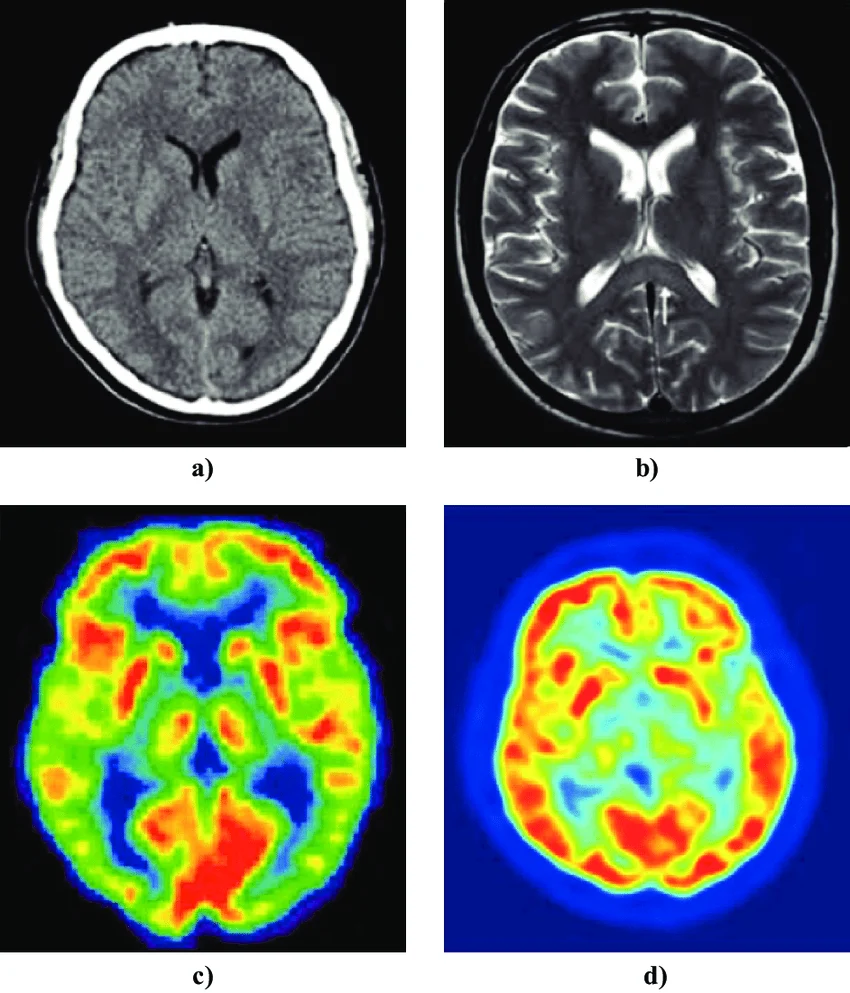
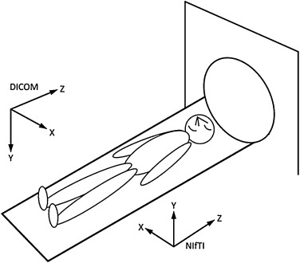

::: {.callout-note}
**Descarga:** [obtener estas notas en PDF](notas2.pdf)
:::

# Introducción

La Física Médica moderna descansa sobre un flujo de trabajo que va desde la **adquisición de la imagen** (en un tomógrafo, resonador, equipo de rayos X, PET, SPECT, ecógrafo, etc.) hasta el **análisis cuantitativo asistido por Inteligencia Artificial** (segmentación de órganos y tumores, radiómica, dosimetría, detección de patologías, generación de contornos para radioterapia, entre otros).

Para que un modelo de IA pueda "ver" una imagen médica, primero debemos entender:

1. **Qué es** una imagen médica desde el punto de vista físico y digital (dimensiones, resolución, tipo de dato, metadatos).
2. **Cómo se almacena y transmite** (formatos como DICOM y NIfTI).
3. **Qué herramientas** nos permiten leer, procesar y transformar estas imágenes en estructuras numéricas manipulables (SimpleITK).
4. **Qué framework de aprendizaje profundo** usaremos para construir y entrenar modelos (PyTorch).
5. **Qué biblioteca especializada** en imágenes médicas nos ahorra reinventar la rueda en transformaciones, arquitecturas y métricas específicas del dominio (MONAI).

Este recorrido —**Imagen → Formato → Herramienta de I/O → Framework de Deep Learning → Biblioteca de dominio**— es exactamente la estructura de estas notas y del curso.

```{mermaid}
%%| label: fig-pipeline-general
%%| fig-cap: "Pipeline general de un proyecto de IA en imágenes médicas"
flowchart LR
    A[Equipo de adquisición<br/>CT / MRI / PET / RX] --> B[Formato DICOM]
    B --> C{Preprocesamiento}
    C -->|Conversión| D[Formato NIfTI]
    C --> E[SimpleITK<br/>Lectura / Registro / Filtrado]
    E --> F[Tensores<br/>PyTorch]
    F --> G[MONAI<br/>Transforms, Redes, Métricas]
    G --> H[Modelo entrenado]
    H --> I[Inferencia clínica /<br/>Investigación]
```

::: {.callout-note}
## Objetivo de la clase
Al finalizar esta sesión, el estudiante debe ser capaz de:

- Explicar las diferencias entre una imagen "natural" (foto, JPEG) y una imagen médica volumétrica.
- Leer, inspeccionar y modificar metadatos de un archivo DICOM.
- Convertir series DICOM a NIfTI y entender por qué se hace.
- Usar SimpleITK para cargar, filtrar y registrar imágenes.
- Construir un pipeline mínimo de entrenamiento con PyTorch y MONAI.
:::

---

# Imágenes Médicas

## ¿Qué hace especial a una imagen médica?

Cuando hablamos de "imagen" en el contexto de visión por computadora clásica, casi siempre pensamos en una fotografía: una matriz bidimensional de píxeles con valores de color, pensada para ser interpretada por el ojo humano y sin ninguna referencia a una escala física del mundo real. Una imagen médica es conceptualmente distinta: es el resultado de **medir una magnitud física** (atenuación de rayos X, relajación de espines nucleares, actividad de un radiotrazador, tiempo de vuelo de un pulso de ultrasonido) y **muestrear esa medición en un espacio 2D, 3D o 4D que corresponde a un volumen real del cuerpo del paciente**, expresado en milímetros. Por eso, no alcanza con saber "qué se ve" en la imagen: hay que saber *dónde* está ese voxel en el paciente, *qué* representa numéricamente su valor y *con qué precisión/resolución* fue medido. Estas diferencias no son solo teóricas: determinan directamente cómo se diseñan las arquitecturas de red (convoluciones 3D en vez de 2D), cómo se normalizan los datos (por rango físico, no por 0-255) y cómo se evalúan los resultados (en milímetros o Unidades Hounsfield, no en píxeles).

La siguiente tabla resume las diferencias más importantes entre ambos tipos de imagen:

| Característica | Imagen natural (JPEG/PNG) | Imagen médica |
|---|---|---|
| Dimensionalidad | 2D (alto × ancho) | 2D, **3D** (volumen) o 4D (volumen + tiempo, ej. RM funcional o CT 4D en radioterapia) |
| Canales | 3 (RGB) u 1 (gris) | Generalmente 1 canal (intensidad), a veces multi-modal (T1, T2, FLAIR apilados) |
| Profundidad de bits | 8 bits (0-255) | 12-16 bits (CT: -1000 a +3000 UH; RM: rango variable) |
| Espaciado físico | No definido (píxeles) | **Espaciado real en mm** (spacing), origen y orientación en el espacio del paciente |
| Significado del valor | Color percibido | Magnitud física: densidad (CT, en Unidades Hounsfield), señal de relajación (RM), actividad (PET, en SUV) |
| Metadatos | EXIF (cámara, fecha) | Datos clínicos, del paciente, del protocolo, del equipo (DICOM tags) |

## Modalidades principales

- **CT (Tomografía Computarizada):** Basada en atenuación de rayos X. Se mide en **Unidades Hounsfield (UH)**, donde el agua = 0 UH y el aire = -1000 UH.
- **MRI (Resonancia Magnética):** Contraste basado en propiedades de relajación de protones (T1, T2, T2\*, difusión). No tiene una escala física universal (valores relativos por equipo/protocolo).
- **PET/SPECT (Medicina Nuclear):** Imagen funcional/metabólica, valores relacionados con la captación de un radiotrazador (SUV — *Standardized Uptake Value*).
- **US (Ultrasonido):** Imagen en tiempo real, muy dependiente del operador, alto ruido tipo *speckle*.
- **RX / Mamografía:** Proyección 2D de atenuación.



## Representación matricial de una imagen 3D

Una imagen médica volumétrica se representa como un arreglo $I(i,j,k)$ donde cada índice discreto (voxel) se relaciona con una coordenada física del paciente $(x,y,z)$ mediante una transformación afín:

$$
\begin{bmatrix} x \\ y \\ z \\ 1 \end{bmatrix}
=
\underbrace{\begin{bmatrix}
s_x R_{11} & s_y R_{12} & s_z R_{13} & o_x \\
s_x R_{21} & s_y R_{22} & s_z R_{23} & o_y \\
s_x R_{31} & s_y R_{32} & s_z R_{33} & o_z \\
0 & 0 & 0 & 1
\end{bmatrix}}_{\text{matriz affine}}
\begin{bmatrix} i \\ j \\ k \\ 1 \end{bmatrix}
$$

donde:

- $s_x, s_y, s_z$: **spacing** (tamaño físico del voxel en mm en cada dirección),
- $R$: matriz de **orientación** (cosenos directores de los ejes del volumen respecto al paciente),
- $o$: **origen** (coordenada física del voxel $(0,0,0)$).

Este trío **(spacing, origin, direction)** es la base de todo el manejo geométrico en SimpleITK, ITK, y del header de NIfTI. Si dos imágenes no comparten este sistema de referencia, no se pueden comparar voxel a voxel sin antes **registrarlas** (co-registro / *image registration*).

```{mermaid}
%%| label: fig-voxel-mundo
%%| fig-cap: "Del espacio índice (voxel) al espacio físico (mundo del paciente)"
flowchart LR
    subgraph Espacio_Indice["Espacio índice (i, j, k)"]
        V["Voxel (i, j, k)<br/>ej: (120, 88, 45)"]
    end
    subgraph Transformacion["Transformación afín"]
        T["Spacing, Origin, Direction"]
    end
    subgraph Espacio_Fisico["Espacio físico del paciente (mm)"]
        P["Punto (x, y, z)<br/>ej: (34.2, -12.5, 101.8) mm"]
    end
    V --> T --> P
```


## Ejemplo conceptual: de foto a volumen

```{python}
import numpy as np

# Imagen natural: (alto, ancho, canales), 8 bits, sin significado físico de escala
foto = np.random.randint(0, 256, size=(480, 640, 3), dtype=np.uint8)
print("Foto:", foto.shape, foto.dtype)

# Imagen médica CT: (slices, alto, ancho), 16 bits con signo, en Unidades Hounsfield
ct_volumen = np.random.randint(-1000, 3000, size=(120, 512, 512)).astype(np.int16)
print("CT:", ct_volumen.shape, ct_volumen.dtype)
print("Aire aprox (UH):", -1000, " | Agua (UH):", 0, " | Hueso (UH): >400")
```

---

# Imágenes DICOM

## ¿Qué es DICOM?

**DICOM** (*Digital Imaging and Communications in Medicine*) es el estándar internacional que define **tanto el formato de archivo como el protocolo de red** para el intercambio de imágenes médicas y datos asociados. No es solo un "formato de imagen": es un ecosistema completo que incluye:

- **Formato de archivo (.dcm):** imagen + metadatos en un único archivo.
- **Protocolo de comunicación:** cómo un PACS, un tomógrafo y una estación de trabajo se hablan entre sí (C-STORE, C-FIND, C-MOVE, etc.).
- **Modelo de información jerárquico:** Paciente → Estudio → Serie → Instancia (imagen).

```{mermaid}
%%| label: fig-jerarquia-dicom
%%| fig-cap: "Jerarquía de información DICOM"
flowchart TD
    Paciente["Paciente<br/>(PatientID, PatientName)"] --> Estudio1["Estudio 1<br/>(StudyInstanceUID)<br/>ej: RM de cráneo, 2024-05-10"]
    Paciente --> Estudio2["Estudio 2<br/>(StudyInstanceUID)<br/>ej: CT de tórax, 2024-08-02"]
    Estudio1 --> SerieT1["Serie: T1<br/>(SeriesInstanceUID)"]
    Estudio1 --> SerieT2["Serie: T2 FLAIR<br/>(SeriesInstanceUID)"]
    SerieT1 --> Img1["Imagen 001<br/>(SOPInstanceUID)"]
    SerieT1 --> Img2["Imagen 002"]
    SerieT1 --> ImgN["... Imagen N"]
```

::: {.callout-important}
Una **serie DICOM** casi siempre corresponde a **múltiples archivos**: un archivo `.dcm` por cada corte (slice) axial. Un volumen 3D de CT de tórax puede tener 300-600 archivos `.dcm`, uno por cada posición en Z.
:::

## Estructura de un archivo DICOM: tags

Cada archivo `.dcm` almacena información como pares **(Grupo, Elemento) → Valor**, conocidos como **tags**. Ejemplos comunes:

| Tag | Nombre | Descripción | Ejemplo |
|---|---|---|---|
| (0010,0010) | PatientName | Nombre del paciente | `DOE^JOHN` |
| (0010,0020) | PatientID | Identificador del paciente | `12345` |
| (0008,0060) | Modality | Modalidad de adquisición | `CT`, `MR`, `PT` |
| (0020,000D) | StudyInstanceUID | ID único del estudio | `1.2.840.113...` |
| (0020,000E) | SeriesInstanceUID | ID único de la serie | `1.2.840.113...` |
| (0028,0010) | Rows | Número de filas | `512` |
| (0028,0011) | Columns | Número de columnas | `512` |
| (0028,0030) | PixelSpacing | Tamaño físico del píxel (mm) | `0.68\0.68` |
| (0018,0050) | SliceThickness | Grosor de corte (mm) | `1.25` |
| (0020,0032) | ImagePositionPatient | Posición 3D del corte | `-150.0\-150.0\-90.5` |
| (0020,0037) | ImageOrientationPatient | Cosenos directores | `1\0\0\0\1\0` |
| (0028,1052) | RescaleIntercept | Para convertir a UH (CT) | `-1024` |
| (0028,1053) | RescaleSlope | Para convertir a UH (CT) | `1` |
| (7FE0,0010) | PixelData | **Los datos crudos de la imagen** | *binario* |

::: {.callout-tip}
## Conversión a Unidades Hounsfield
El valor crudo almacenado en `PixelData` **no** es directamente la Unidad Hounsfield. Se debe aplicar:
$$
\text{UH} = \text{PixelValue} \times \text{RescaleSlope} + \text{RescaleIntercept}
$$
SimpleITK e ITK aplican esto automáticamente al leer la imagen si los metadatos están presentes; si se usa `pydicom` "a mano", hay que hacerlo manualmente.
:::

## Un archivo por corte vs. un archivo multi-frame

Hasta ahora asumimos implícitamente que un volumen DICOM se compone de **muchos archivos**, uno por cada corte (*single-frame*). Esta es la convención más común en **CT** y **MR**, herencia de cómo funcionaban los equipos y los sistemas PACS clásicos: cada corte axial se adquiere, reconstruye y almacena como una instancia (SOPInstanceUID) independiente, todas compartiendo el mismo `SeriesInstanceUID`.

Sin embargo, el estándar DICOM también define objetos **multi-frame**, donde **todos los cortes (o todos los frames temporales) de un volumen se almacenan dentro de un único archivo `.dcm`**, en un solo `PixelData` que contiene la pila completa de imágenes. Esto es particularmente común en:

- **PET (Tomografía por Emisión de Positrones):** el IOD *Positron Emission Tomography Image* o, más modernamente, *Enhanced PET Image Storage*, suele almacenar el volumen 3D completo (o incluso series dinámicas 4D) en un solo archivo multi-frame.
- **SPECT (Tomografía por Emisión de Fotón Único):** el IOD *Nuclear Medicine Image Storage* frecuentemente agrupa todos los cortes de la reconstrucción tomográfica en un único archivo, con un tag `NumberOfFrames` (0028,0008) que indica cuántos cortes contiene.
- Otras modalidades: **Enhanced CT/MR Storage** (versiones "enhanced" más recientes de CT y MR también pueden ser multi-frame), angiografía rotacional, cine cardíaco, RX de sustracción digital (DSA).

```{mermaid}
%%| label: fig-single-vs-multiframe
%%| fig-cap: "Single-frame (CT/MR clásico) vs. Multi-frame (SPECT/PET típico)"
flowchart TB
    subgraph SF["Single-frame — ej. CT convencional"]
        direction LR
        S1["corte_001.dcm"] ~~~ S2["corte_002.dcm"] ~~~ S3["..."] ~~~ SN["corte_N.dcm"]
    end
    subgraph MF["Multi-frame — ej. SPECT/PET"]
        direction LR
        M1["estudio.dcm<br/>PixelData contiene<br/>los N frames apilados<br/>+ tag NumberOfFrames = N"]
    end
```

### Tags relevantes para identificar/leer un multi-frame

| Tag | Nombre | Rol |
|---|---|---|
| (0028,0008) | NumberOfFrames | Cantidad de cortes/frames contenidos en el `PixelData` |
| (0028,0009) | FrameIncrementPointer | Indica qué tag describe cómo varían los frames (ej. posición o tiempo) |
| (0054,0080) | SliceVector | Orden/índice de los cortes dentro del volumen (Medicina Nuclear) |
| (0018,1063) | FrameTime | Duración de cada frame, en estudios dinámicos (ms) |
| (0020,9111) / (5200,9230) | Frame Functional Groups (Enhanced) | Metadatos por-frame en objetos "Enhanced" (posición, orientación individuales) |

::: {.callout-important}
## Implicancia práctica para la lectura de datos
Un pipeline de preprocesamiento que asuma "una serie = una carpeta con muchos archivos .dcm" (como el `ImageSeriesReader` que usamos para CT) **fallará silenciosamente o directamente arrojará error si el archivo de esa serie es multi-frame**, porque en ese caso ¡la serie completa es un único archivo! Por eso, para SPECT/PET conviene:

1. Verificar primero si `NumberOfFrames` está presente y es mayor a 1.
2. Si es multi-frame, leer el volumen completo con `sitk.ReadImage()` directamente sobre ese único archivo (no con `ImageSeriesReader`).
3. Si es single-frame, usar `ImageSeriesReader` como en CT/MR.
:::

```{python}
import pydicom
import SimpleITK as sitk

ds = pydicom.dcmread("estudio_spect.dcm", stop_before_pixels=True)

if hasattr(ds, "NumberOfFrames") and int(ds.NumberOfFrames) > 1:
    print(f"Archivo multi-frame con {ds.NumberOfFrames} cortes/frames")
    # Un solo archivo contiene todo el volumen 3D (o 4D)
    volumen = sitk.ReadImage("estudio_spect.dcm")
else:
    print("Archivo single-frame: se espera una serie de múltiples archivos")
    reader = sitk.ImageSeriesReader()
    archivos = reader.GetGDCMSeriesFileNames("carpeta_serie/")
    reader.SetFileNames(archivos)
    volumen = reader.Execute()

print("Tamaño del volumen:", volumen.GetSize())
```

## Consideraciones críticas: anonimización y privacidad

Los archivos DICOM contienen **información de identificación del paciente (PHI/PII)**: nombre, fecha de nacimiento, número de historia clínica, e incluso puede haber texto quemado en la imagen (*burned-in annotation*). Antes de usar datos DICOM para investigación o entrenamiento de modelos:

1. **Anonimizar/de-identificar** los tags (nombre, ID, fechas, instituciones).
2. Verificar que no haya *burned-in PHI* en los píxeles.
3. Cumplir normativa local (HIPAA, GDPR, Habeas Data en Argentina — Ley 25.326).

## Ejemplo de lectura con `pydicom`

```{python}
import pydicom

ds = pydicom.dcmread("ejemplo.dcm")

print("Modalidad:", ds.Modality)
print("Dimensiones:", ds.Rows, "x", ds.Columns)
print("PixelSpacing:", ds.PixelSpacing)
print("SliceThickness:", ds.SliceThickness)

# Acceso a los píxeles crudos
pixel_array = ds.pixel_array
print("Shape:", pixel_array.shape, "dtype:", pixel_array.dtype)

# Conversión manual a Unidades Hounsfield (si es CT)
if ds.Modality == "CT":
    slope = float(ds.RescaleSlope)
    intercept = float(ds.RescaleIntercept)
    hu_image = pixel_array * slope + intercept
    print("Rango UH:", hu_image.min(), "-", hu_image.max())
```

## Lectura de una serie completa (volumen 3D) con SimpleITK

```{python}
import SimpleITK as sitk

reader = sitk.ImageSeriesReader()
series_ids = reader.GetGDCMSeriesIDs("carpeta_dicom/")
print("Series encontradas:", series_ids)

dicom_files = reader.GetGDCMSeriesFileNames("carpeta_dicom/", series_ids[0])
reader.SetFileNames(dicom_files)
volumen = reader.Execute()

print("Tamaño:", volumen.GetSize())        # (X, Y, Z)
print("Spacing:", volumen.GetSpacing())    # mm
print("Origen:", volumen.GetOrigin())
print("Dirección:", volumen.GetDirection())
```

---

# Imágenes NIfTI

## ¿Qué es NIfTI y por qué existe?

**NIfTI** (*Neuroimaging Informatics Technology Initiative*) es un formato creado originalmente para **neuroimagen** (fMRI, RM estructural) como respuesta a las limitaciones del antiguo formato *Analyze 7.5*. A diferencia de DICOM:

- **Un solo archivo (o par) representa el volumen 3D completo**, no un archivo por corte.
- Extensiones: **`.nii`** (un solo archivo, header + datos) o **`.nii.gz`** (comprimido, el más usado) o el par **`.hdr` + `.img`** (formato antiguo Analyze-compatible).
- Header **mucho más simple** que DICOM (no tiene datos clínicos del paciente, protocolo, institución, etc.).
- Es el formato preferido para **investigación, benchmarks públicos y frameworks de deep learning** (BraTS, Medical Segmentation Decathlon, etc. distribuyen datos en NIfTI).

## DICOM vs. NIfTI: comparación directa

| Aspecto | DICOM | NIfTI |
|---|---|---|
| Uso principal | Clínico, comunicación entre equipos (PACS) | Investigación, procesamiento, deep learning |
| Estructura | 1 archivo por corte (muchos archivos por volumen) | 1 archivo por volumen completo |
| Metadatos | Extensos (paciente, protocolo, institución) | Mínimos (spacing, orientación, tipo de dato) |
| Contiene PHI | Sí (por defecto) | No, generalmente ya anonimizado |
| Orientación espacial | ImagePositionPatient / ImageOrientationPatient | Matriz **qform**/**sform** (affine 4x4) |
| Estándar de comunicación en red | Sí (protocolo DICOM) | No |
| Compresión nativa | Variable (a veces sin comprimir) | `.nii.gz` (gzip) muy común |

## Estructura del header NIfTI

El header NIfTI-1 tiene 348 bytes con campos clave:

- `dim[8]`: dimensiones (ej: `[3, 256, 256, 150, 1, 1, 1, 1]` → volumen 3D de 256×256×150).
- `pixdim[8]`: tamaño físico de cada dimensión (spacing).
- `sform`/`qform`: matrices afines que llevan de índice de voxel a coordenadas del mundo (equivalente al trío spacing/origin/direction de DICOM, pero condensado en una matriz 4×4).
- `datatype`: tipo de dato (int16, float32, etc.).
- Códigos de orientación: **RAS**, **LAS**, etc. (convención de ejes: Right/Left, Anterior/Posterior, Superior/Inferior).

::: {.callout-note}
## Recordatorio: ¿qué es una transformación afín?
Una **transformación afín** es una función que combina una transformación **lineal** (rotación, escala, cizalladura/*shear*) con una **traslación**. En 3D se representa cómodamente con una matriz de 4×4 usando **coordenadas homogéneas** (se le agrega un "1" extra al vector de posición para poder incluir la traslación dentro de una única multiplicación de matrices):

$$
\begin{bmatrix} x \\ y \\ z \\ 1 \end{bmatrix}
=
\begin{bmatrix}
a_{11} & a_{12} & a_{13} & t_x \\
a_{21} & a_{22} & a_{23} & t_y \\
a_{31} & a_{32} & a_{33} & t_z \\
0 & 0 & 0 & 1
\end{bmatrix}
\begin{bmatrix} i \\ j \\ k \\ 1 \end{bmatrix}
$$

La submatriz $3\times3$ ($a_{11}$ … $a_{33}$) codifica rotación, escala y shear; el vector $(t_x, t_y, t_z)$ codifica la traslación (el origen). Lo importante de una transformación afín es que **preserva líneas rectas y el paralelismo** (una grilla de voxels sigue siendo una grilla regular después de transformarse), pero **no necesariamente preserva ángulos ni distancias** si hay escala o shear. Es exactamente el tipo de matriz que ya usamos más arriba en @fig-voxel-mundo para llevar el índice de un voxel $(i,j,k)$ a su coordenada física $(x,y,z)$ en mm — y es también, matemáticamente, lo que hay detrás de las matrices qform/sform de NIfTI y del trío spacing/origin/direction de SimpleITK: **distintas formas de guardar/parametrizar la misma matriz afín 4×4.**

Un caso particular importante es la **transformación rígida** (*rigid*): cuando la submatriz $3\times3$ es solo una rotación pura (sin escala ni shear), la transformación preserva además ángulos y distancias — es la que corresponde, por ejemplo, a mover o rotar un objeto sólido sin deformarlo. El qform de NIfTI está restringido a este caso particular.
:::

### Las matrices qform y sform

NIfTI-1 define **dos matrices afines independientes** para llevar del espacio de índices de voxel $(i,j,k)$ al espacio físico del mundo $(x,y,z)$: **qform** y **sform**. Esto suele confundir a quien viene de trabajar solo con DICOM, donde existe un único mecanismo (ImagePositionPatient/ImageOrientationPatient) para definir la geometría. Que existan dos matrices en NIfTI no es redundancia porque cada una sirve a un propósito distinto:

- **qform (`qform_code`, cuaternión + `pixdim`):** Codifica la orientación mediante un **cuaternión** (una representación matemática compacta y numéricamente estable de una rotación 3D, sin escala ni cizalladura). Se usa típicamente para representar la **orientación "nativa" del escáner** en el momento de la adquisición — es decir, cómo el equipo generó el volumen. Solo admite transformaciones rígidas (rotación + traslación), consistente con "así es como el escáner orientó los cortes".
- **sform (`sform_code`, matriz 4×4 general):** Es una matriz afín completa de 4×4, que además de rotación y traslación puede incluir **escala anisotrópica y cizalladura (shear)**. Se usa para representar transformaciones posteriores a la adquisición, como el resultado de un **registro (co-registro)** a un espacio estándar — por ejemplo, llevar un cerebro individual al espacio del atlas **MNI152** o **Talairach**.

Cada matriz tiene un código de estado asociado (`qform_code`, `sform_code`) que indica si es válida y qué tipo de espacio de referencia representa (0 = desconocido, 1 = espacio del scanner, 2 = espacio alineado a otro archivo, 3 = espacio Talairach, 4 = espacio MNI152). **Cuando ambas están presentes y difieren, la convención más aceptada (y la que usan NiBabel, ITK y FSL) es dar prioridad al sform** por ser la transformación más general y, generalmente, la más "actualizada" (post-procesamiento).

```{python}
import nibabel as nib

img = nib.load("volumen_paciente.nii.gz")

print("qform code:", img.header['qform_code'], "\n", img.get_qform())
print("sform code:", img.header['sform_code'], "\n", img.get_sform())

# La matriz que NiBabel usa por defecto para img.affine
# sigue la lógica de prioridad sform > qform > "fallback" (pixdim + esquina)
print("affine efectivo:\n", img.affine)
```

::: {.callout-warning}
## Cuidado con las convenciones de orientación
NIfTI suele usar convención **RAS+** (eje X apunta a la derecha, Y hacia adelante, Z hacia arriba), mientras que DICOM usa convención **LPS** (Left, Posterior, Superior). Herramientas como ITK/SimpleITK manejan esta diferencia internamente, pero si se mezclan bibliotecas (ej. NiBabel + SimpleITK) sin cuidado, es una **fuente clásica de bugs** donde la imagen aparece "espejada" o rotada.

)

- **LPS**: Left, Posterior, Superior (DICOM)
- **RAS**: Right, Anterior, Superior (NIfTI)
:::

::: {.callout-tip}
## Relación con el trío spacing/origin/direction de SimpleITK
Conceptualmente, la matriz **qform/sform de NIfTI** cumple exactamente el mismo rol que el trío **(spacing, origin, direction)** que vimos en la sección de Imágenes Médicas y que usa SimpleITK/ITK: ambos son formas de describir la transformación afín voxel→mundo. SimpleITK, al leer un NIfTI, descompone automáticamente la matriz afín (sform o qform, según prioridad) en spacing + origin + direction; y al escribir, hace el camino inverso.
:::

## Conversión DICOM → NIfTI

Es una de las tareas más comunes en un pipeline de investigación. Herramientas típicas: `dcm2niix`, SimpleITK, `dicom2nifti`.

```{python}
import SimpleITK as sitk

# Leer serie DICOM (como en la sección anterior)
reader = sitk.ImageSeriesReader()
series_ids = reader.GetGDCMSeriesIDs("carpeta_dicom/")
dicom_files = reader.GetGDCMSeriesFileNames("carpeta_dicom/", series_ids[0])
reader.SetFileNames(dicom_files)
volumen = reader.Execute()

# Guardar como NIfTI comprimido
sitk.WriteImage(volumen, "volumen_paciente.nii.gz")
```

```{bash}
# Alternativa muy usada en la práctica clínica/investigación: dcm2niix
dcm2niix -z y -f "paciente_%p_%s" -o salida/ carpeta_dicom/
```

## Lectura de NIfTI con NiBabel

```{python}
import nibabel as nib
import numpy as np

img = nib.load("volumen_paciente.nii.gz")

datos = img.get_fdata()         # array numpy (X, Y, Z)
affine = img.affine             # matriz 4x4
header = img.header

print("Shape:", datos.shape)
print("Affine:\n", affine)
print("Voxel size (mm):", header.get_zooms())
```

```{mermaid}
%%| label: fig-dicom-nifti
%%| fig-cap: "Flujo típico: adquisición en DICOM, investigación en NIfTI"
flowchart LR
    A["Tomógrafo / Resonador"] -->|"genera"| B["Serie DICOM<br/>(N archivos .dcm)"]
    B -->|"envío"| C["PACS<br/>(archivo clínico)"]
    B -->|"exportación +<br/>anonimización"| D["dcm2niix /<br/>SimpleITK"]
    D --> E["Volumen NIfTI<br/>(1 archivo .nii.gz)"]
    E --> F["Pipeline de<br/>investigación / IA"]
```

---

# SimpleITK

## ¿Qué es SimpleITK?

**SimpleITK** es una interfaz simplificada (con bindings en Python, R, C++, Java, etc.) sobre **ITK** (*Insight Segmentation and Registration Toolkit*), la biblioteca de referencia en procesamiento de imágenes médicas desde hace más de 20 años. SimpleITK expone de forma sencilla capacidades que en ITK "puro" requerirían mucho código de plantillas C++:

- **Lectura/escritura** de decenas de formatos (DICOM, NIfTI, NRRD, MetaImage, nrrd, nii, etc.) con una API unificada.
- **Filtrado** (suavizado, realce de bordes, morfología matemática).
- **Segmentación clásica** (umbralización, *region growing*, *level sets*, watershed).
- **Registro de imágenes** (*image registration*): alinear dos volúmenes (ej. CT de planificación vs. CT de seguimiento; o RM T1 vs. T2 del mismo paciente).
- Manejo nativo del sistema de coordenadas físicas (spacing, origin, direction) — **algo que un array de NumPy puro no sabe hacer**.

## La clase `Image`: más que un array

Un objeto `sitk.Image` **no es solo una matriz de números**: lleva consigo su información geométrica. Esta es la diferencia clave frente a trabajar directamente con `numpy.ndarray`.

```{python}
import SimpleITK as sitk

imagen = sitk.ReadImage("volumen_paciente.nii.gz")

print("Tamaño (voxels):", imagen.GetSize())          # (X, Y, Z)
print("Spacing (mm):", imagen.GetSpacing())
print("Origen (mm):", imagen.GetOrigin())
print("Dirección:", imagen.GetDirection())
print("Tipo de píxel:", imagen.GetPixelIDTypeAsString())

# Conversión a NumPy para procesamiento con otras librerías (ojo: cambia el orden de ejes)
array = sitk.GetArrayFromImage(imagen)   # devuelve (Z, Y, X)
print("Shape NumPy:", array.shape)

# Y de vuelta a sitk.Image (hay que reasignar la información geométrica)
nueva_imagen = sitk.GetImageFromArray(array)
nueva_imagen.CopyInformation(imagen)  # ¡crítico! copiar spacing/origin/direction
```

::: {.callout-important}
## Trampa clásica: orden de ejes
`sitk.Image.GetSize()` devuelve `(X, Y, Z)`, pero al convertir con `sitk.GetArrayFromImage()` el array de NumPy resultante tiene forma `(Z, Y, X)` (convención C-order, más eficiente para iterar por cortes). Es una fuente muy común de errores al mezclar SimpleITK con PyTorch/MONAI.
:::

## Ejemplo: filtrado y realce

```{python}
import SimpleITK as sitk

imagen = sitk.ReadImage("volumen_paciente.nii.gz", sitk.sitkFloat32)

# Suavizado Gaussiano (reducción de ruido)
suavizada = sitk.SmoothingRecursiveGaussian(imagen, sigma=1.5)

# Realce de bordes / gradiente
bordes = sitk.SobelEdgeDetection(imagen)

# Umbralización simple (ej. segmentar hueso en CT, UH > 300)
mascara_hueso = sitk.BinaryThreshold(
    imagen, lowerThreshold=300, upperThreshold=3000,
    insideValue=1, outsideValue=0
)

sitk.WriteImage(mascara_hueso, "mascara_hueso.nii.gz")
```

## Ejemplo: registro de imágenes (*image registration*)

Uno de los usos más importantes en física médica: alinear dos volúmenes (por ejemplo, un CT de planificación de radioterapia con un CT de control).

```{python}
import SimpleITK as sitk

imagen_fija = sitk.ReadImage("ct_planificacion.nii.gz", sitk.sitkFloat32)
imagen_movil = sitk.ReadImage("ct_seguimiento.nii.gz", sitk.sitkFloat32)

# Método de registro: transformación rígida + métrica de información mutua
metodo_registro = sitk.ImageRegistrationMethod()
metodo_registro.SetMetricAsMattesMutualInformation(numberOfHistogramBins=50)
metodo_registro.SetOptimizerAsRegularStepGradientDescent(
    learningRate=1.0, minStep=1e-4, numberOfIterations=200
)
metodo_registro.SetInitialTransform(
    sitk.CenteredTransformInitializer(
        imagen_fija, imagen_movil, sitk.Euler3DTransform()
    )
)
metodo_registro.SetInterpolator(sitk.sitkLinear)

transformacion_final = metodo_registro.Execute(imagen_fija, imagen_movil)

# Aplicar la transformación para llevar la imagen móvil al espacio de la fija
imagen_registrada = sitk.Resample(
    imagen_movil, imagen_fija, transformacion_final,
    sitk.sitkLinear, 0.0, imagen_movil.GetPixelID()
)

sitk.WriteImage(imagen_registrada, "ct_seguimiento_registrado.nii.gz")
```

```{mermaid}
%%| label: fig-registro
%%| fig-cap: "Concepto de registro de imágenes"
flowchart LR
    F["Imagen fija<br/>(referencia)"] --> M["Métrica de similitud<br/>(información mutua)"]
    Mv["Imagen móvil"] --> T["Transformación<br/>(rígida / afín / deformable)"]
    T --> M
    M --> Opt["Optimizador<br/>(gradiente descendente)"]
    Opt -->|"actualiza parámetros"| T
    Opt -->|"convergencia"| R["Imagen móvil<br/>registrada al espacio fijo"]
```

## Rol de SimpleITK en el pipeline de IA

SimpleITK normalmente se usa en la etapa de **preprocesamiento** antes de entrar a PyTorch/MONAI: lectura de archivos, resampleo a un spacing isotrópico común, normalización de intensidades, recorte de la región de interés, y conversión final a arrays/tensores.

---

# PyTorch

## ¿Qué es PyTorch y por qué lo usamos?

**PyTorch** es el framework de *deep learning* de código abierto (desarrollado originalmente por Meta AI) más utilizado actualmente en investigación, incluyendo el dominio biomédico. Sus ventajas clave para este curso:

- **Tensores** con API muy similar a NumPy, pero con soporte nativo para **GPU** (aceleración masiva necesaria para volúmenes 3D).
- **Autograd**: diferenciación automática para calcular gradientes y entrenar redes mediante retropropagación.
- **`torch.nn`**: módulo con capas (convolucionales, normalización, activación) para construir arquitecturas.
- Ecosistema maduro y es la base sobre la cual está construido **MONAI**.

## Tensores: la estructura de datos fundamental

```{python}
import torch

# Un volumen CT como tensor: (Canal, Profundidad, Alto, Ancho)
volumen = torch.randn(1, 128, 128, 128)  # 1 canal, 128^3 voxels
print("Shape:", volumen.shape)
print("Dispositivo:", volumen.device)

# Mover a GPU si está disponible
device = torch.device("cuda" if torch.cuda.is_available() else "cpu")
volumen = volumen.to(device)
print("Ahora en:", volumen.device)

# Un batch de N pacientes: (N, C, D, H, W)
batch = torch.randn(4, 1, 96, 96, 96).to(device)
```

## Convención de dimensiones en PyTorch para imágenes médicas

| Dimensión | 2D (ej. radiografía) | 3D (ej. CT/RM completo) |
|---|---|---|
| Formato estándar | `(N, C, H, W)` | `(N, C, D, H, W)` |
| N | Tamaño del batch | Tamaño del batch |
| C | Canales (1 para gris, 3 para RGB, o múltiples modalidades apiladas) | Igual |
| D | — | Profundidad (número de cortes) |
| H, W | Alto, Ancho | Alto, Ancho |

## Autograd: el motor de entrenamiento

```{python}
import torch

x = torch.tensor([2.0], requires_grad=True)
y = x ** 2 + 3 * x

y.backward()  # calcula dy/dx automáticamente
print("Gradiente dy/dx:", x.grad)  # dy/dx = 2x + 3 = 7.0
```

## Ejemplo mínimo: una red convolucional 3D simple

```{python}
import torch
import torch.nn as nn

class CNN3DSimple(nn.Module):
    """Red convolucional 3D simple para clasificación binaria
    (ej. presencia/ausencia de nódulo pulmonar en un parche de CT)."""
    def __init__(self, in_channels=1, num_classes=2):
        super().__init__()
        self.features = nn.Sequential(
            nn.Conv3d(in_channels, 16, kernel_size=3, padding=1),
            nn.BatchNorm3d(16),
            nn.ReLU(inplace=True),
            nn.MaxPool3d(2),

            nn.Conv3d(16, 32, kernel_size=3, padding=1),
            nn.BatchNorm3d(32),
            nn.ReLU(inplace=True),
            nn.MaxPool3d(2),
        )
        self.clasificador = nn.Sequential(
            nn.AdaptiveAvgPool3d(1),
            nn.Flatten(),
            nn.Linear(32, num_classes),
        )

    def forward(self, x):
        x = self.features(x)
        x = self.clasificador(x)
        return x

modelo = CNN3DSimple()
entrada_ejemplo = torch.randn(2, 1, 64, 64, 64)  # batch=2
salida = modelo(entrada_ejemplo)
print("Salida:", salida.shape)  # (2, 2) -> logits por clase
```

## Bucle de entrenamiento típico

```{python}
import torch
import torch.nn as nn
import torch.optim as optim

modelo = CNN3DSimple().to(device)
criterio = nn.CrossEntropyLoss()
optimizador = optim.Adam(modelo.parameters(), lr=1e-4)

modelo.train()
for epoca in range(10):
    for volumenes, etiquetas in dataloader:  # dataloader definido con Dataset propio
        volumenes = volumenes.to(device)
        etiquetas = etiquetas.to(device)

        optimizador.zero_grad()
        salidas = modelo(volumenes)
        perdida = criterio(salidas, etiquetas)
        perdida.backward()
        optimizador.step()

    print(f"Época {epoca+1}: pérdida = {perdida.item():.4f}")
```

```{mermaid}
%%| label: fig-ciclo-entrenamiento
%%| fig-cap: "Ciclo de entrenamiento en PyTorch"
flowchart LR
    A["Batch de datos<br/>(volúmenes + etiquetas)"] --> B["Forward pass<br/>modelo(x)"]
    B --> C["Cálculo de pérdida<br/>criterio(salida, etiqueta)"]
    C --> D["Backward pass<br/>perdida.backward()"]
    D --> E["Actualización de pesos<br/>optimizador.step()"]
    E -->|"siguiente batch"| A
```

---

# MONAI

## ¿Qué es MONAI?

**MONAI** (*Medical Open Network for AI*) es un framework de código abierto **construido sobre PyTorch**, desarrollado por un consorcio que incluye NVIDIA, King's College London y otras instituciones, **específicamente diseñado para imágenes médicas**. Su objetivo es evitar que cada laboratorio reimplemente desde cero:

- Lectores de DICOM/NIfTI integrados con el `Dataset` de PyTorch.
- Transformaciones (*transforms*) conscientes del dominio médico (que respetan spacing, orientación, intensidades en UH, etc.).
- Arquitecturas de referencia ya implementadas (U-Net, UNETR, SegResNet, DenseNet, etc.).
- Métricas y funciones de pérdida específicas (Dice, Hausdorff, IoU 3D).
- Utilidades de inferencia por *sliding window* (necesaria porque los volúmenes 3D completos no siempre caben en memoria de GPU).

::: {.callout-note}
## Relación entre las piezas del curso
**MONAI no reemplaza a SimpleITK ni a PyTorch: los integra.** MONAI usa por debajo lectores basados en ITK/NiBabel para I/O, y todos sus modelos son módulos `torch.nn.Module` estándar. Es la "capa de dominio médico" sobre el framework general.
:::

```{mermaid}
%%| label: fig-monai-stack
%%| fig-cap: "MONAI como capa de dominio sobre PyTorch"
flowchart TB
    subgraph L1["Capa de bajo nivel"]
        S["SimpleITK / ITK / NiBabel<br/>(I/O, geometría física)"]
    end
    subgraph L2["Framework general de Deep Learning"]
        P["PyTorch<br/>(tensores, autograd, nn.Module)"]
    end
    subgraph L3["Capa de dominio médico"]
        M["MONAI<br/>(transforms, redes, métricas, inferencia)"]
    end
    S --> M
    P --> M
    M --> A["Aplicación final:<br/>segmentación, clasificación,<br/>detección, radiómica"]
```

## Transforms de MONAI

Las *transforms* son el corazón del preprocesamiento en MONAI y siguen dos estilos:

- **Diccionario (`d`)**: operan sobre un diccionario `{"image": ..., "label": ...}`, aplicando la misma transformación geométrica sincronizada a la imagen y su máscara. **Es el estilo recomendado en segmentación.**
- **Array**: operan directamente sobre un tensor/array.

```{python}
from monai.transforms import (
    Compose, LoadImaged, EnsureChannelFirstd, Spacingd, Orientationd,
    ScaleIntensityRanged, CropForegroundd, RandCropByPosNegLabeld,
    RandFlipd, RandRotate90d, ToTensord,
)

transformaciones_entrenamiento = Compose([
    LoadImaged(keys=["image", "label"]),                  # lee NIfTI/DICOM
    EnsureChannelFirstd(keys=["image", "label"]),          # asegura formato (C, D, H, W)
    Orientationd(keys=["image", "label"], axcodes="RAS"),  # estandariza orientación
    Spacingd(
        keys=["image", "label"],
        pixdim=(1.0, 1.0, 1.0),                             # resampleo a 1mm isotrópico
        mode=("bilinear", "nearest"),
    ),
    ScaleIntensityRanged(                                   # normalización de UH (CT)
        keys=["image"], a_min=-175, a_max=250,
        b_min=0.0, b_max=1.0, clip=True,
    ),
    CropForegroundd(keys=["image", "label"], source_key="image"),
    RandCropByPosNegLabeld(                                  # muestreo balanceado de parches
        keys=["image", "label"], label_key="label",
        spatial_size=(96, 96, 96), pos=1, neg=1, num_samples=4,
    ),
    RandFlipd(keys=["image", "label"], prob=0.5, spatial_axis=0),
    RandRotate90d(keys=["image", "label"], prob=0.5),
    ToTensord(keys=["image", "label"]),
])
```

## Dataset y DataLoader con MONAI

```{python}
from monai.data import Dataset, DataLoader, CacheDataset

archivos_entrenamiento = [
    {"image": "paciente001_ct.nii.gz", "label": "paciente001_mask.nii.gz"},
    {"image": "paciente002_ct.nii.gz", "label": "paciente002_mask.nii.gz"},
    # ...
]

# CacheDataset acelera épocas posteriores cacheando transformaciones deterministas
dataset_entrenamiento = CacheDataset(
    data=archivos_entrenamiento,
    transform=transformaciones_entrenamiento,
    cache_rate=1.0,
    num_workers=4,
)

dataloader_entrenamiento = DataLoader(
    dataset_entrenamiento, batch_size=2, shuffle=True, num_workers=4
)
```

## Arquitecturas listas para usar: ejemplo con U-Net 3D

```{python}
from monai.networks.nets import UNet
from monai.networks.layers import Norm

modelo = UNet(
    spatial_dims=3,
    in_channels=1,
    out_channels=2,                 # ej: fondo + órgano de interés
    channels=(16, 32, 64, 128, 256),
    strides=(2, 2, 2, 2),
    num_res_units=2,
    norm=Norm.BATCH,
).to(device)
```

## Pérdida y métrica específicas de segmentación: Dice

$$
\text{DiceLoss} = 1 - \frac{2 |A \cap B|}{|A| + |B|}
$$

donde $A$ es la máscara predicha y $B$ la máscara de referencia (*ground truth*).

```{python}
from monai.losses import DiceLoss
from monai.metrics import DiceMetric
from monai.inferers import sliding_window_inference

criterio = DiceLoss(to_onehot_y=True, softmax=True)
metrica_dice = DiceMetric(include_background=False, reduction="mean")

optimizador = torch.optim.Adam(modelo.parameters(), lr=1e-4)

for epoca in range(50):
    modelo.train()
    for batch in dataloader_entrenamiento:
        imagenes = batch["image"].to(device)
        etiquetas = batch["label"].to(device)

        optimizador.zero_grad()
        salidas = modelo(imagenes)
        perdida = criterio(salidas, etiquetas)
        perdida.backward()
        optimizador.step()

    # Inferencia por ventana deslizante para volúmenes completos en validación
    modelo.eval()
    with torch.no_grad():
        for batch_val in dataloader_validacion:
            imagenes_val = batch_val["image"].to(device)
            etiquetas_val = batch_val["label"].to(device)
            salidas_val = sliding_window_inference(
                imagenes_val, roi_size=(96, 96, 96),
                sw_batch_size=4, predictor=modelo
            )
            metrica_dice(y_pred=salidas_val, y=etiquetas_val)

        dice_promedio = metrica_dice.aggregate().item()
        metrica_dice.reset()
        print(f"Época {epoca+1}: Dice de validación = {dice_promedio:.4f}")
```


```{mermaid}
%%| label: fig-pipeline-monai
%%| fig-cap: "Pipeline completo de segmentación con MONAI"
flowchart TB
    A["Archivos NIfTI<br/>(image, label)"] --> B["Transforms MONAI<br/>(Load, Spacing, Crop, Augment)"]
    B --> C["Dataset / DataLoader"]
    C --> D["Modelo: UNet 3D<br/>(monai.networks.nets)"]
    D --> E["DiceLoss +<br/>Backpropagation"]
    E --> F{"¿Convergió?"}
    F -->|No| C
    F -->|Sí| G["Sliding Window Inference<br/>sobre volumen completo"]
    G --> H["Métrica Dice /<br/>Evaluación clínica"]
```

## Tabla resumen: ¿qué resuelve cada herramienta?

| Herramienta | Rol principal | Analogía |
|---|---|---|
| **DICOM** | Formato/protocolo de datos clínicos | El "idioma" en que habla el hospital |
| **NIfTI** | Formato de datos para investigación | El "idioma" en que habla la ciencia de datos |
| **SimpleITK** | I/O + procesamiento geométrico clásico | El "traductor y editor" de imágenes |
| **PyTorch** | Motor de cómputo y aprendizaje profundo | El "motor del auto" |
| **MONAI** | Capa de dominio médico sobre PyTorch | El "kit específico para off-road" sobre ese motor |

---

::: {.callout-tip}
## Lecturas recomendadas
- NEMA. *DICOM Standard*, Parte 3: Information Object Definitions.
- Cardoso, M.J. et al. "MONAI: An open-source framework for deep learning in healthcare imaging" (2022).
- Documentación oficial: `simpleitk.org`, `pytorch.org`, `monai.io`.
:::
