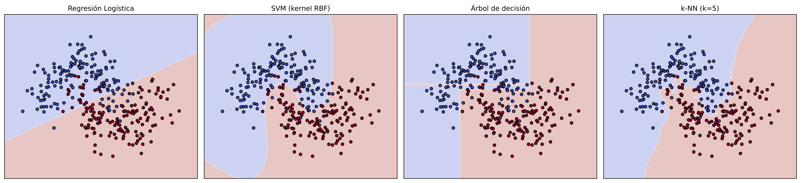
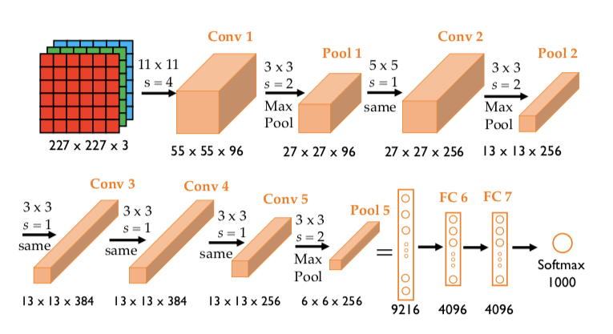
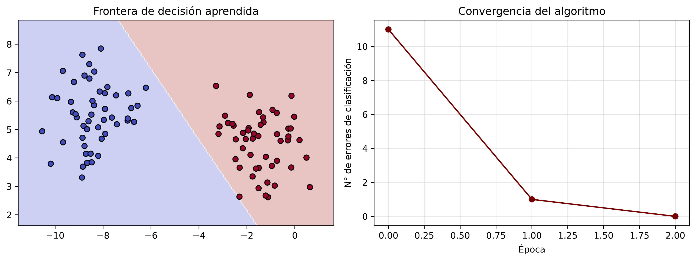
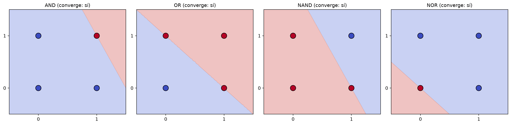
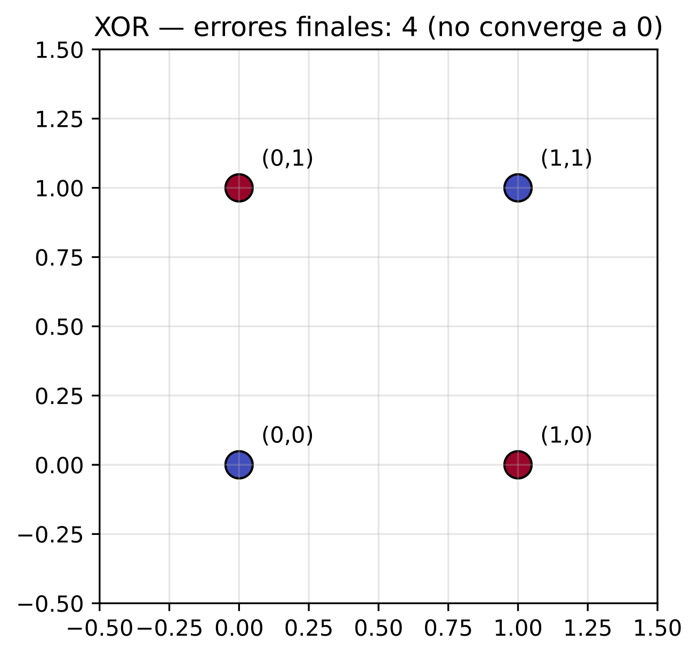

## ¿Qué vamos a ver hoy? {.smaller}

- Repasar los modelos clásicos de aprendizaje automático y por qué siguen siendo el baseline obligado en Física Médica.
- Comprender el contexto histórico y conceptual que dio origen al Deep Learning — con un repaso año a año de la última década.
- Formalizar matemáticamente el Perceptrón, entender su algoritmo de aprendizaje y sus limitaciones (el problema XOR).
- Conectar cada bloque con el siguiente: regresión logística → perceptrón → perceptrón multicapa.

## Agenda

1. Revisión de modelos clásicos
2. Introducción al Deep Learning: breve historia
3. La última década de IA, año a año (2013–2026)
4. Redes neuronales simples: el algoritmo del Perceptrón
5. De AND y OR a XOR: qué puede (y no puede) aprender un perceptrón
6. Síntesis y puente hacia la próxima clase

# Bloque 1 · Revisión de modelos clásicos

## ¿Por qué empezar por lo clásico?

- En Física Médica, la interpretabilidad, los datasets acotados y la trazabilidad regulatoria (FDA/ANMAT) hacen que los modelos clásicos sigan siendo protagonistas.
- Antes de introducir redes profundas, es indispensable entender los métodos que dominan hoy el análisis de datos médicos.
- Serán nuestro punto de comparación obligado para todo lo que veremos en Deep Learning.

## La regla de oro {.center}


> Todo pipeline de Deep Learning en Física Médica debe compararse contra un baseline clásico bien ajustado. Si el modelo profundo no supera con claridad a la regresión logística o cualquier otro modelo clásico (árbol de decisión, SVM, k-NN), probablemente su complejidad adicional no se justifica.


## Paradigmas del aprendizaje automático {.smaller}

Podemos organizar una gran parte de los métodos de aprendizaje automático según la información disponible durante el entrenamiento.

| Paradigma          | Información disponible          | Objetivo                            |
| ------------------ | ------------------------------- | ----------------------------------- |
| **Supervisado**    | $(\mathbf{x},y)$                | Aprender a predecir $y$             |
| **No supervisado** | $\mathbf{x}$                    | Descubrir estructura en los datos   |
| **Por refuerzo**   | Estados, acciones y recompensas | Aprender una estrategia de decisión |

> **Aprendizaje auto-supervisado (*self-supervised learning*)**
> En este caso, las etiquetas utilizadas para entrenar el modelo se construyen automáticamente a partir de los propios datos.

##  Riesgo esperado y riesgo empírico {.smaller}


El **riesgo esperado** o **riesgo real** de un modelo es:

$$
R(f)
=
\mathbb{E}_{(\mathbf{x},y)\sim P}
\left[
\mathcal{L}(f(\mathbf{x}),y)
\right],
$$

donde $P(\mathbf{x},y)$ representa la distribución de probabilidad que genera los datos.

El problema es que **no conocemos $P$**.

Solo disponemos de una muestra finita:

$$
\mathcal{D}
=
{(\mathbf{x}_ i,y_i)}_{i=1}^{N}
$$

Por lo tanto, podemos calcular el **riesgo empírico**:

$$
\hat R(f)
=
\frac{1}{N}
\sum_{i=1}^{N}
\mathcal{L}
\left(
f(\mathbf{x}_i),y_i
\right).
$$

El riesgo empírico es nuestro estimador del riesgo esperado.

---

## Analogía {.smaller}

Supongamos que queremos conocer la altura promedio de todos los adultos de Argentina.

No podemos medir a toda la población. Podemos seleccionar una muestra de 1.000 personas y calcular su altura promedio.

El promedio de esas 1.000 personas es una estimación del promedio poblacional.

La calidad de esa estimación dependerá, entre otras cosas, de cómo fue seleccionada la muestra.

Lo mismo ocurre con un modelo de aprendizaje automático:

::: {.callout-important title="Importante"}
**Entrenamos y evaluamos sobre una muestra, pero queremos que el modelo funcione sobre una población más amplia.**
:::

## Generalización y sobreajuste {.smaller}

Un modelo puede obtener un error extremadamente bajo sobre los datos de entrenamiento sin necesariamente generalizar bien a nuevos datos.

Esto es el **sobreajuste (*overfitting*)**.


::: {.callout-important title="Idea central"}
* El objetivo del aprendizaje automático no es memorizar los datos disponibles.

* El objetivo es **aprender regularidades que permitan realizar buenas predicciones sobre datos que todavía no hemos visto**.
:::

> En aplicaciones médicas, esta separación debe realizarse cuidadosamente para evitar *data leakage*.

## Generalización en Física Médica {.smaller}

Un modelo puede funcionar correctamente sobre nuevos pacientes del mismo centro y, sin embargo, degradar su desempeño cuando cambia:

* el hospital;
* el fabricante del equipo;
* el modelo del tomógrafo;
* el protocolo de adquisición;
* etc.

Este problema se conoce genéricamente como **dataset shift** o **domain shift**.


> Generalizar no significa solamente funcionar sobre una imagen que el modelo nunca vio. También significa funcionar cuando cambian las condiciones bajo las cuales se generan los datos.

## Aprendizaje supervisado: formalización {.smaller}

Los valores óptimos de los parámetros del modelo $\theta^*$ se obtienen minimizando la función de pérdida sobre el conjunto de entrenamiento:

$$
\theta^* = \arg\min_{\theta} \; R(\theta)
$$
$$
\theta^* = \arg\min_{\theta} \; \mathbb{E}_{(\mathbf{x},y)\sim \mathcal{D}} \left[ \mathcal{L}(f_\theta(\mathbf{x}), y) \right]
$$

La estimación de los parámetros que obtenemos a partir de los datos disponibles:

$$
\hat{\theta} = \arg\min_{\theta} \; \hat{R}(\theta)
$$

$$
\hat{\theta} = \arg\min_{\theta} \; \frac{1}{N}\sum_{i=1}^{N} \mathcal{L}(f_\theta(\mathbf{x}_i), y_i) + \lambda \, \Omega(\theta)
$$

En la práctica minimizamos el riesgo empírico, no el riesgo real (que no conocemos).

## Regresión lineal {.smaller}

Se utiliza cuando la variable objetivo $y$ es continua.

El modelo predice directamente:
$$
\hat{y} = \mathbf{w}^\top \mathbf{x} + b
$$

Los parámetros $\mathbf{w}$ y $b$ pueden ajustarse minimizando el error cuadrático medio (*Mean Squared Error*, MSE):

$$
\mathcal{L}_{\text{MSE}} = \frac{1}{N}\sum_i (y_i - \hat{y}_i)^2
$$

El modelo busca una combinación de las características que produzca predicciones lo más cercanas posible a los valores observados.

## Regresión logística {.smaller}


Se utiliza para clasificación. En el caso binario queremos distinguir, por ejemplo, entre una lesión benigna y una maligna.

$$
\hat{p} = \sigma(\mathbf{w}^\top \mathbf{x} + b) = \frac{1}{1+e^{-(\mathbf{w}^\top \mathbf{x} + b)}}
$$

Para entrenar el modelo utilizamos habitualmente la entropía cruzada binaria (*Binary Cross-Entropy*, BCE):

$$
\mathcal{L}_{\text{BCE}} = -\frac{1}{N}\sum_i \left[ y_i \log(\hat{p}_i) + (1-y_i) \log(1-\hat{p}_i) \right]
$$

La clasificación final puede obtenerse aplicando un umbral:

$$
\hat y=
\begin{cases}
1 & \text{si } \hat p\geq 0.5,\\
0 & \text{si } \hat p<0.5.
\end{cases}
$$

## Nexo con la unidad {.callout-important-slide}

::: {.callout-important}
La función sigmoide de la regresión logística es, matemáticamente, idéntica a la función de activación que usaremos en las primeras redes neuronales. **La regresión logística es, de hecho, un perceptrón con activación sigmoide y una sola capa.**
:::

## Otros modelos relevantes en Física Médica {.smaller}

| Modelo | Uso típico | Ventaja | Limitación |
|---|---|---|---|
| Árboles / Random Forest | Toxicidad, features radiómicas | Interpretable, no lineal | Sobreajuste, fronteras en escalera |
| SVM | Clasificación de tejidos, QA | Robusto en alta dimensión | Escala mal, elección de kernel |
| PCA / ICA | Reducción dimensional, denoising | Rápido, interpretable | Solo relaciones lineales |
| k-NN | Espectros, dosimetría comparativa | Simple, no paramétrico | Costoso en inferencia |

## Fronteras de decisión: el sesgo inductivo

- Cada modelo clásico impone una forma distinta sobre la frontera de decisión: lineal (regresión logística), suave y global (SVM-RBF), o local y fragmentada (árbol, k-NN).

{fig-align="center" width="80%"}

- A esto se lo llama el **sesgo inductivo** del modelo: sus supuestos implícitos sobre cómo deberían verse los datos.

# Bloque 2 · Introducción al Deep Learning

## ¿Qué es el Deep Learning?

{fig-align="center" width="80%"}

## La diferencia central

{fig-align="center" width="80%"}

## Un modelo profundo como composición de funciones

$$
f_\theta(\mathbf{x}) = f^{(L)} \circ f^{(L-1)} \circ \cdots \circ f^{(1)}(\mathbf{x})
$$

Cada $f^{(L)}$ es una transformación (capa) con parámetros propios $\theta^{(L)}$. 

## La historia no fue lineal

{fig-align="center" width="80%"}

## Primer invierno (post-1969)

::: {.callout-warning}
Minsky y Papert demuestran que el perceptrón simple no puede resolver problemas no linealmente separables (el caso paradigmático: XOR, que veremos en detalle). El financiamiento a redes neuronales cae drásticamente durante casi dos décadas.
:::

## Segundo invierno (90s–2000s)

::: {.callout-warning}
A pesar del backpropagation (1986), la falta de datos masivos y poder de cómputo, sumada al auge de las SVMs y los métodos de *ensemble*, relega nuevamente a las redes neuronales.
:::

## El resurgimiento (2006–2012)

::: {.callout-note}
La disponibilidad de GPUs, de grandes bases de datos etiquetadas (ImageNet) y de mejoras algorítmicas (ReLU, dropout, mejor inicialización) permite entrenar redes verdaderamente profundas. **AlexNet (2012)** marca el inicio de la era moderna del Deep Learning.
:::

## ImageNet: un benchmark que cambió todo

- **ILSVRC** (ImageNet Large Scale Visual Recognition Challenge): competencia anual desde 2010, sobre ~1.000 clases de imágenes.
- Se convirtió en el benchmark de referencia mundial para medir el progreso en clasificación de imágenes.
- Su evolución entre 2010 y 2017 resume, en una sola trayectoria, la revolución de las CNNs.

## De 28% a 2,25% de error en 7 años {.smaller}

::::{.columns}
:::{.column width="55%"}
| Año | Modelo / hito | Top-5 accuracy |
|---|---|---|
| 2010 | SVM + HoG/LBP | 71,8% |
| 2011 | SVM + Fisher Vectors | 74,2% |
| 2012 | **AlexNet** (CNN profunda) | 84,7% — salto de ~10 pts |
| 2014 | GoogLeNet / VGGNet | 93–94% |
| 2015 | **ResNet** — supera al humano | 96,4% |
| 2017 | **SENet** — fin de la competencia | 97,75% |
:::
:::{.column width="45%"}
{fig-align="center" width="90%"}
:::
::::
## El salto de 2012

AlexNet (5 capas convolucionales + 3 totalmente conectadas, entrenada en paralelo sobre 2 GPUs, con ReLU en vez de sigmoide/tanh) redujo el error top-5 en casi 10 puntos respecto del año anterior — el mayor salto individual de toda la competencia.

{fig-align="center" width="80%"}

## Los últimos 10 años de avances en IA

{fig-align="center" width="80%"}


## ¿Por qué "profundo" y por qué ahora en Física Médica?

- **Datos:** las imágenes médicas (CT, RM, PET, mamografía) son datos de alta dimensionalidad donde las CNNs sobresalen.
- **Cómputo:** GPUs/TPUs permiten entrenar modelos con millones de parámetros en tiempos razonables.
- **Representaciones jerárquicas:** capas iniciales aprenden bordes y texturas; capas intermedias, estructuras anatómicas; capas profundas, patrones patológicos complejos.

## Aplicaciones actuales en Física Médica

::: {.callout-tip}
* Segmentación automática de órganos en riesgo (OARs) y tumores
* Reducción de dosis en CT mediante *denoising* 
* Reconstrucción acelerada de PET/RM 
* Detección asistida de nódulos y lesiones  
* Control de calidad automatizado y predicción de *outcomes* clínicos
:::

# Bloque 3 · El Perceptrón

## La neurona biológica como inspiración

- McCulloch y Pitts (1943) propusieron un modelo matemático simplificado de la neurona: recibe señales, las pondera y produce una salida binaria si supera un umbral.
- Con ese modelo mostraron que una red de neuronas simples podía implementar cualquier función lógica booleana.
- Rosenblatt (1958) convirtió esta idea en un **algoritmo de aprendizaje**: el Perceptrón.

## Definición formal

Dado un vector de entrada $\mathbf{x} = (x_1, x_2, \dots, x_d) \in \mathbb{R}^d$, el perceptrón calcula:

$$
z = \sum_{j=1}^{d} w_j x_j + b = \mathbf{w}^\top \mathbf{x} + b
$$

$$
\hat{y} = \phi(z) =
\begin{cases}
1 & \text{si } z \geq 0 \\
0 \text{ (o } -1) & \text{si } z < 0
\end{cases}
$$

$\phi$: función de activación escalón (Heaviside) · $\mathbf{w}$: pesos sinápticos · $b$: sesgo (*bias*)

## Interpretación geométrica

El perceptrón define un **hiperplano separador** en $\mathbb{R}^d$: $\mathbf{w}^\top \mathbf{x} + b = 0$.

* Todo lo que quede de un lado se clasifica como $+1$
* Todo lo que quede del otro, como $-1$ (o $0$).

## Algoritmo de aprendizaje (Rosenblatt, 1958)

1. **Inicializar** — $\mathbf{w} \leftarrow \mathbf{0}$, $b \leftarrow 0$
2. **Predecir** — $\hat{y}_i = \text{sign}(\mathbf{w}^\top \mathbf{x}_i + b)$
3. **Comparar** — ¿$\hat{y}_i \neq y_i$?
4. **Actualizar** — $\mathbf{w} \leftarrow \mathbf{w} + \eta \, y_i \, \mathbf{x}_i$ ,  $b \leftarrow b + \eta \, y_i$

El algoritmo actualiza los pesos **solo cuando comete un error**. $\eta > 0$ es la tasa de aprendizaje (*learning rate*).

## Teorema de convergencia (Novikoff, 1962)

::: {.callout-warning}
Si los datos son **linealmente separables**, el algoritmo converge en un número finito de pasos a una solución que clasifica correctamente todo el conjunto de entrenamiento. Si los datos **no** son linealmente separables, el algoritmo **nunca converge** y oscila indefinidamente.
:::

## Implementación en Python {.smaller}

```{python}
class Perceptron:
    def __init__(self, lr=0.1, n_epochs=50):
        self.lr = lr
        self.n_epochs = n_epochs

    def fit(self, X, y):
        n_samples, n_features = X.shape
        self.w = np.zeros(n_features)
        self.b = 0.0
        self.errores_por_epoca = []

        for epoca in range(self.n_epochs):
            errores = 0
            for xi, yi in zip(X, y):
                y_pred = np.sign(np.dot(self.w, xi) + self.b)
                y_pred = 1 if y_pred >= 0 else -1
                if y_pred != yi:
                    self.w += self.lr * yi * xi
                    self.b += self.lr * yi
                    errores += 1
            self.errores_por_epoca.append(errores)
            if errores == 0:
                break
        return self

    def predict(self, X):
        z = X @ self.w + self.b
        return np.where(z >= 0, 1, -1)
```

## Ejemplo de entrenamiento
```{python}
import matplotlib.pyplot as plt
from sklearn.datasets import make_blobs

X, y = make_blobs(n_samples=100, centers=2, cluster_std=1.0, random_state=7)
y = np.where(y == 0, -1, 1)

modelo = Perceptron(lr=0.1, n_epochs=30).fit(X, y)
```


{fig-align="center" width="80%"}

# De AND/OR a XOR

## ¿Qué tipo de problema resuelve un perceptrón?

- La forma más simple de probar un clasificador binario con dos entradas: pedirle que aprenda una **función lógica booleana**.
- AND, OR, NAND, NOR y, finalmente, XOR — todas toman dos entradas $x_1, x_2 \in \{0,1\}$ y devuelven una salida binaria.
- Al vivir en el plano (dos dimensiones), son ideales para visualizar qué significa "ser linealmente separable".

## AND, OR, NAND, NOR: linealmente separables

| $x_1$ | $x_2$ | AND | OR | NAND | NOR |
|---|---|---|---|---|---|
| 0 | 0 | 0 | 0 | 1 | 1 |
| 0 | 1 | 0 | 1 | 1 | 0 |
| 1 | 0 | 0 | 1 | 1 | 0 |
| 1 | 1 | 1 | 1 | 0 | 0 |

## AND, OR, NAND, NOR: linealmente separables

```{python}
X_bool = np.array([[0,0],[0,1],[1,0],[1,1]])
compuertas = {
    "AND":  np.array([-1,-1,-1, 1]),
    "OR":   np.array([-1, 1, 1, 1]),
    "NAND": np.array([ 1, 1, 1,-1]),
    "NOR":  np.array([ 1,-1,-1,-1]),
}

fig, axes = plt.subplots(1, 4, figsize=(16, 4))
xx_b, yy_b = np.meshgrid(np.linspace(-0.5, 1.5, 200), np.linspace(-0.5, 1.5, 200))

for ax, (nombre, y_gate) in zip(axes, compuertas.items()):
    modelo_gate = Perceptron(lr=0.5, n_epochs=50).fit(X_bool, y_gate)
    Z = modelo_gate.predict(np.c_[xx_b.ravel(), yy_b.ravel()]).reshape(xx_b.shape)
    ax.contourf(xx_b, yy_b, Z, alpha=0.3, cmap="coolwarm")
    ax.scatter(X_bool[:,0], X_bool[:,1], c=y_gate, cmap="coolwarm", s=150, edgecolor="k")
    convergio = "sí" if modelo_gate.errores_por_epoca[-1] == 0 else "no"
    ax.set_title(f"{nombre} (converge: {convergio})", fontsize=11)
    ax.set_xticks([0,1]); ax.set_yticks([0,1])

plt.tight_layout()
plt.show()
```

## AND, OR, NAND, NOR: linealmente separables

{fig-align="center" width="80%"}

Entrenamos el mismo algoritmo del Perceptrón sobre AND, OR, NAND y NOR: en los cuatro casos existe una recta que separa limpiamente ambas clases, y el algoritmo converge en pocas épocas — tal como predice el teorema de Novikoff.


## La excepción: la tabla de verdad de XOR

::::{.columns}
:::{.column width="50%"}
| $x_1$ | $x_2$ | XOR |
|---|---|---|
| 0 | 0 | 0 |
| 0 | 1 | 1 |
| 1 | 0 | 1 |
| 1 | 1 | 0 |
:::
:::{.column width="50%"}
{fig-align="center" width="80%"}
:::
::::

## ¿Por qué XOR es distinto?

* En XOR, las dos clases están **entrelazadas geométricamente**: $(0,0)$ y $(1,1)$ pertenecen a una clase, mientras que $(0,1)$ y $(1,0)$ —sus "vecinos" más cercanos en el plano— pertenecen a la otra.

* No existe ninguna recta capaz de dejar a $(0,0)$ y $(1,1)$ de un lado y a $(0,1)$ y $(1,0)$ del otro: cualquier línea que separe correctamente dos de los cuatro puntos deja mal clasificado a algún tercero.

## El límite fundamental

::: {.callout-warning}
### El perceptrón simple nunca converge en XOR
A diferencia de AND/OR/NAND/NOR, el número de errores nunca llega a cero: el algoritmo sigue "empujando" la recta sin encontrar jamás una posición que satisfaga a los cuatro puntos simultáneamente. Este resultado, señalado por Minsky y Papert en 1969, causó el primer "invierno de la IA".
:::

## La solución: combinar perceptrones {.smaller}

$$
\text{XOR}(x_1, x_2) = \text{OR}(x_1, x_2) \;\land\; \text{NAND}(x_1, x_2)
$$

$$
h_1 = \text{OR}(x_1, x_2), \qquad h_2 = \text{NAND}(x_1, x_2), \qquad \hat{y} = \text{AND}(h_1, h_2)
$$

| $x_1$ | $x_2$  | OR | NAND |OR $\land$ NAND  |
|---|---|---|---|---|
| 0 | 0  | 0 | 1 | 0 |
| 0 | 1  | 1 | 1 | 1 |
| 1 | 0  | 1 | 1 | 1 |
| 1 | 1  | 1 | 0 | 0 |

## El Perceptrón Multicapa, en su forma más chica

Esta arquitectura de tres perceptrones —dos en una "capa oculta" y uno de salida— es, ni más ni menos, el **Perceptrón Multicapa (MLP)** en su forma más pequeña posible.

La solución existía conceptualmente desde los años 60, pero faltaba un ingrediente clave: **un algoritmo que aprendiera automáticamente los pesos** de cada perceptrón. Ese ingrediente es el **backpropagation** (1986), que retomaremos en la próxima clase.

# Síntesis

## Perceptrón vs. Regresión Logística

| Aspecto | Perceptrón | Regresión Logística |
|---|---|---|
| Activación | Escalón (Heaviside) | Sigmoide |
| Salida | Binaria dura $\{-1,+1\}$ | Probabilidad continua $[0,1]$ |
| Función de pérdida | Implícita (regla de error) | Entropía cruzada (log-loss) |
| Optimización | Regla de actualización simple | Descenso por gradiente |
| Frontera de decisión | Lineal | Lineal |
| Interpretación probabilística | No | Sí |

## Lo que viene en la próxima clase

- El **ciclo de entrenamiento**: funciones de pérdida, optimizadores (SGD, Adam) y learning rate.
- **Backpropagation**: cómo se entrenan automáticamente los pesos de un Perceptrón Multicapa.
- **Arquitecturas especializadas**: CNN, U-Net, ViT — y su aplicación directa a imágenes médicas.

## ¿Preguntas? {.center}

Gracias por su atención
