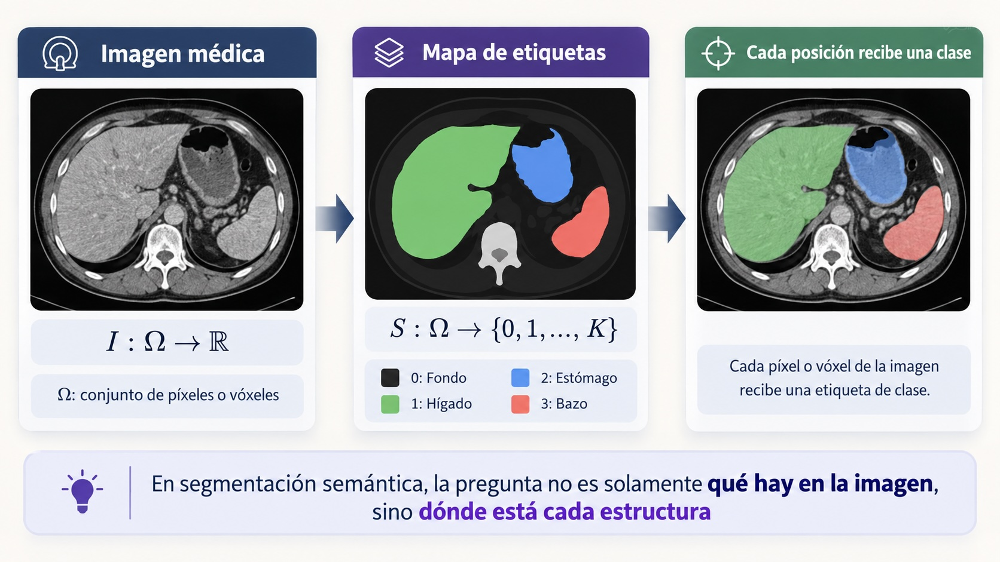
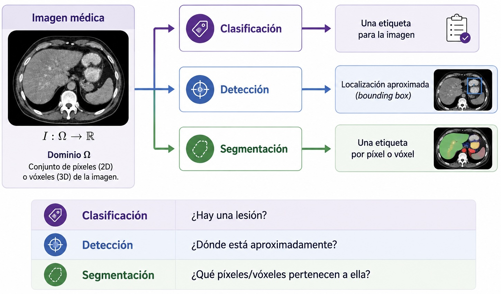
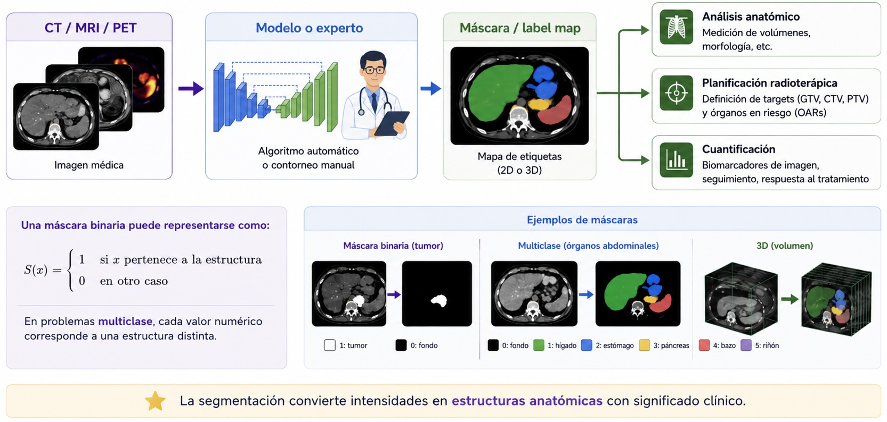
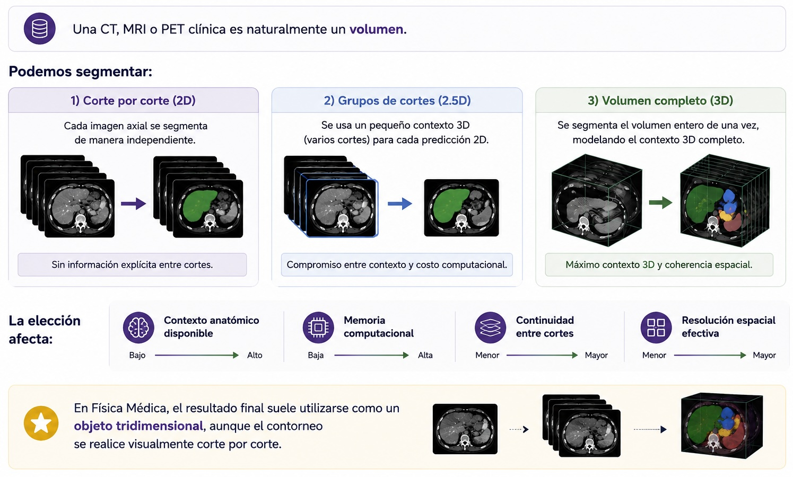
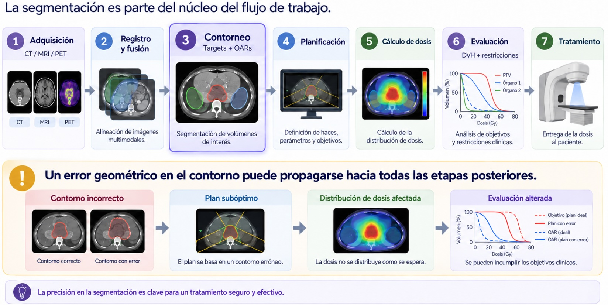
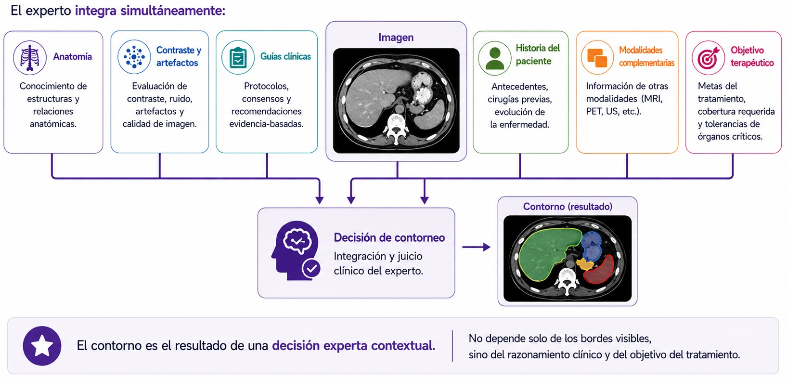
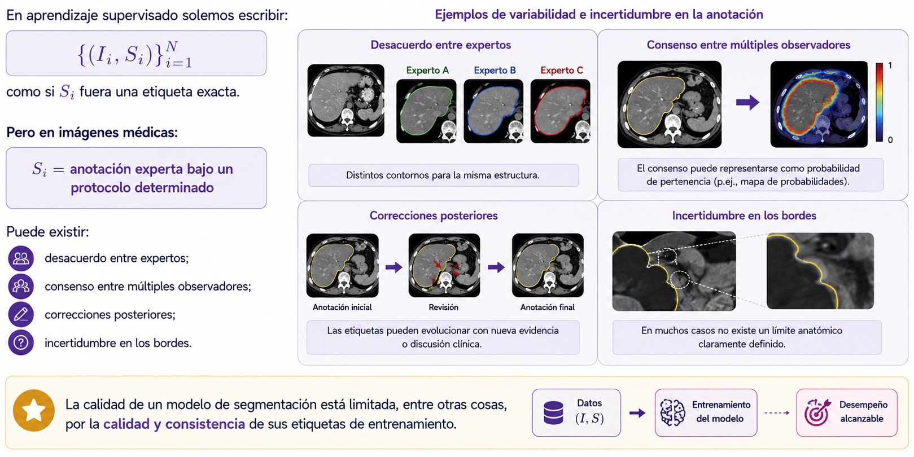

## ¿Dónde estamos en el curso?

En la unidad anterior discutimos cómo una red neuronal aprende representaciones a partir de datos.

Ahora pasamos a una de las tareas centrales de la IA en imágenes médicas:

> **asignar significado anatómico o patológico a cada píxel o vóxel de una imagen.**

Esta tarea se denomina **segmentación**.

---

## Objetivos de esta clase

Al finalizar esta clase deberíamos poder:

1. Explicar qué significa segmentar una imagen médica.
2. Diferenciar *clasificación*, *detección* y *segmentación*.
3. Interpretar una segmentación como un **mapa de etiquetas**.
4. Reconocer el papel clínico de los contornos en Física Médica.
5. Entender por qué el contorneo manual es costoso, variable y difícil de escalar.
6. Identificar por qué la calidad de las etiquetas condiciona el aprendizaje automático.

---

## ¿Qué significa segmentar?

---

## Tres tareas distintas

---

## Segmentación = clasificación densa

---

## De la imagen a la máscara

---

## 2D y 3D no son exactamente el mismo problema

---

## ¿Qué segmentamos en imágenes médicas?

La segmentación puede describir estructuras muy diferentes:

| Tipo | Ejemplos |
|---|---|
| Anatomía normal | cerebro, pulmones, hígado, riñones |
| Órganos en riesgo | médula, parótidas, corazón, recto |
| Volúmenes tumorales | GTV, CTV, lesiones metastásicas |
| Regiones funcionales | subregiones PET, perfusión, ventilación |
| Hallazgos | nódulos, hemorragias, lesiones focales |

La definición de la estructura depende de la **tarea clínica**, no solamente de la imagen.

---

## La misma imagen puede admitir distintas segmentaciones

Una segmentación no es una descripción neutral del mundo.

Depende de:

- qué estructura se quiere identificar;
- con qué finalidad clínica;
- qué modalidad de imagen se utiliza;
- qué protocolo o guía de contorneo se sigue;
- qué nivel de detalle es relevante.

> **La etiqueta correcta depende del problema que estamos intentando resolver.**

---

## El caso de Radioterapia

---

## Targets y órganos en riesgo

En radioterapia se segmentan, entre otras estructuras:

**Volúmenes objetivo**

- GTV — *Gross Tumor Volume*
- CTV — *Clinical Target Volume*
- PTV — *Planning Target Volume*

**Órganos en riesgo (OARs)**

- estructuras cuya irradiación debe limitarse;
- pueden presentar límites anatómicos claros o ambiguos;
- su relevancia depende del sitio anatómico y del plan.

---

## ¿Por qué importa la geometría del contorno?

El contorno define qué vóxeles se consideran parte de una estructura.

A partir de él se calculan:

- volumen
- dosis media
- dosis máxima
- $D_x$: dosis recibida por el x% del volumen
- $V_x$: volumen que recibe al menos x Gy
- histogramas dosis-volumen (DVH)
- métricas de cobertura y conformidad.

Por lo tanto:

$$
\text{contorno}
\rightarrow
\text{geometría}
\rightarrow
\text{dosimetría}
\rightarrow
\text{decisión clínica}
$$

---

## Un pequeño cambio puede no ser pequeño

Dos contornos pueden parecer visualmente similares y, sin embargo, producir diferencias relevantes si la discrepancia ocurre:

- cerca de una región de alto gradiente de dosis
- junto a un órgano serial
- en una estructura pequeña
- alrededor de una lesión con margen reducido

::: {.callout-warning}
La calidad geométrica de una segmentación no debe interpretarse aislada de su **impacto clínico o dosimétrico**.
:::

---

## Contornear no es simplemente “dibujar bordes”

---

## ¿Cómo se realiza el contorneo manual?

De forma simplificada:

1. El especialista revisa el estudio completo.
2. Identifica referencias anatómicas.
3. Delinea la estructura corte por corte.
4. Interpola o corrige entre cortes.
5. Revisa continuidad en los tres planos.
6. Ajusta el contorno utilizando modalidades complementarias si están disponibles.
7. Realiza una revisión final antes de su utilización clínica.

En regiones complejas, este proceso puede repetirse para numerosas estructuras.

---

# El problema del contorneo manual

---

## Problema 1 — Tiempo

El contorneo manual es una tarea intensiva en tiempo humano especializado.

Esto se vuelve especialmente relevante cuando:

- aumenta el número de pacientes
- se requieren muchas estructuras
- se utilizan protocolos adaptativos
- se necesitan recontorneos longitudinales
- el flujo de trabajo exige respuestas rápidas

> El cuello de botella no es solamente computacional: también es **clínico y operativo**.

---

## Problema 2 — Variabilidad interobservador

Dos expertos pueden producir contornos diferentes sobre el mismo estudio.

Las discrepancias pueden deberse a:

- límites anatómicos poco definidos
- bajo contraste
- interpretación de guías
- experiencia del observador
- ventana de visualización
- disponibilidad de MRI/PET u otras modalidades

No toda discrepancia significa que uno de los dos contornos sea necesariamente incorrecto.

---

## Problema 3 — Variabilidad intraobservador

El mismo experto puede producir contornos ligeramente diferentes si repite la tarea en otro momento.

Esto introduce una idea importante:

> **la referencia humana también contiene incertidumbre.**

Por lo tanto, al entrenar un modelo no estamos aprendiendo necesariamente una “verdad absoluta”, sino una aproximación a un criterio de anotación.

---

## Problema 4 — La imagen puede ser ambigua

La frontera anatómica puede degradarse por:

- ruido
- artefactos metálicos
- movimiento
- volumen parcial
- bajo contraste de tejidos blandos
- cambios postquirúrgicos o postratamiento
- anatomía patológica o deformada

En estos casos, la segmentación exige más que reconocer una forma típica.

---

## El “ground truth” no siempre es una verdad absoluta

---

## ¿Por qué automatizar?

La motivación no es solamente “dibujar más rápido”.

Buscamos potencialmente:

- reducir tiempo de contorneo
- mejorar reproducibilidad
- estandarizar protocolos
- facilitar adaptación y seguimiento longitudinal
- disminuir tareas repetitivas
- concentrar el tiempo experto en revisión y casos complejos

Pero automatizar introduce una nueva pregunta:

> **¿Cómo sabemos si una segmentación automática es suficientemente buena?**

---

## Para la próxima clase

Pasaremos de la motivación clínica a la **evaluación cuantitativa**.

Veremos:

- superposición entre máscaras;
- Dice e IoU;
- distancia de Hausdorff;
- por qué una única métrica no alcanza;
- relación entre métricas geométricas y relevancia clínica.

---

## Ideas para llevarse de esta clase

1. La segmentación asigna una etiqueta a cada píxel o vóxel.
2. En Física Médica, los contornos forman parte de decisiones clínicas y dosimétricas.
3. El contorneo manual requiere conocimiento experto y contexto multimodal.
4. Las anotaciones humanas presentan variabilidad e incertidumbre.
5. Una etiqueta de entrenamiento no debe confundirse automáticamente con una verdad absoluta.
6. La automatización tiene valor solamente si el resultado es **robusto, revisable y clínicamente útil**.

---

## Pregunta de cierre

> Si dos expertos no producen exactamente el mismo contorno,  
> **¿qué debería aprender un modelo de segmentación?**
