title: "Unidad 2 — Segmentación de estructuras anatómicas"
subtitle: "Clase 2 — ¿Cómo evaluamos una segmentación?"
author: "Ignacio Scarinci"
lang: es
format:
    revealjs:
        theme: ../themes/presentaciones.scss
        slide-number: true
        chalkboard: true
        preview-links: auto
        transition: fade
        width: 1600
        height: 900
        margin: 0.06
        center: false
        smaller: false
        toc: false
        code-line-numbers: true
jupyter: python3
execute:
  echo: true
  warning: false
  message: false
  freeze: auto


## De la clase anterior

Terminamos con una pregunta:

> **¿Cómo sabemos si una segmentación automática es suficientemente buena?**

En la clase anterior vimos que:

- los contornos son objetos clínicamente relevantes;
- las anotaciones humanas presentan variabilidad;
- un error geométrico puede propagarse hacia la dosimetría;
- el *ground truth* no siempre representa una verdad absoluta.

Hoy pasamos de la **segmentación** a su **evaluación**.


## Objetivos de esta clase

Al finalizar la clase deberían poder:

1. Explicar qué significa evaluar una segmentación.
2. Construir la matriz de confusión a nivel de píxel o vóxel.
3. Interpretar **Dice** e **IoU** como métricas de superposición.
4. Diferenciar una **métrica de evaluación** de una **función de pérdida**.
5. Comprender BCE/CE, Dice Loss y la combinación CE + Dice.
6. Interpretar la **distancia de Hausdorff** como métrica de borde.
7. Reconocer las limitaciones de cada métrica.
8. Diseñar una estrategia básica de validación durante el desarrollo.


# ¿Qué significa que una segmentación sea buena?


## Una pregunta aparentemente simple


## No existe una única noción de calidad

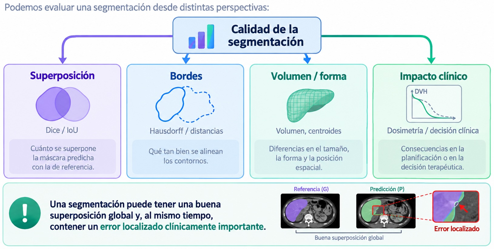


## Antes de las métricas: TP, FP, FN y TN

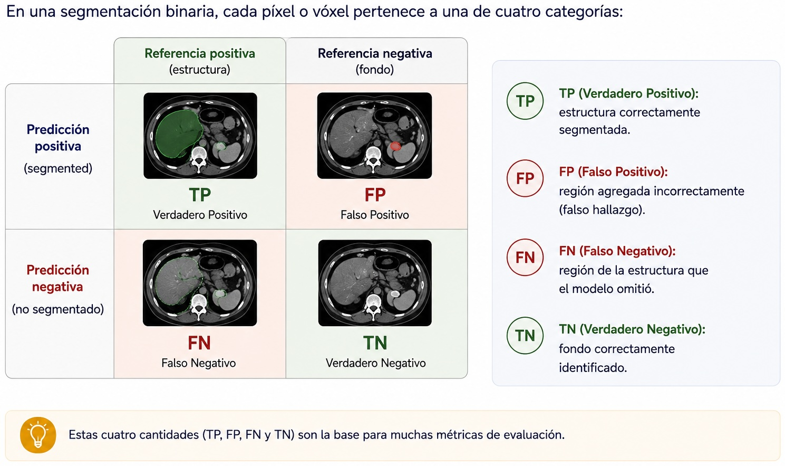


## La matriz de confusión ocurre en el espacio

En clasificación convencional, una observación suele producir una entrada de la matriz de confusión.

En segmentación:

> **cada píxel o vóxel contribuye a la matriz de confusión.**

Para un volumen de \(512\times512\times200\):

$$
512\cdot512\cdot200
\approx 52\,\text{millones de vóxeles}
$$

Esto introduce un problema: la mayoría puede ser simplemente **fondo**.


## ¿Por qué accuracy puede ser engañosa?

Supongamos que una lesión ocupa solo el \(1\%\) del volumen.

Un modelo que predice **todo como fondo** obtiene:

$$
\text{Accuracy}\approx 99\%
$$

pero:

$$
\text{segmentación de la lesión}=0
$$

::: {.callout-warning}
En segmentación médica, la *accuracy* global suele estar dominada por el fondo y puede ocultar un fracaso completo sobre la estructura de interés.
:::

Por eso preferimos métricas centradas en la región positiva.


# Métricas de superposición


## Dice: ¿cuánto se superponen las máscaras?

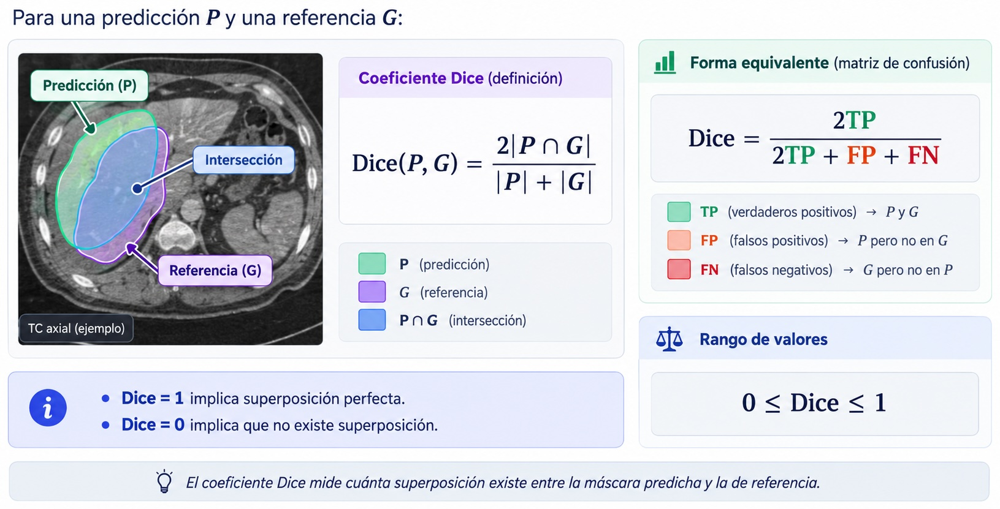


## Intuición geométrica del Dice

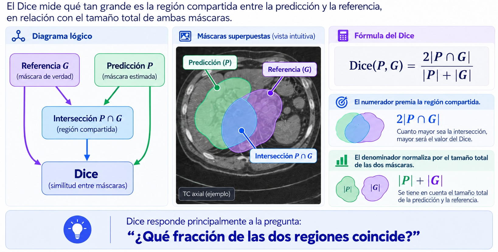


## Un ejemplo simple

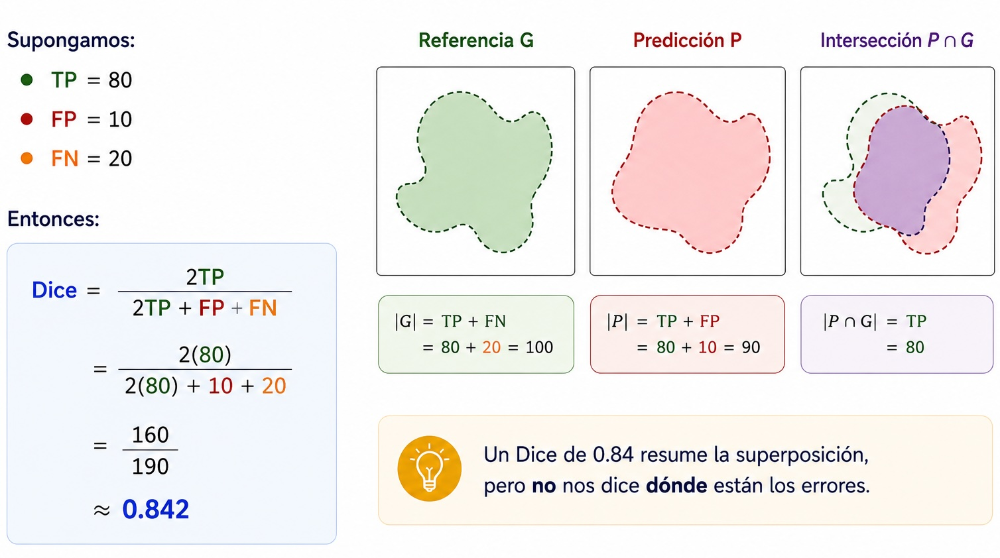


## ¿Dice = 0.90 es siempre “bueno”?

No necesariamente.

El mismo valor puede tener significados distintos dependiendo de:

- tamaño de la estructura
- complejidad de su forma
- resolución espacial
- calidad del *ground truth*
- localización del error
- propósito clínico

> Una métrica necesita siempre **contexto anatómico y clínico**.


## El efecto del tamaño de la estructura

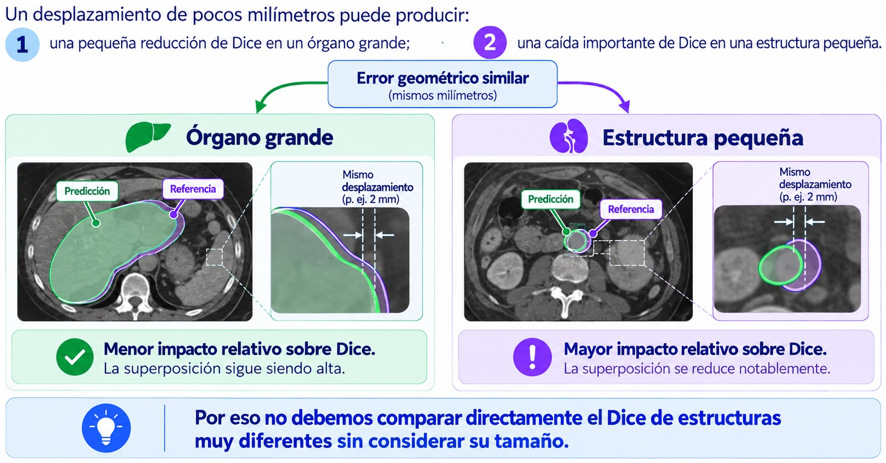


## Dice puede ocultar errores de borde

Dos máscaras pueden tener una gran región común y alcanzar un Dice elevado.

Sin embargo, un pequeño sector del borde puede desviarse considerablemente.

Esto importa especialmente:

- cerca de un gradiente de dosis elevado
- en órganos seriales
- en lesiones pequeñas
- cuando los márgenes terapéuticos son reducidos

Necesitamos métricas que miren explícitamente la **superficie**.


# Funciones de pérdida para segmentación


## Métrica y función de pérdida no son lo mismo

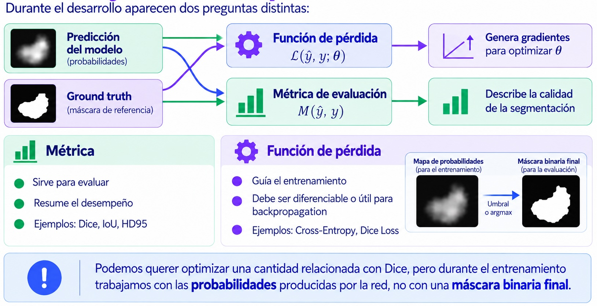


## Binary Cross-Entropy: decisión vóxel a vóxel

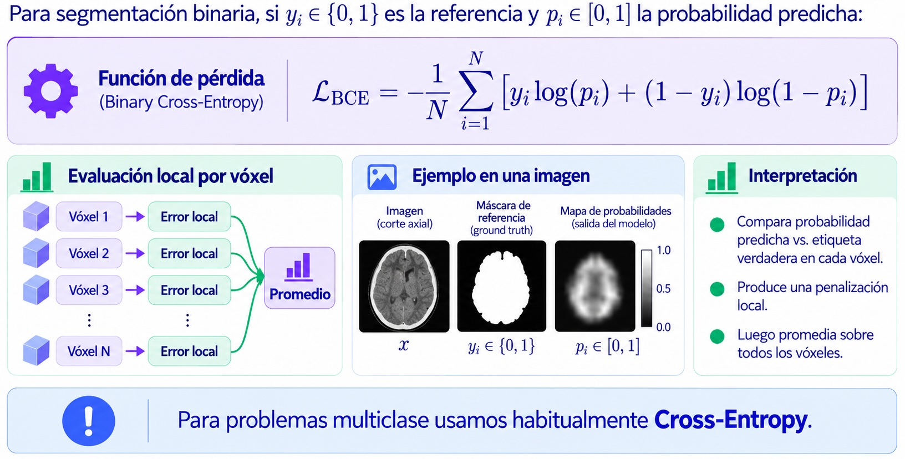


## El problema: fondo ≫ estructura

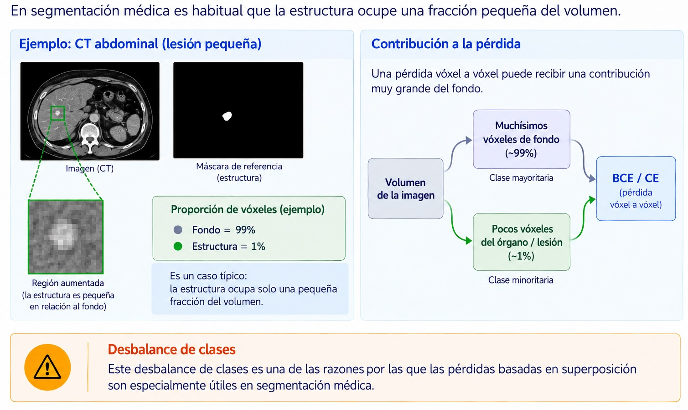


## Dice Loss: optimizar la superposición

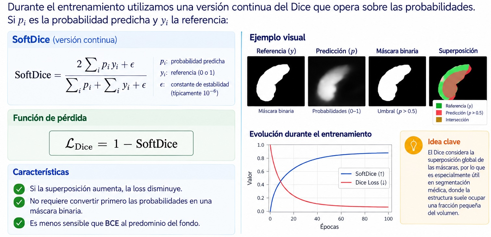


## Cross-Entropy + Dice

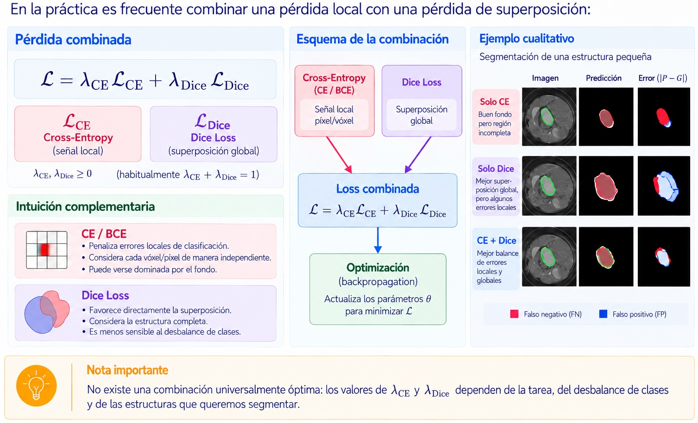


## Focal Loss: cuando predominan los ejemplos fáciles

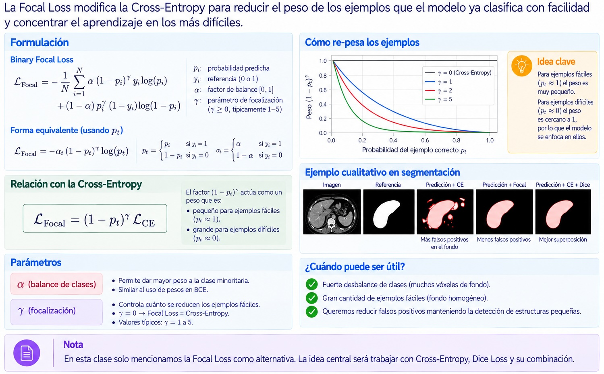


## Loss de entrenamiento ≠ calidad clínica

Supongamos que durante el entrenamiento:

$$
\mathcal{L}_{val}
\downarrow
$$

Esto indica que el objetivo matemático está mejorando sobre validación.

Pero todavía debemos preguntar:

- ¿mejora Dice?
- ¿qué ocurre en estructuras pequeñas?
- ¿aparecen fallos localizados?
- ¿el resultado es clínicamente aceptable?

> **La función de pérdida guía el aprendizaje; las métricas y la revisión clínica evalúan el resultado.**


# Métricas de distancia


## De regiones a superficies

Sea:

- $\partial P$: superficie de la predicción;
- $\partial G$: superficie de la referencia.

Ahora la pregunta cambia:

> **¿Qué tan lejos están los bordes entre sí?**

Para cada punto de una superficie podemos buscar su punto más cercano en la otra.


## Distancia dirigida entre superficies

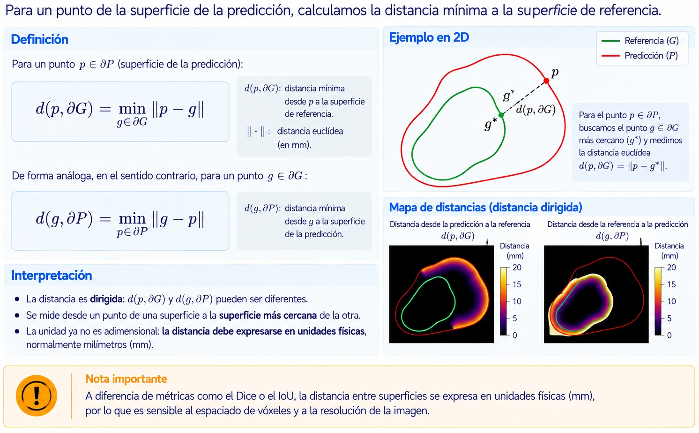


## Distancia de Hausdorff

La distancia de Hausdorff toma el peor desacuerdo entre las superficies:

$$
H(P,G)=
\max
\left\{
\sup_{p\in\partial P} d(p,\partial G),
\sup_{g\in\partial G} d(g,\partial P)
\right\}
$$

En palabras:

> **¿Cuál es el punto del contorno que está más lejos de la otra superficie?**

Menor es mejor.


## ¿Qué aporta Hausdorff?

Dice e IoU pueden permanecer altos aunque exista una desviación localizada.

Hausdorff es sensible a ese tipo de error.

```{mermaid}
flowchart LR
    D[Dice / IoU] --> D1[Superposición global]
    H[Hausdorff] --> H1[Peor discrepancia de borde]
```

::: {.callout-important}
Las métricas de superposición y las métricas de superficie responden a **preguntas diferentes** y son complementarias.
:::


## El problema de Hausdorff: los outliers

La Hausdorff clásica utiliza el **máximo**.

Por lo tanto, un único punto aberrante puede dominar completamente la métrica.

Ejemplos:

- una pequeña isla de falsos positivos
- un vóxel aislado
- un artefacto de postprocesamiento
- una anotación puntual errónea

Resultado:

$$
\text{un outlier}
\rightarrow
\text{Hausdorff muy grande}
$$


## HD95: una alternativa más robusta

Una práctica habitual es utilizar el percentil 95 de las distancias de superficie:

$$
HD_{95}
=
P_{95}
\left(
\{d(p,\partial G)\}\cup
\{d(g,\partial P)\}
\right)
$$

Interpretación:

> El $95\%$ de las discrepancias de superficie se encuentra por debajo de ese valor.

Esto reduce la sensibilidad a unos pocos puntos extremos.

::: {.callout-note}
**HD95 no reemplaza conceptualmente a Hausdorff:** cambia deliberadamente la pregunta para obtener una medida más robusta.
:::


## El spacing importa

En imágenes médicas, un vóxel no tiene necesariamente el mismo tamaño en todas las direcciones.

Por ejemplo:

$$
0.8\times0.8\times3.0\ \mathrm{mm^3}
$$

Una distancia calculada solo en índices de vóxel puede ser físicamente incorrecta.

::: {.callout-warning}
Las métricas de distancia deben calcularse utilizando el **pixel/voxel spacing real** de la imagen.
:::

Especialmente en estudios anisotrópicos.


## Superposición y distancia: juntas cuentan mejor la historia

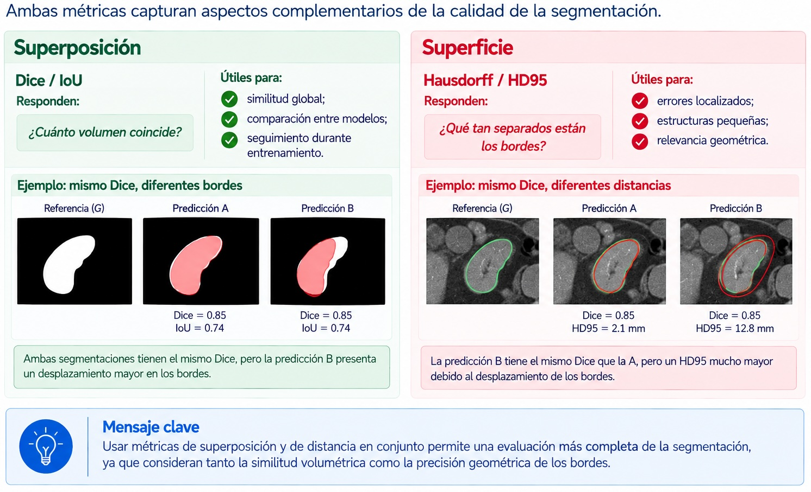


# Cómo interpretar las métricas


## Un promedio puede esconder mucho

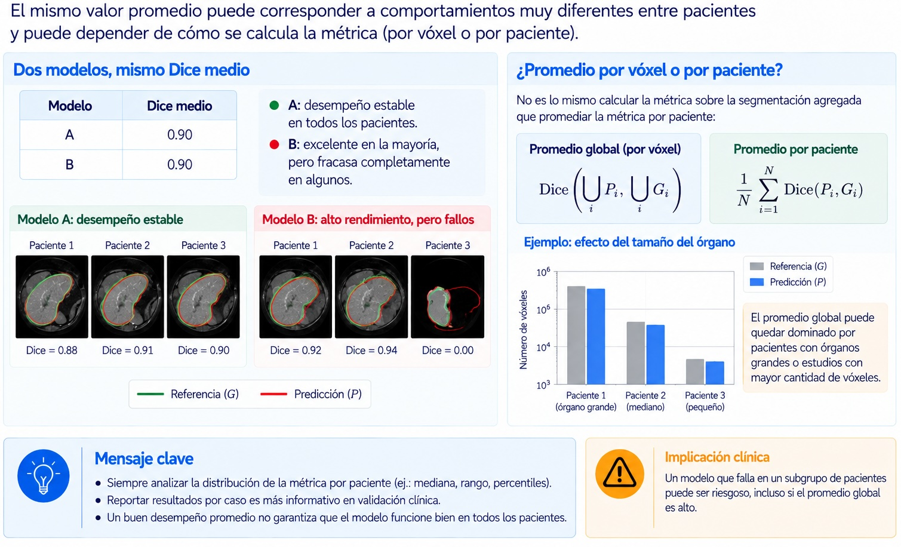


## Segmentación multiclase

En un problema con \(K\) estructuras podemos calcular una métrica por clase:

$$
\mathrm{Dice}_1,\;
\mathrm{Dice}_2,\;
\dots,\;
\mathrm{Dice}_K
$$

No debemos asumir que todas las clases tienen la misma dificultad.

Ejemplo:

- hígado: grande, alto contraste;
- nervio óptico: pequeño;
- tumor: heterogéneo y ambiguo.

> Reportar solo un promedio global puede ocultar qué estructuras fallan.


## ¿Macro o micro promedio?

**Macro average**

$$
\mathrm{Dice}_{macro}
=
\frac{1}{K}\sum_{k=1}^{K}\mathrm{Dice}_k
$$

Cada clase tiene el mismo peso.

**Micro / global**

Agrega primero los TP, FP y FN de todas las clases y luego calcula la métrica.

::: {.callout-note}
En conjuntos desbalanceados, el promedio global puede quedar dominado por las estructuras más grandes.
:::

Para Física Médica suele ser importante reportar resultados **por estructura**.


## ¿Qué hacer con estructuras ausentes?

Puede ocurrir que una estructura o lesión no esté presente en un caso.

Entonces:

$$
|P|=0,\qquad |G|=0
$$

y Dice queda matemáticamente indeterminado:

$$
\frac{0}{0}
$$

Debemos definir explícitamente la convención:

- excluir ese caso para esa estructura;
- asignar Dice = 1 si ambos son vacíos;
- tratar falsos positivos sobre una referencia vacía por separado.

Lo importante es que la política sea **explícita y consistente**.


## La métrica debe responder a la aplicación

```{mermaid}
flowchart LR
    A[Pregunta clínica] --> M[Selección de métricas]
    M --> O[Overlap]
    M --> S[Superficie]
    M --> C[Impacto clínico]
```

Ejemplos:

- segmentación hepática para volumetría → volumen + Dice pueden ser relevantes;
- médula espinal en radioterapia → errores de superficie pueden ser críticos;
- tumor junto a alto gradiente de dosis → la geometría debe relacionarse con dosimetría.

::: {.callout-important}
No existe una métrica universal que determine por sí sola si una segmentación es **clínicamente aceptable**.
:::


# Validación durante el desarrollo


## Training, validation y test cumplen roles distintos

```{mermaid}
flowchart LR
    D[Dataset] --> T[Training]
    D --> V[Validation]
    D --> E[Test]

    T --> T1[Ajustar parámetros]
    V --> V1[Elegir modelo<br/>e hiperparámetros]
    E --> E1[Evaluación final]
```

Durante el desarrollo usamos el conjunto de **validación** repetidamente.

El test debe permanecer reservado hasta que el proceso de desarrollo esté definido.


## La unidad de separación debe ser el paciente

En imágenes médicas, un paciente puede aportar:

- múltiples cortes;
- múltiples series;
- distintas modalidades;
- estudios longitudinales;
- múltiples lesiones.

::: {.callout-warning}
No debemos colocar imágenes del mismo paciente en entrenamiento y validación/test.
:::

De lo contrario aparece **data leakage** y el desempeño puede quedar artificialmente inflado.


## Validar no es mirar solo la loss

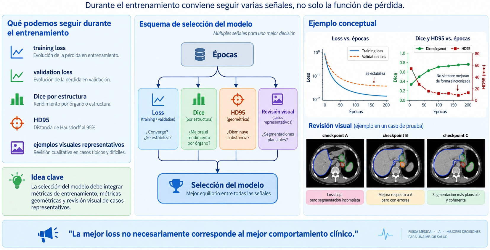


## Qué conviene registrar

Para cada experimento:

- partición de pacientes
- versión de los datos
- preprocesamiento
- arquitectura
- función de pérdida
- hiperparámetros
- métricas por estructura y por paciente
- *checkpoint* seleccionado
- casos de fallo

Esto permite que la validación sea **reproducible** y no una inspección informal.


## Qué deberíamos mirar en validación

No solamente:

> “Dice promedio = 0.91”

Sino también:

- ¿qué estructuras tienen peor desempeño?
- ¿cuál es la dispersión entre pacientes?
- ¿existen fallos catastróficos?
- ¿qué ocurre en casos pequeños o difíciles?
- ¿Dice y HD95 cuentan la misma historia?
- ¿los errores son clínicamente relevantes?


## Cierre

Una buena evaluación combina:

$$
\boxed{
\text{superposición}
+
\text{distancia}
+
\text{distribución por paciente}
+
\text{contexto clínico}
}
$$

Ideas para llevarse:

1. **Dice e IoU** miden superposición.
2. La **loss** guía la optimización y no debe confundirse con una métrica de evaluación.
3. **BCE/CE + Dice Loss** combina información local y superposición global.
4. **Hausdorff / HD95** miden discrepancias de superficie.
5. Ninguna métrica debe interpretarse aisladamente.
6. Las métricas dependen del tamaño, resolución y anatomía.
7. La validación debe hacerse por paciente y sin *data leakage*.
8. El test no forma parte del proceso iterativo de desarrollo.


## Pregunta de cierre

> Dos modelos tienen el mismo Dice promedio.  
> Uno tiene errores pequeños en todos los pacientes y el otro falla por completo en unos pocos casos.

**¿Diríamos que tienen el mismo desempeño clínico?**
