## De la clase anterior

En la clase anterior discutimos cómo evaluar una segmentación:

- Dice e IoU para superposición;
- Hausdorff y HD95 para discrepancias de superficie;
- funciones de pérdida para entrenamiento;
- validación por paciente;
- necesidad de combinar métricas y revisión visual.

Hoy damos un paso atrás:

> **¿Cómo diseñamos el sistema de segmentación completo?**

Y, sobre todo:

> **¿Qué rol queremos que tenga el modelo dentro del flujo clínico?**

## Objetivos de esta clase

Al finalizar la clase deberían poder:

1. Diferenciar **arquitectura** de **pipeline**.
2. Entender por qué nnU-Net es un sistema auto-configurable y no solo una arquitectura.
3. Distinguir segmentación **automática** de segmentación **interactiva**.
4. Comprender el rol de los *prompts* en sistemas como SAM/MedSAM.
5. Analizar las diferencias entre workflows *machine-first* y *human-in-the-loop*.
6. Reconocer que cada paradigma requiere un protocolo de evaluación distinto.

# Arquitectura y pipeline no son lo mismo

## Un sistema de segmentación tiene muchas piezas

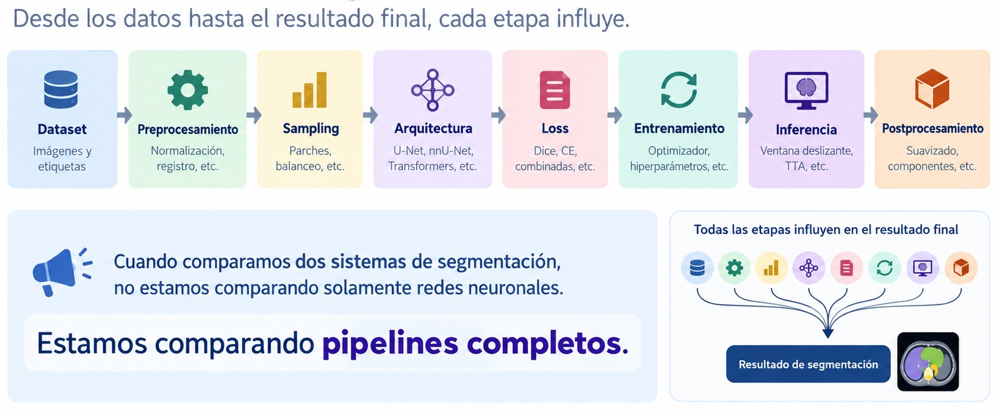{ width=80% }

## Dos U-Net pueden comportarse muy distinto

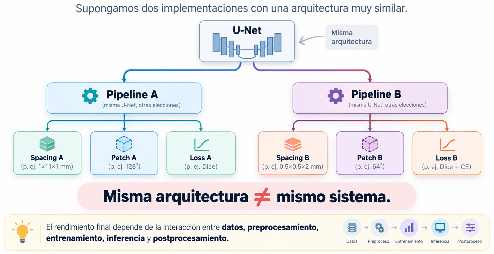{ width=80% }


# De decisiones manuales a sistemas auto-configurables


## ¿Cuántas decisiones tomamos antes de entrenar?

- ¿2D o 3D?
- ¿qué *spacing*?
- ¿qué tamaño de *patch*?
- ¿qué *batch size*?
- ¿cómo normalizar?
- ¿qué función de pérdida usar?
- ¿cómo muestrear?
- ¿qué data *augmentations* implementar?
- ¿qué postprocesamiento?

Tradicionalmente, muchas de estas decisiones se ajustan manualmente para cada problema.

## Una pregunta diferente

En vez de preguntar:

> “¿Qué configuración elijo para este dataset?”

podemos preguntar:

> **“¿Puede el sistema analizar el dataset y configurar automáticamente gran parte del pipeline?”**

# Dos paradigmas de segmentación

## Dos formulaciones distintas

{ width=80% }

## Pregunta central de la clase

No queremos preguntar solamente:

> “¿Cuál tiene mayor Dice?”

La pregunta más importante es:

> **¿Queremos que el sistema reemplace el proceso de delineación o que colabore con el experto durante ese proceso?**


# Segmentación automática

## Formulación

En segmentación automática:

$$
X
\xrightarrow{f_\theta}
\hat Y
$$

el modelo debe resolver por sí mismo:

1. qué estructuras están presentes;
2. dónde se encuentran;
3. cuáles son sus fronteras.


## Auto-contouring

Un flujo típico puede representarse como:

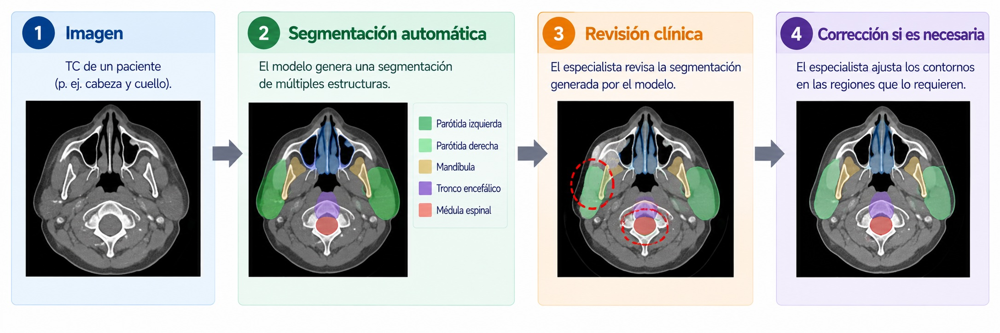{ width=80% }

::: {.callout-note title="Automático no significa autónomo"}
Que la máscara inicial sea automática no implica que deba aceptarse sin revisión.
:::

## Localizar + reconocer + delinear

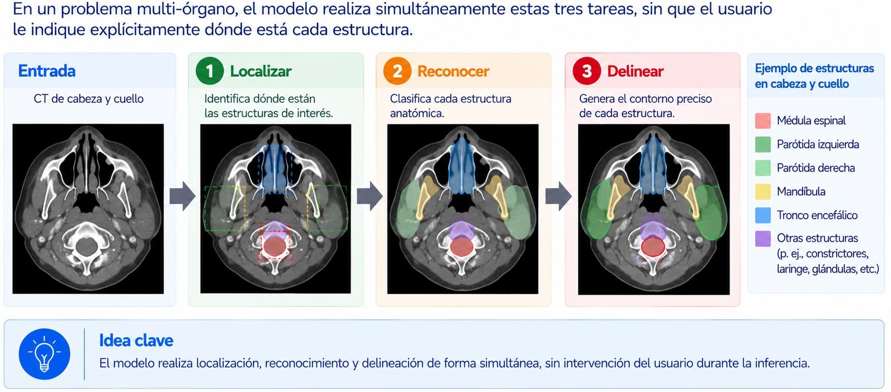{ width=80% }


# nnU-Net como ejemplo del paradigma automático


## nnU-Net no es “otra U-Net”

La importancia de nnU-Net no radica principalmente en introducir una arquitectura radicalmente nueva.

Su idea central es:

> **adaptar automáticamente el pipeline a las propiedades del dataset.**

Por eso es más útil pensarlo como:

$$
\boxed{\text{framework auto-configurable}}
$$

y no simplemente como una variante arquitectónica.

## ¿Qué problema intenta resolver?

Dado un nuevo dataset, debemos decidir:

- *spacing*;
- normalización;
- 2D o 3D;
- tamaño de *patch*;
- profundidad de red;
- *batch size*;
- resampling;
- estrategia de inferencia;
- postprocesamiento.

nnU-Net intenta derivar gran parte de estas decisiones a partir de los datos.

## nnU-Net overwiew

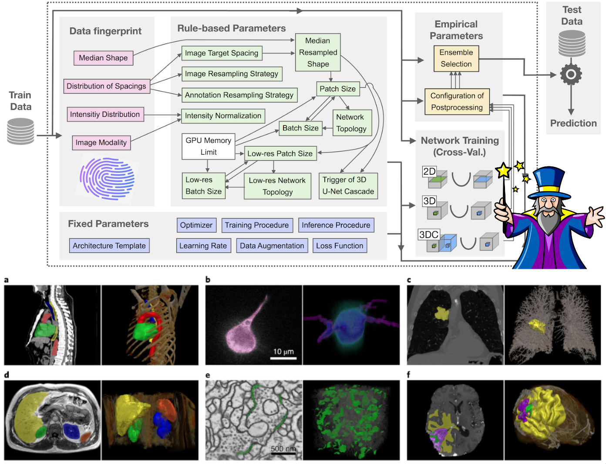{ width=80% }

## Dataset → configuración

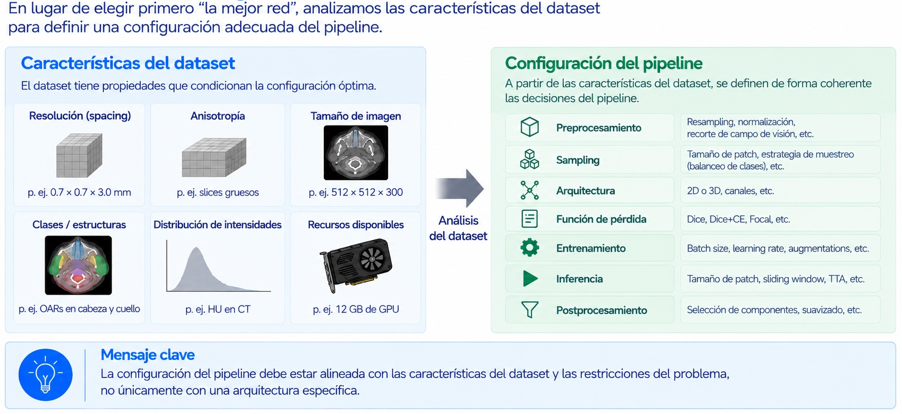{ width=80% }

## El fingerprint del dataset

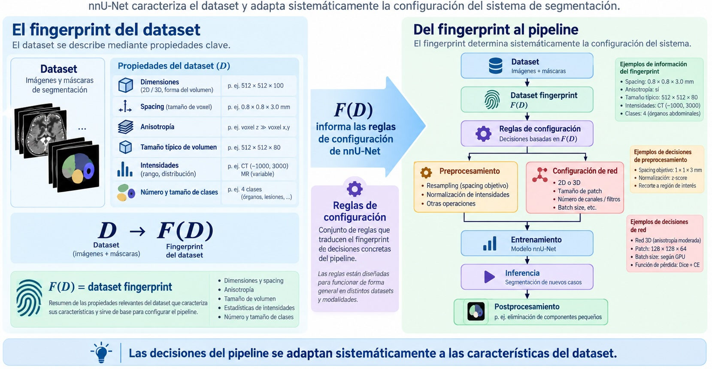{ width=80% }

## ¿Qué cosas configura nnU-Net automáticamente?

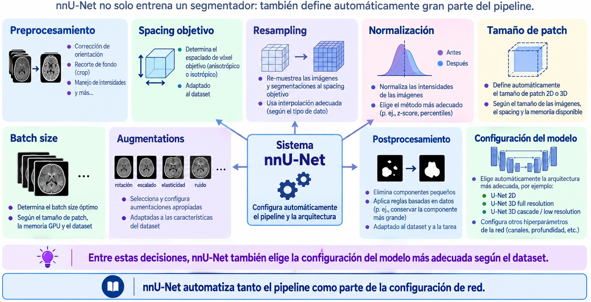{ width=80% }

## nnU-Net no siempre usa la misma arquitectura

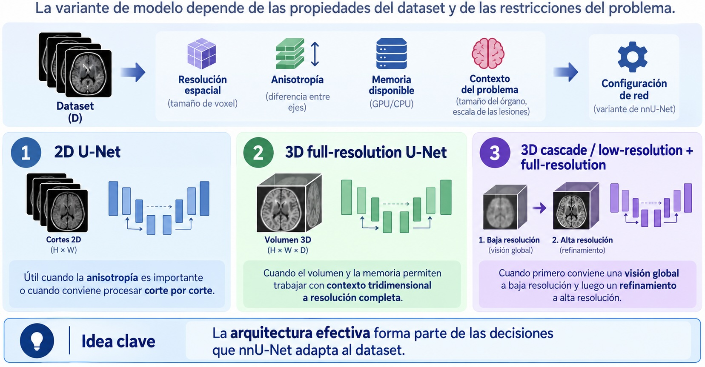{ width=80% }

## ¿Qué es 3D U-Net cascade?

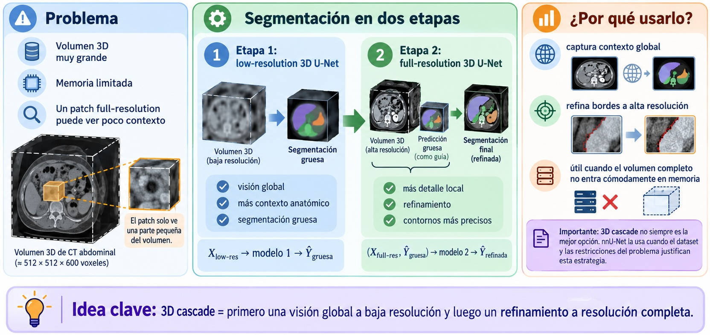{ width=80% }

## Automatización en dos niveles

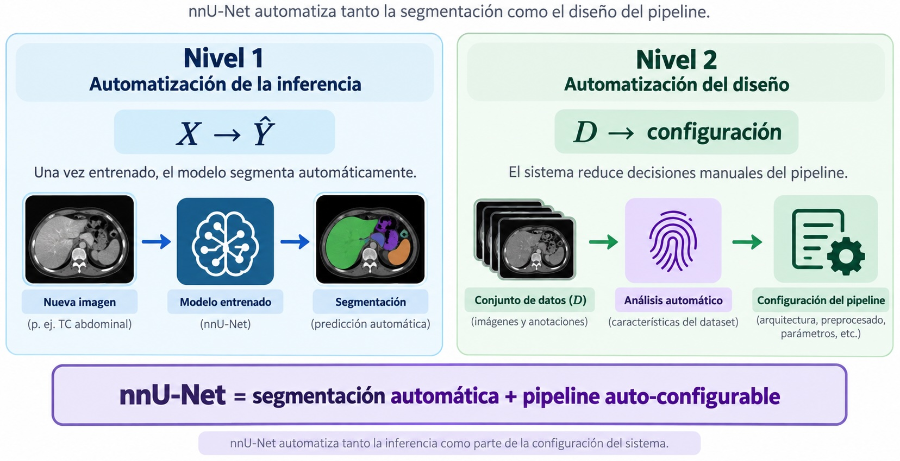{ width=80% }


## La lección metodológica de nnU-Net

Antes era frecuente comparar:

> nueva arquitectura vs. baseline poco optimizado.

Pero entonces aparece una duda:

> **¿La mejora viene de la arquitectura o del pipeline?**

::: {.callout-important}
Una arquitectura novedosa no garantiza por sí sola un mejor sistema.  
La configuración del pipeline puede tener un impacto comparable o incluso mayor.
:::


## 2D, 3D y configuraciones adaptadas

Una decisión central es cuánto contexto volumétrico utilizar.

```{mermaid}
flowchart LR
    D[Dataset] --> R[Resolución + anisotropía]
    R --> M[Restricciones de memoria]
    M --> C[Configuración 2D / 3D]
```

La idea importante:

$$
\text{dataset}
\rightarrow
\text{restricciones}
\rightarrow
\text{configuración apropiada}
$$


## Cambio de pregunta

En lugar de:

> “¿Cuál es la mejor arquitectura?”

pasamos a:

> **“¿Cuál es la configuración de pipeline más adecuada para este dataset?”**

Este cambio desplaza el foco desde el diseño manual de arquitecturas hacia la **adaptación sistemática al problema**.


# Limitaciones del paradigma completamente automático


## Ventajas claras

- velocidad;
- reproducibilidad;
- escalabilidad;
- procesamiento masivo;
- mínima interacción durante inferencia.

Pero el modelo debe resolver todo desde la imagen.

## ¿Dónde puede fallar?

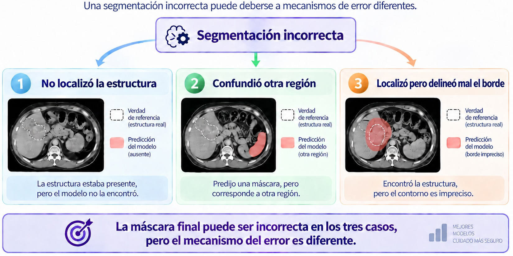{ width=80% }

## Dependencia del dominio

Un modelo automático suele especializarse en:

- modalidad;
- región anatómica;
- protocolo;
- clases;
- población de entrenamiento.

Por eso:

$$
\text{hospital A}
\not\equiv
\text{hospital B}
$$

Cambios de scanner, reconstrucción, contraste o práctica clínica pueden degradar el desempeño.


## Clases predefinidas

Si un modelo fue entrenado para:

$$
\{\text{hígado},\text{riñones},\text{bazo}\}
$$

no podemos asumir que segmentará correctamente una estructura nueva.

::: {.callout-note}
La automatización suele ganar escalabilidad, pero a costa de una tarea más cerrada y especializada.
:::

## ¿Qué nos deja nnU-Net?

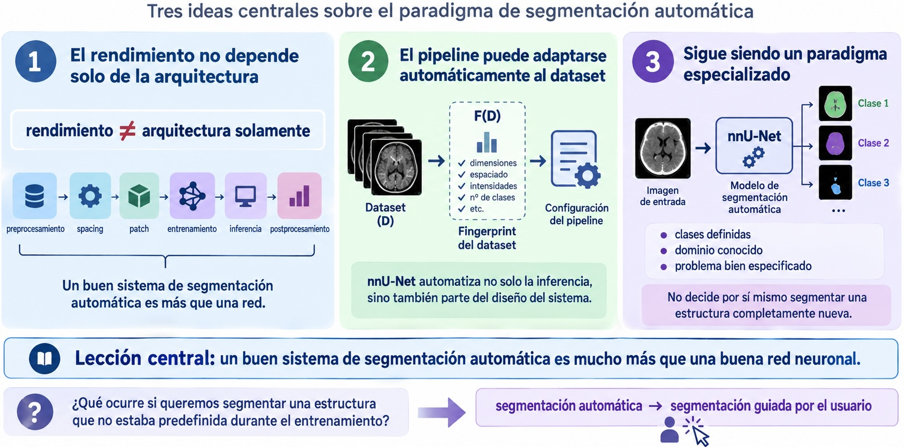{ width=80% }


