## ¿Dónde estamos?

En las unidades anteriores ya vimos:

- modelos de *Deep Learning* y entrenamiento
- arquitecturas convolucionales y representaciones aprendidas (embeddings)
- segmentación de estructuras anatómicas

. . .

La nueva pregunta es:

> **¿Cómo pasamos de decir qué hay en una imagen a decir también dónde está?**


## El mapa de esta unidad

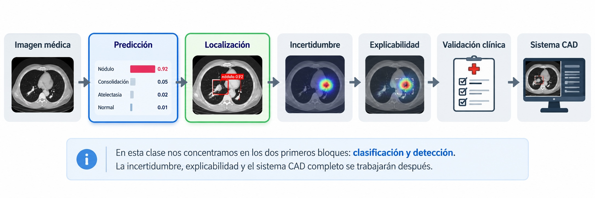{ width=80% }

## Objetivos de la clase

Al finalizar, deberían poder:

1. distinguir **clasificación, detección y segmentación** según la pregunta clínica;
2. interpretar correctamente *scores*, umbrales y métricas de clasificación;
3. formalizar la salida de un detector mediante **bounding boxes, clase y score**;
4. comprender **IoU, NMS, precision-recall, AP y mAP**;
5. diferenciar conceptualmente detectores **two-stage, one-stage y end-to-end basados en queries**;
6. reconocer el papel de **Focal Loss, NMS y bipartite matching** en distintos paradigmas de detección;
7. reconocer dificultades específicas de la detección en imágenes médicas.


# De la pregunta clínica a la tarea

## Una imagen, tres problemas diferentes

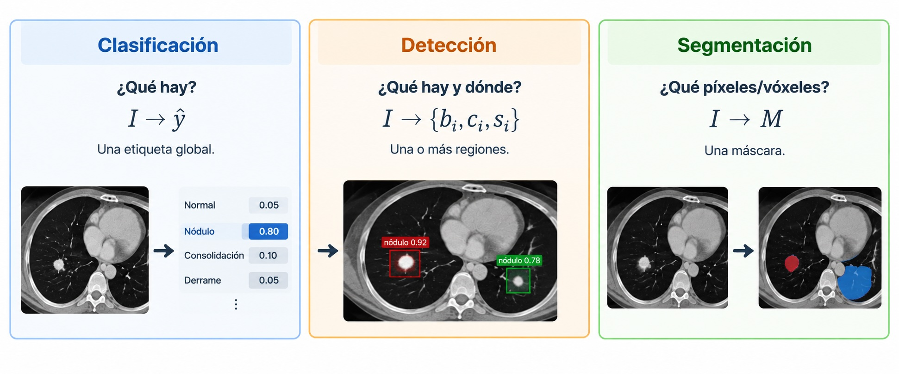{ width=80% }

## No es una diferencia de arquitectura

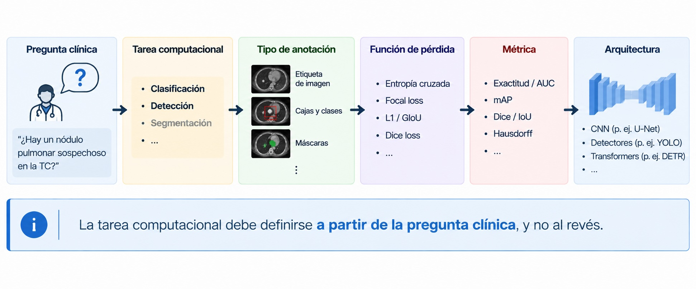{ width=80% }


## Ejemplo: nódulo pulmonar

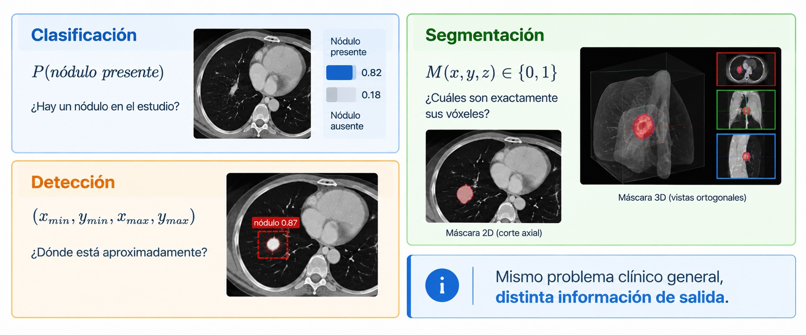{ width=80% }

# Clasificación: lo que necesitamos para avanzar

## Clasificación de imágenes

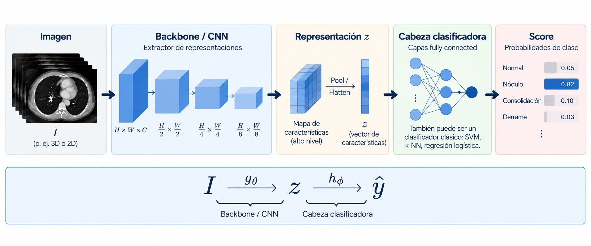{ width=80% } 


## Estrategias posibles

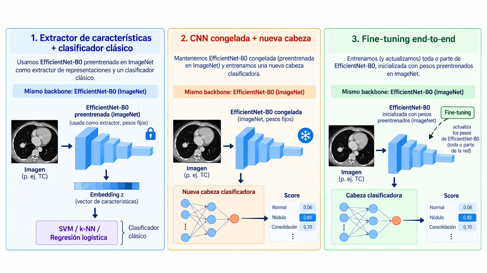{ width=80% }

## De un score a una decisión

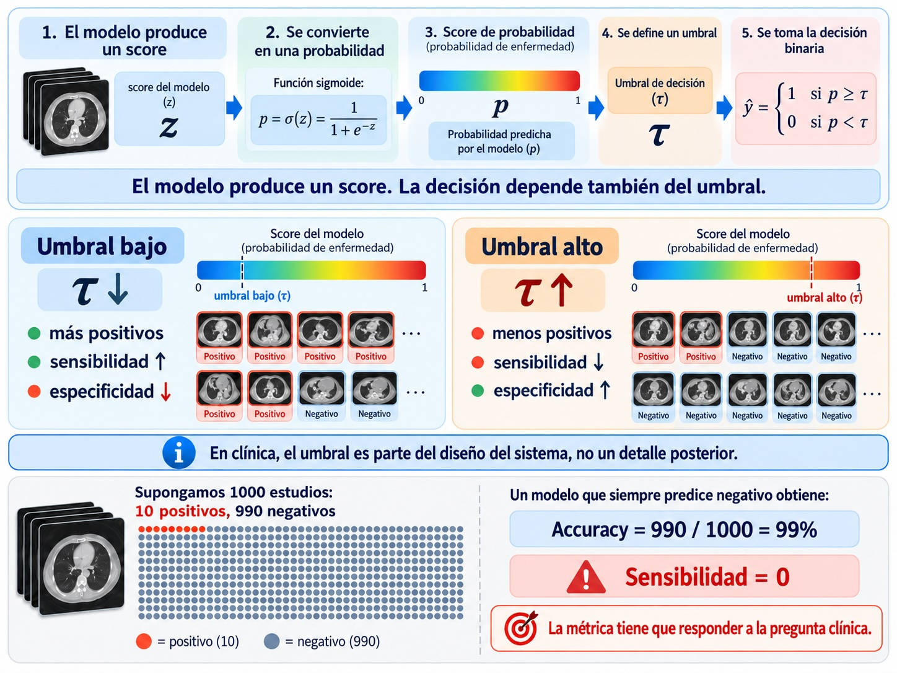{ width=80% }

## Matriz de confusión

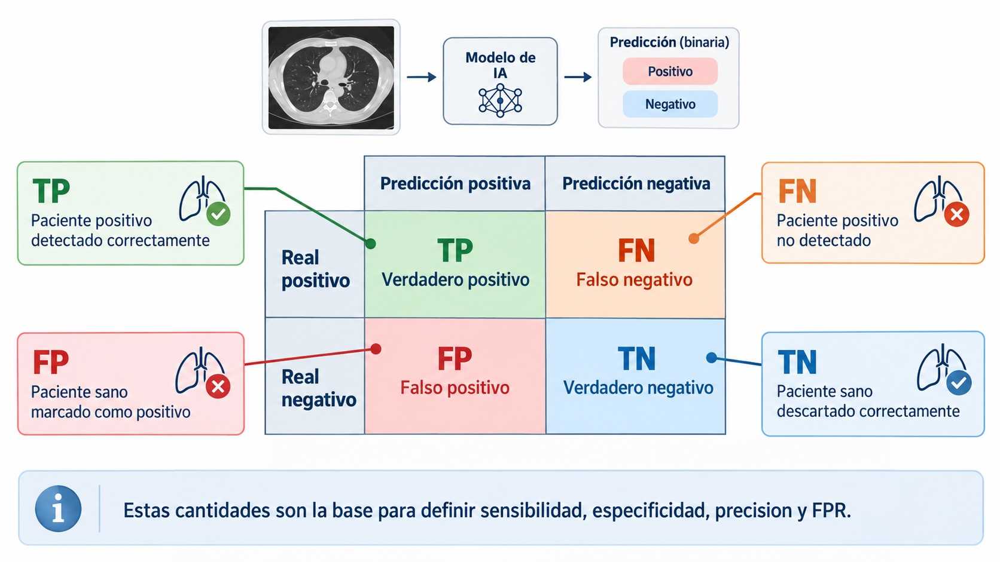{ width=80% }

## Sensibilidad, especificidad y precisión

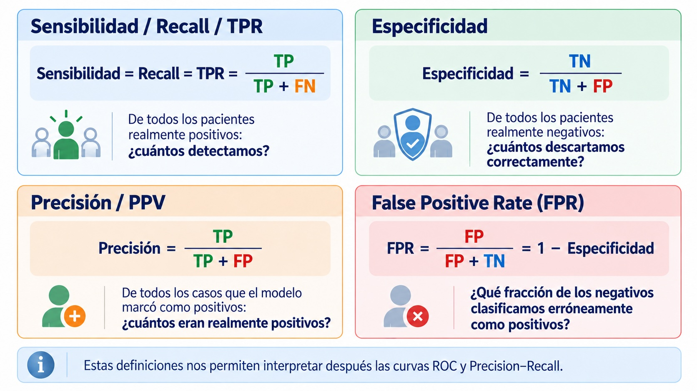{ width=80% }

## ROC y precision-recall: ¿qué nos aportan?

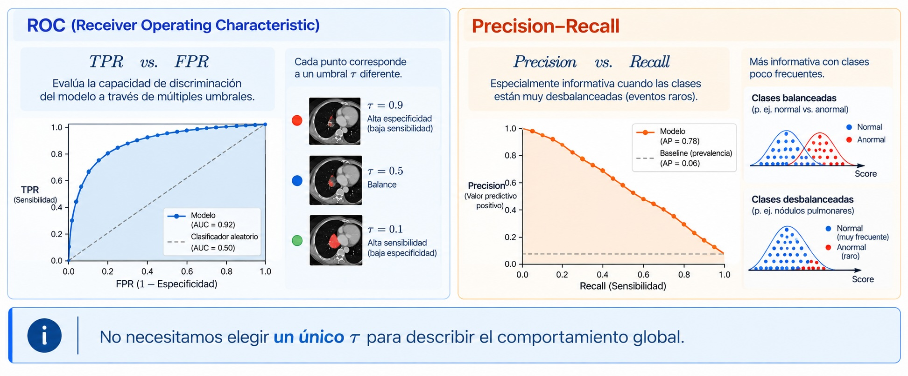{ width=80% }

## ¿Qué le falta a la clasificación?

Supongamos:

$$
P(\text{hallazgo})=0.97
$$

La predicción global no responde:

- ¿dónde está el hallazgo?
- ¿hay uno o varios?
- ¿qué tamaño aproximado tienen?
- ¿qué región originó la decisión

```{mermaid}
%%| echo: false

flowchart LR
    I["Imagen médica"] --> A["Clasificación<br/><small>¿qué hay?</small>"]
    A -->|necesitamos más detalle| B["Detección<br/><small>¿dónde y cuántos?</small>"]
    B --> C["Cajas + clases<br/>+ scores"]

    classDef input fill:#E8F1FB,stroke:#2563EB,stroke-width:2px,color:#173B73
    classDef task fill:#FFF3CD,stroke:#D97706,stroke-width:3px,color:#713F12
    classDef output fill:#DCFCE7,stroke:#16A34A,stroke-width:2px,color:#14532D
    class I input
    class A,B task
    class C output

    linkStyle 0 stroke:#64748B,stroke-width:2px
    linkStyle 1 stroke:#DC2626,stroke-width:3px
    linkStyle 2 stroke:#16A34A,stroke-width:2px
```


# Detección de objetos

## La salida ya no es una etiqueta

Un detector produce un **conjunto** de objetos:

$$
f_\theta(I)
\rightarrow
\left\{(b_i,c_i,s_i)\right\}_{i=1}^{N}
$$

Para cada objeto:

- $b_i$: localización
- $c_i$: clase
- $s_i$: score

Y además:

$$
N=0,1,2,\ldots
$$

**El número de salidas no es fijo.**

## Bounding box

Una caja 2D puede representarse como:

$$
b=(x_{min},y_{min},x_{max},y_{max})
$$

donde $(x_{min},y_{min})$ es la esquina superior izquierda y $(x_{max},y_{max})$ la inferior derecha.

o como:

$$
b=(x_c,y_c,w,h).
$$

donde $(x_c,y_c)$ es el centro y $(w,h)$ el ancho y alto.

Para un volumen:

$$
b=(x_{min},y_{min},z_{min},x_{max},y_{max},z_{max}).
$$

donde $(x_{min},y_{min},z_{min})$ es la esquina superior izquierda y $(x_{max},y_{max},z_{max})$ la inferior derecha.


Una *bounding box* **localiza aproximadamente**: no describe el contorno exacto.


## Clasificación vs detección: cambia la anotación

::: {.columns}
::: {.column width="48%"}
### Clasificación

Una etiqueta por imagen:

$$
(I_i,y_i)
$$
:::

::: {.column width="48%"}
### Detección

Un conjunto variable de objetos:

$$
\left(
I_i,
\{(b_{ij},c_{ij})\}_{j=1}^{N_i}
\right)
$$
:::
:::


En imágenes médicas, la “verdad de referencia” también puede tener **variabilidad entre expertos**.


## ¿Cómo sabemos si una caja está bien localizada?

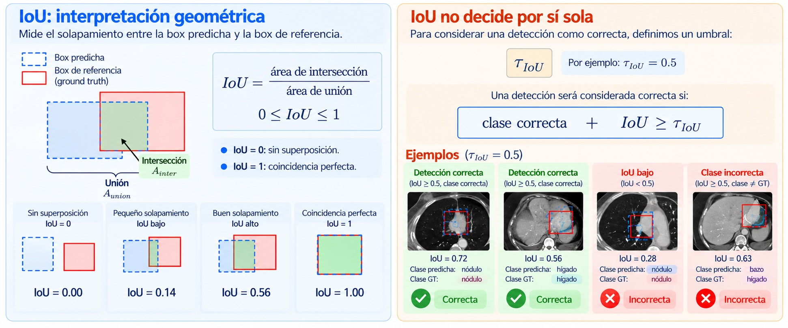{ width=80% }


## Non-Maximum Suppression (NMS) 

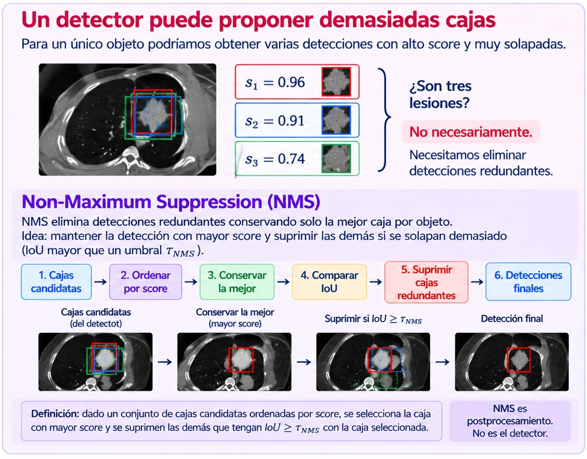{ width=80% }

## Del score a precision-recall

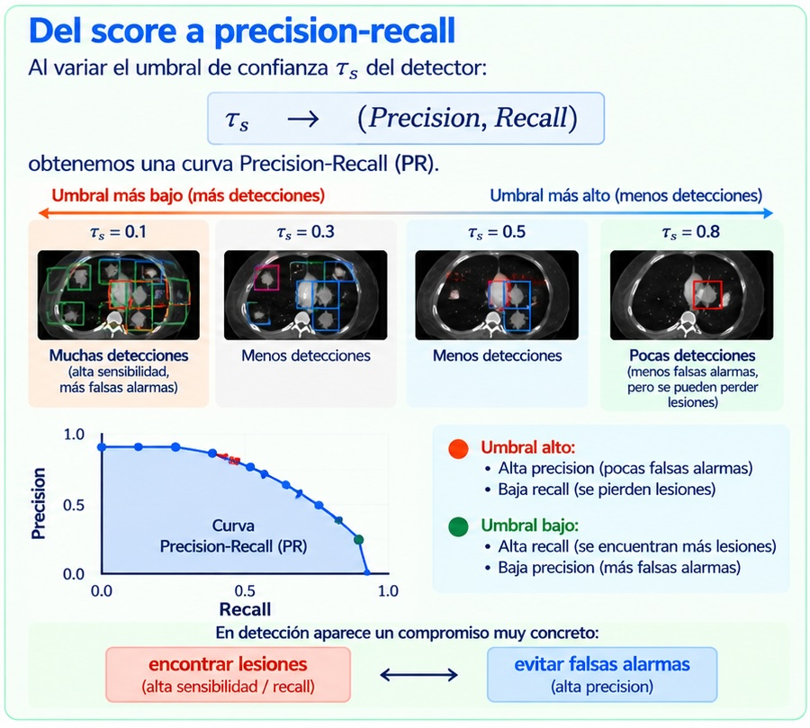{ width=80% }


## Average Precision (AP)

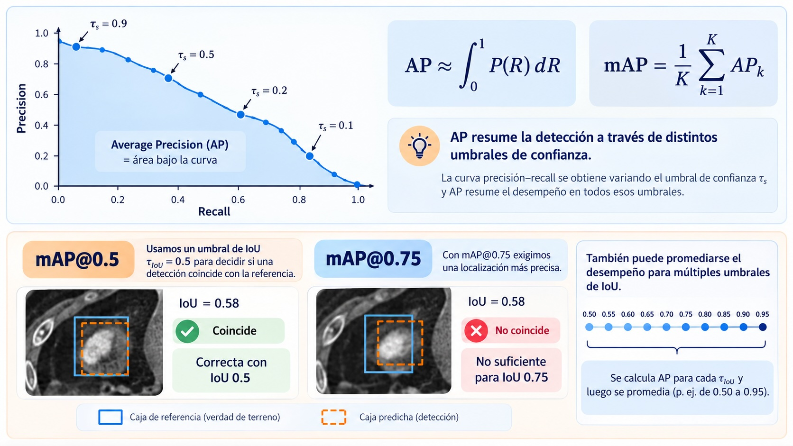{ width=80% }

## Un detector aprende varias tareas a la vez

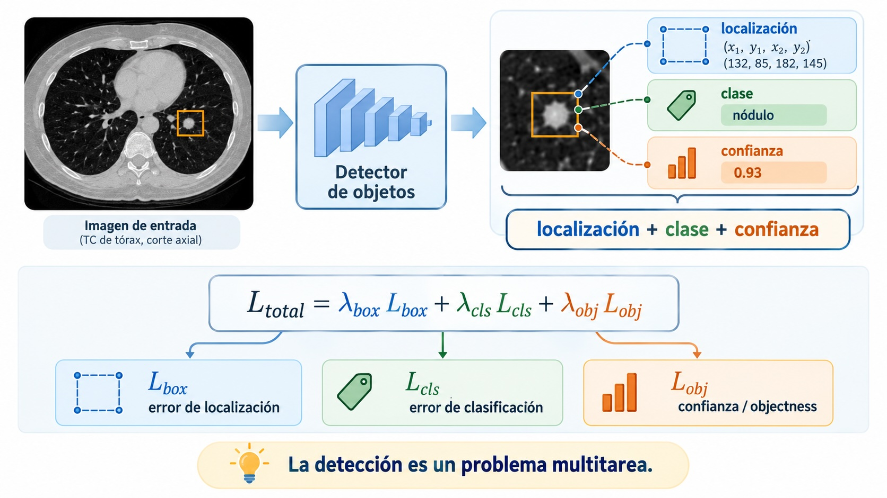{ width=80% }


# Arquitecturas de detección

## Tres formas de pensar el problema

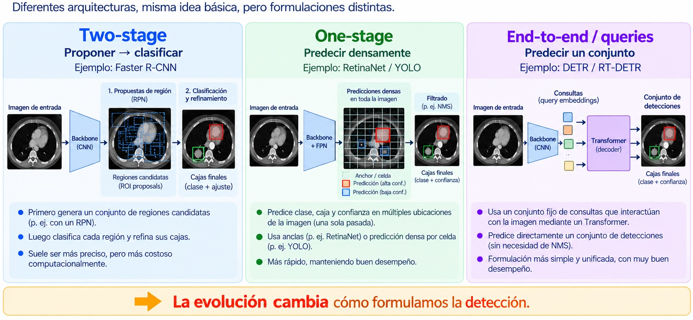{ width=80% }

## Two-stage: la idea

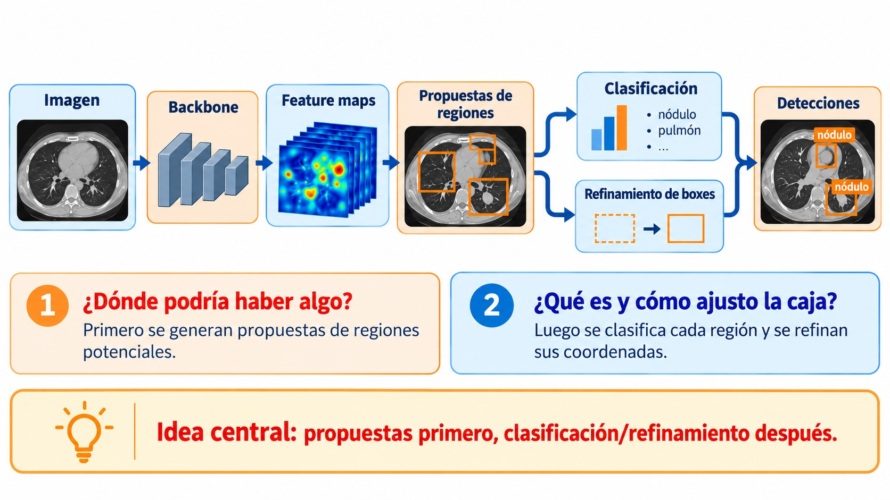{ width=80% }

## Faster R-CNN

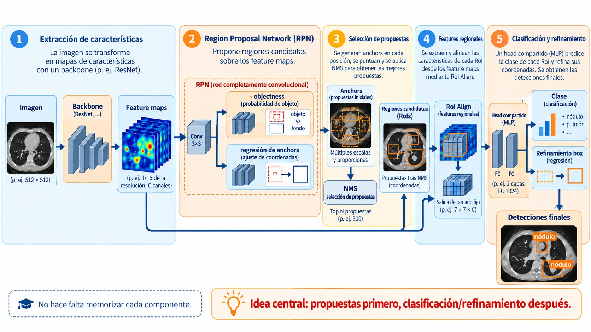{ width=80% }

## One-stage: la idea

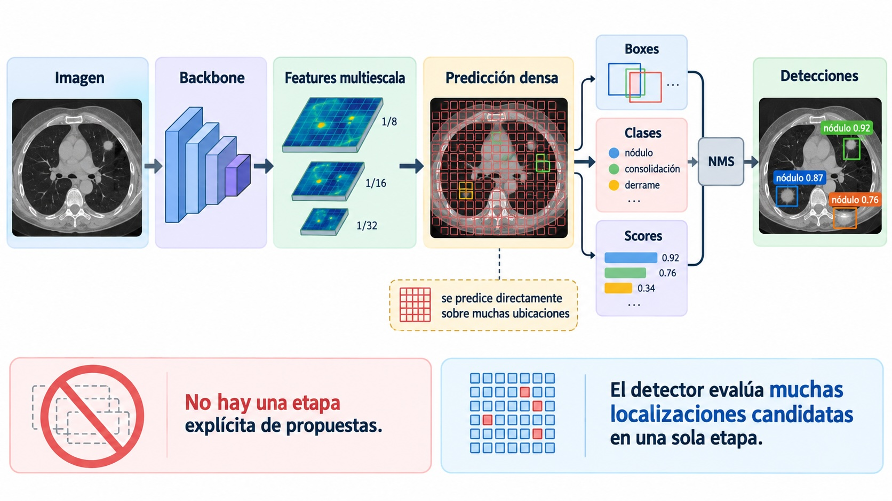{ width=80% 

## El problema de la predicción densa

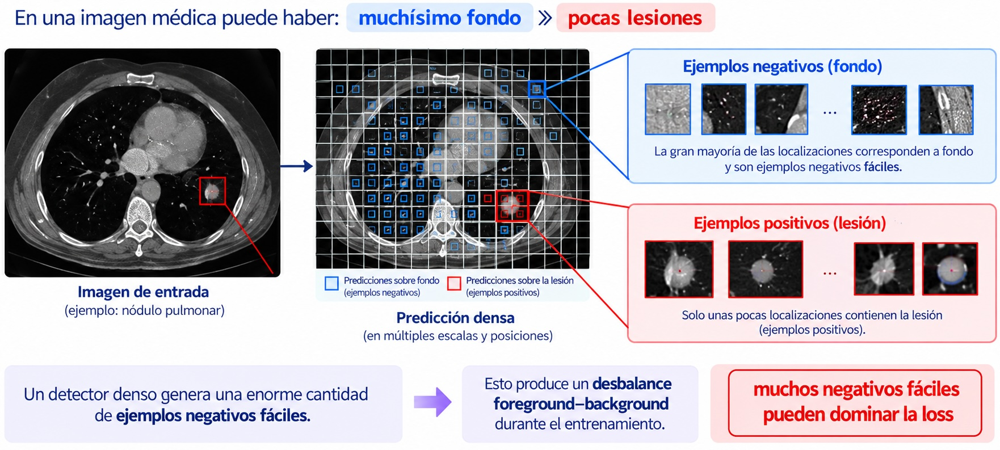{ width=80% }

## RetinaNet: Focal Loss

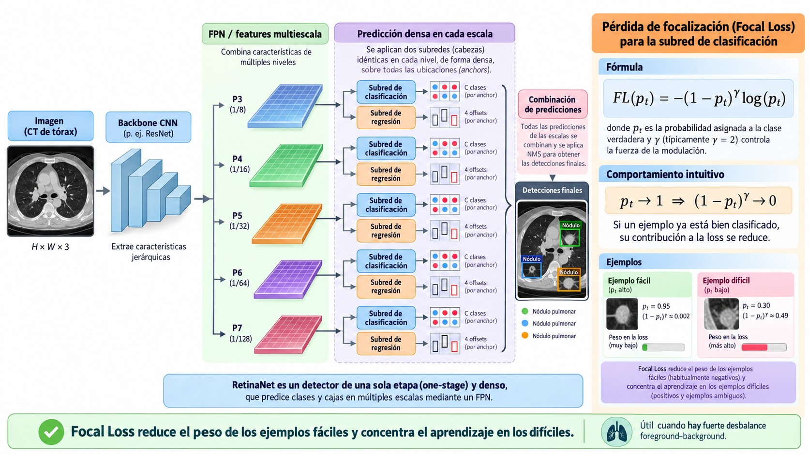{ width=80% }

## YOLO: una familia, no una versión

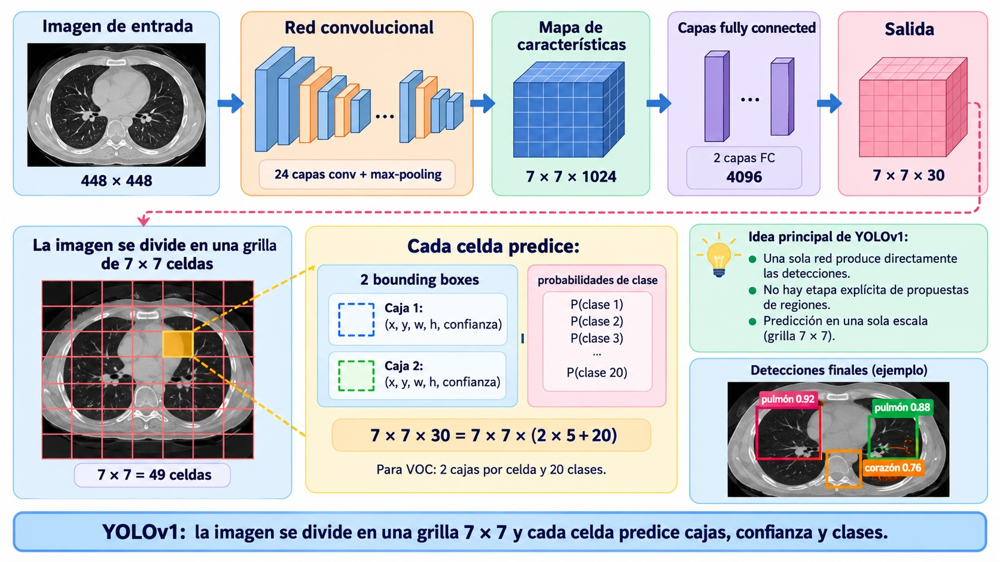{ width=80% }

Es entender el cambio de estrategia:


```{mermaid}
%%| echo: false

flowchart LR
    subgraph T["Two-stage"]
        direction LR
        A["Proponer regiones"] --> B["Clasificar cada región"]
    end
    subgraph O["One-stage"]
        direction LR
        C["Predecir cajas y clases directamente"]
    end
    T -. "vs." .- O

    classDef twoStage fill:#eaf2ff,stroke:#3973b8,stroke-width:2px,color:#17324d
    classDef oneStage fill:#e3f4e8,stroke:#3b8f5a,stroke-width:2px,color:#194d2d
    class T twoStage
    class O oneStage
    
```

## Hasta aquí: ¿qué problema queda?

En detectores densos podemos obtener varias predicciones para el mismo objeto:

```{mermaid}
%%| echo: false

flowchart LR
    A["Muchas<br/>predicciones"] --> B["Scores"]
    B --> C["Solapamiento<br/>entre boxes"]
    C --> D["NMS<br/><small>suprime duplicados</small>"]
    D --> E["Una detección<br/>final"]

    classDef input fill:#eaf2ff,stroke:#3973b8,stroke-width:1.5px,color:#17324d
    classDef filter fill:#fff4cc,stroke:#c69214,stroke-width:2px,color:#5c4300
    classDef output fill:#e3f4e8,stroke:#3b8f5a,stroke-width:2px,color:#194d2d
    class A,B,C input
    class D filter
    class E output
```

Ya vimos NMS como postprocesamiento.

Pero podemos hacer otra pregunta:

> **¿Podemos formular el modelo para que produzca directamente un conjunto de objetos sin necesitar NMS?**


## DETR: detección como *set prediction*

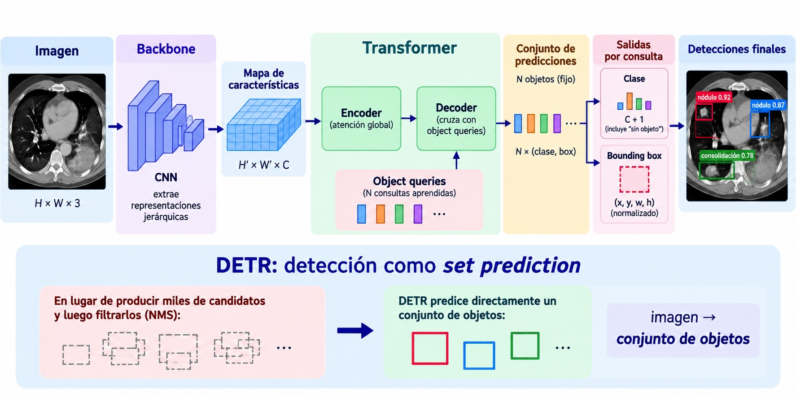{ width=80% }

## ¿Cómo evita DETR las detecciones duplicadas?

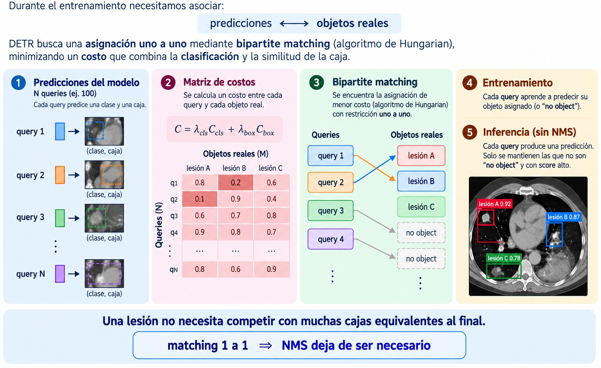{ width=80% }


## Del DETR original a detectores en tiempo real

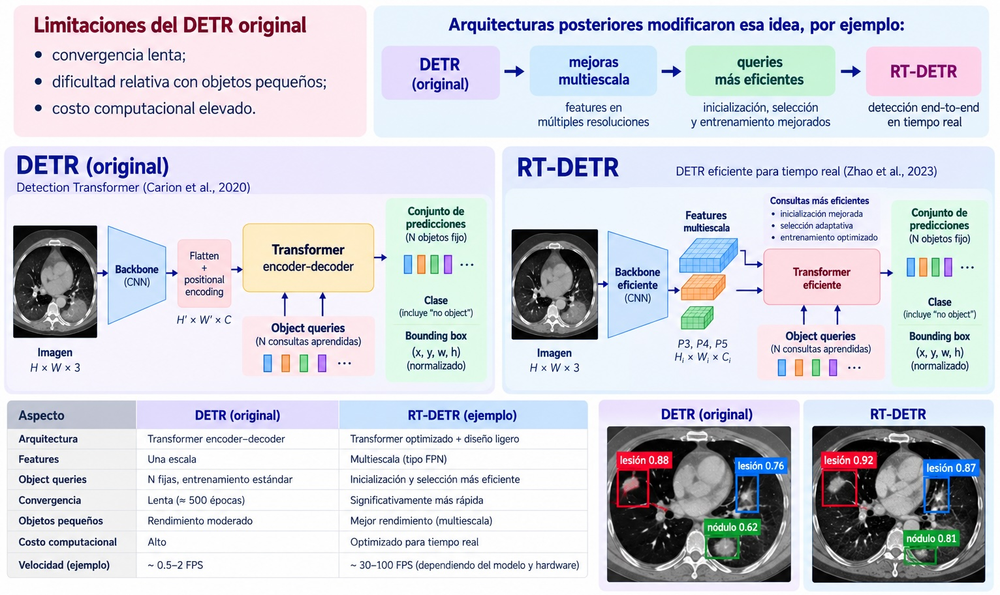{ width=80% }

## Evolución conceptual

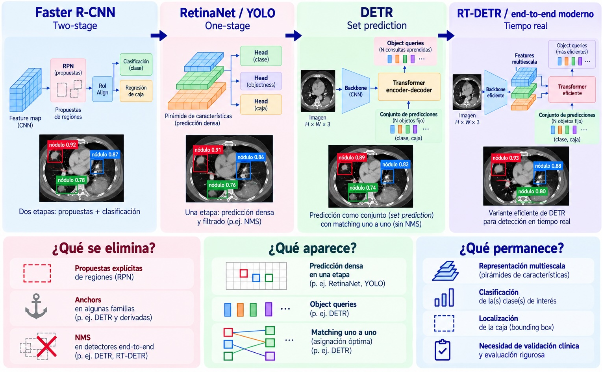{ width=80% }


## Comparación de paradigmas

| | Faster R-CNN | YOLO / RetinaNet | DETR / RT-DETR |
| ----- | ----- | ----- | ----- |
| Formulación | two-stage | one-stage densa | *set prediction* |
| Propuestas | sí | no | no |
| Anchors | habitualmente | depende del diseño | no |
| NMS | sí | habitualmente | no |
| Salida intermedia | regiones | muchas predicciones | *object queries* |
| Idea didáctica | RPN | detección directa | matching 1 a 1 |


> No hay una arquitectura universalmente mejor: la elección depende del problema, los datos y las restricciones clínicas/computacionales.


# Particularidades de imágenes médicas

## El problema de los objetos pequeños

Imagen:

$$
2048\times2048
$$

Lesión:

$$
20\times20
$$

Fracción del área:

$$
\frac{20\times20}{2048\times2048}
\approx9.5\times10^{-5}
$$

menos de:

$$
0.01\%.
$$

. . .

**Casi toda la imagen es fondo.**


## Resolución y contexto anatómico

::: {.columns}
::: {.column width="48%"}
### Detectar

Una lesión pequeña requiere **alta resolución**:

$$
\boxed{\text{más detalle}}\quad\longrightarrow\quad\text{lesión visible}
$$
:::

::: {.column width="4%"}
:::

::: {.column width="48%"}
### Interpretar

Para entender dónde está, necesitamos **contexto anatómico**:

$$
\boxed{\text{campo de visión amplio}}
$$
:::
:::

::: {.callout-important title="Compromiso"}
Al aumentar el campo de visión, puede disminuir el detalle espacial. La adquisición debe equilibrar **resolución** y **contexto** según la tarea clínica.
:::


## En medicina, el tamaño físico importa

Una lesión de:

$$
10\ \mathrm{mm}
$$

no ocupa siempre el mismo número de píxeles o vóxeles.

Depende de:

- *pixel spacing*
- *voxel spacing*
- *slice thickness*
- resampling

. . .

> **La escala en la matriz no es necesariamente la escala física.**


## Un detector puede fallar de varias maneras

```{mermaid}
%%| echo: false

flowchart TB
    E["Error de detección"] --> C["Clase incorrecta"]
    E --> L["Localización insuficiente"]
    E --> FN["Objeto no detectado"]
    E --> FP["Falsa detección"]
    E --> D["Detección duplicada"]

    classDef root fill:#1f4e79,color:#fff,stroke:#163a5c,stroke-width:2px
    classDef error fill:#fce4d6,color:#7f2704,stroke:#c65911
    class E root
    class C,L,FN,FP,D error
```

No existe un único “error del detector”.


## ¿Qué error importa más?

Depende del uso clínico.

::: {.columns}
::: {.column width="48%"}
### Falsos negativos

Una lesión relevante puede no ser marcada.

Especialmente crítico en tareas de detección.
:::

::: {.column width="48%"}
### Falsos positivos

Pueden aumentar:

- estudios complementarios
- intervenciones innecesarias
:::
:::


> La evaluación debe incluir el **perfil de errores**, no solo una métrica agregada.


# Integración

## El pipeline completo de un detector

```{mermaid}
%%| echo: false

flowchart LR
    I["Imagen de entrada"] --> B["Backbone<br/>extrae características"]
    B --> H["Cabeza de detección"]
    H --> C["Predicciones<br/>cajas · clases · scores"]
    C --> T["Umbral de confianza<br/>filtra por score"]
    T --> N["NMS<br/>suprime cajas redundantes"]
    N --> O["Detecciones finales"]
    O --> M["Evaluación<br/>IoU · precisión-recall · AP"]

    classDef entrada fill:#e8f1fb,stroke:#3973ac,color:#17324d
    classDef modelo fill:#eaf5ea,stroke:#4b8b4b,color:#203820
    classDef post fill:#fff3df,stroke:#c58a26,color:#49330e
    classDef salida fill:#f1eafb,stroke:#8055a5,color:#302044
    class I entrada
    class B,H modelo
    class C,T,N post
    class O,M salida
```

Cada bloque introduce decisiones que afectan el resultado final.


## Dos umbrales, dos preguntas

$$
\boxed{s_i\geq\tau_s}
$$

**¿Qué predicciones mostramos?**

$$
\boxed{IoU\geq\tau_{IoU}}
$$

**¿Cuándo consideramos que una detección coincide con la referencia?**


Confundirlos lleva a interpretar incorrectamente las métricas.

## Lo que NO debemos concluir de un score alto

Supongamos:

$$
s_i=0.98
$$

Esto no implica automáticamente:

> “Existe un 98 % de probabilidad real de que haya una lesión”.

. . .

El score puede ser alto y la predicción ser incorrecta.

$$
\boxed{\text{score}}
\neq
\boxed{\text{probabilidad calibrada}}
\neq
\boxed{\text{incertidumbre}}
$$


## Ideas que deben quedar

1. **Clasificación, detección y segmentación responden preguntas diferentes.**
2. En detección, la salida es un conjunto de **boxes + clases + scores**.
3. Una detección correcta depende de la clase y de un criterio espacial como **IoU**.
4. **NMS** elimina predicciones redundantes.
5. **AP/mAP** resumen el compromiso precision-recall bajo un criterio de localización.
6. Two-stage, one-stage y *set prediction* representan **formulaciones diferentes** del problema de detección.
7. DETR muestra que detección puede formularse como una asignación **uno a uno** y prescindir de NMS.

## La próxima pregunta

Hasta ahora el detector devuelve:

$$
(b_i,c_i,s_i).
$$

Pero si:

$$
s_i=0.98,
$$

¿qué significa realmente ese número?

. . .

> **¿Cómo sabemos cuándo confiar en la predicción de un modelo?**

$$
\boxed{\text{calibración + incertidumbre}}
$$
