## La pregunta de hoy

::: {.question .centered}
Un modelo predice [0.98]{.metric}.


¿Eso significa que está *98 % seguro*?
:::

. . .

::: {.takeaway .centered}
**No necesariamente.**
:::

## Objetivos de la clase

Al finalizar deberíamos poder responder cuatro preguntas:

1. ¿Qué diferencia hay entre **score**, **probabilidad calibrada** e **incertidumbre**?
2. ¿Cómo podemos estimar incertidumbre en redes neuronales?
3. ¿Qué nos dicen —y qué no— los mapas de saliencia y **Grad-CAM**?
4. ¿Cómo utilizar estas herramientas para construir sistemas clínicos más seguros?

## El mapa conceptual

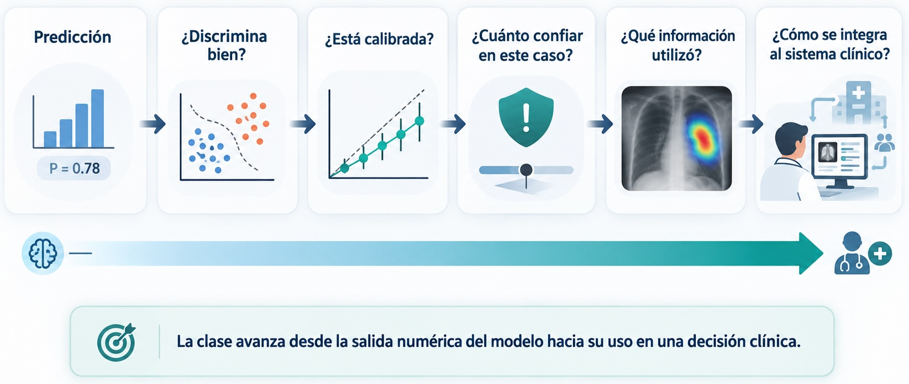{ width=80% .centered}

## Un score alto puede estar equivocado

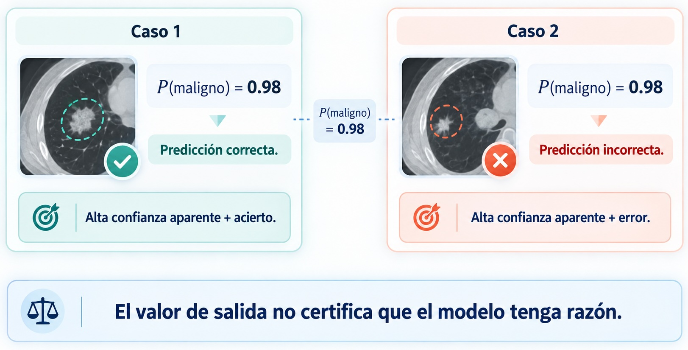{ width=80% .centered}

## ¿De dónde sale esa “probabilidad”?

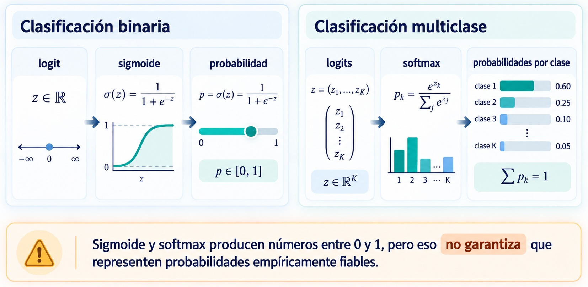{ width=80% .centered}

## Discriminación ≠ calibración

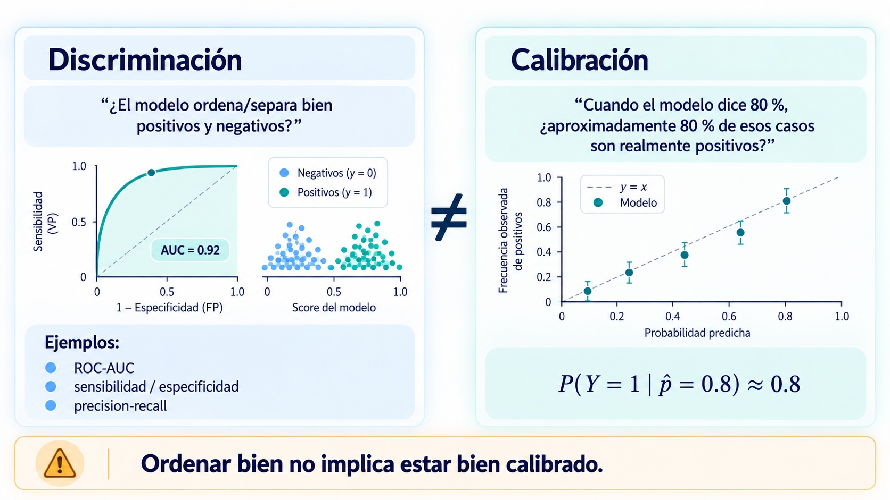{ width=80% .centered}

## ¿Qué significa estar calibrado?

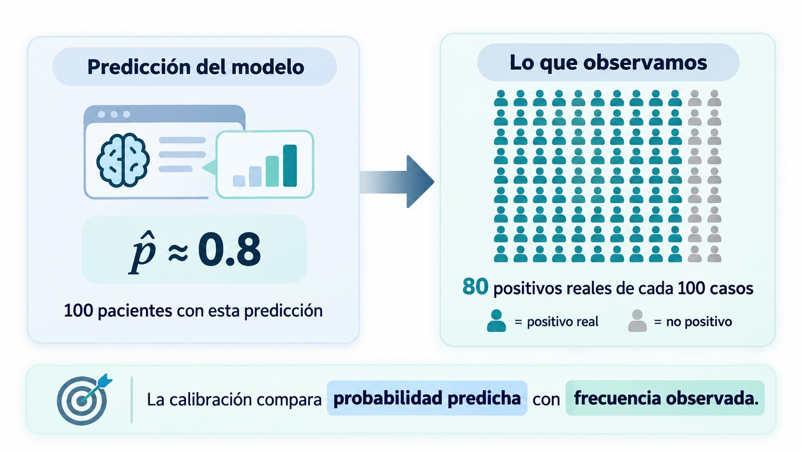{ width=80% .centered}

## Reliability diagram

```{python}
#| label: fig-reliability
#| fig-width: 8
#| fig-height: 5.2
#| fig-align: center
#| echo: false

import numpy as np
import matplotlib.pyplot as plt

pred = np.array([0.08, 0.18, 0.31, 0.44, 0.58, 0.70, 0.82, 0.93])
obs_good = np.array([0.10, 0.19, 0.29, 0.45, 0.56, 0.72, 0.80, 0.91])
obs_over = np.array([0.03, 0.08, 0.16, 0.25, 0.39, 0.52, 0.65, 0.76])

fig, ax = plt.subplots(figsize=(8, 5.2))
ax.plot([0, 1], [0, 1], linestyle="--", linewidth=2, label="Calibración perfecta")
ax.plot(pred, obs_good, marker="o", linewidth=2.2, label="Bien calibrado")
ax.plot(pred, obs_over, marker="s", linewidth=2.2, label="Sobreconfiado")
ax.set_xlim(0, 1)
ax.set_ylim(0, 1)
ax.set_xlabel("Probabilidad predicha")
ax.set_ylabel("Frecuencia observada")
ax.legend(frameon=False)
ax.grid(alpha=0.2)
plt.tight_layout()
plt.show()
```

::: {.visual-note .centered .muted}
Debajo de la diagonal: el modelo suele reportar más confianza de la que merece.
:::

## Métricas de calibración

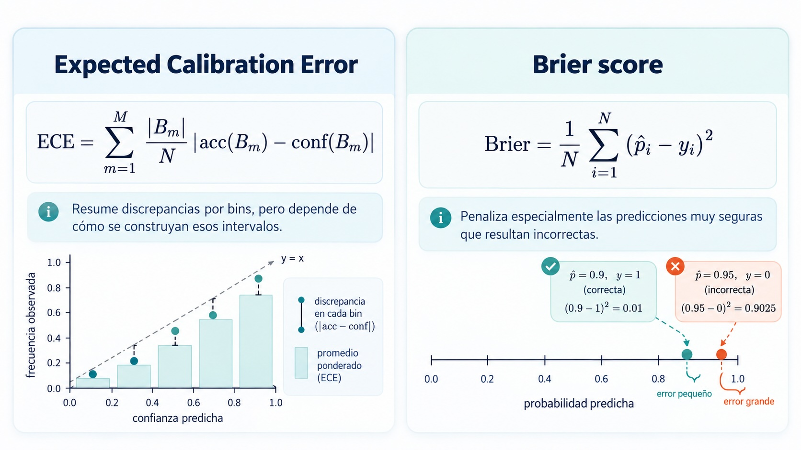{ width=80% .centered}

## Recalibración: temperature scaling

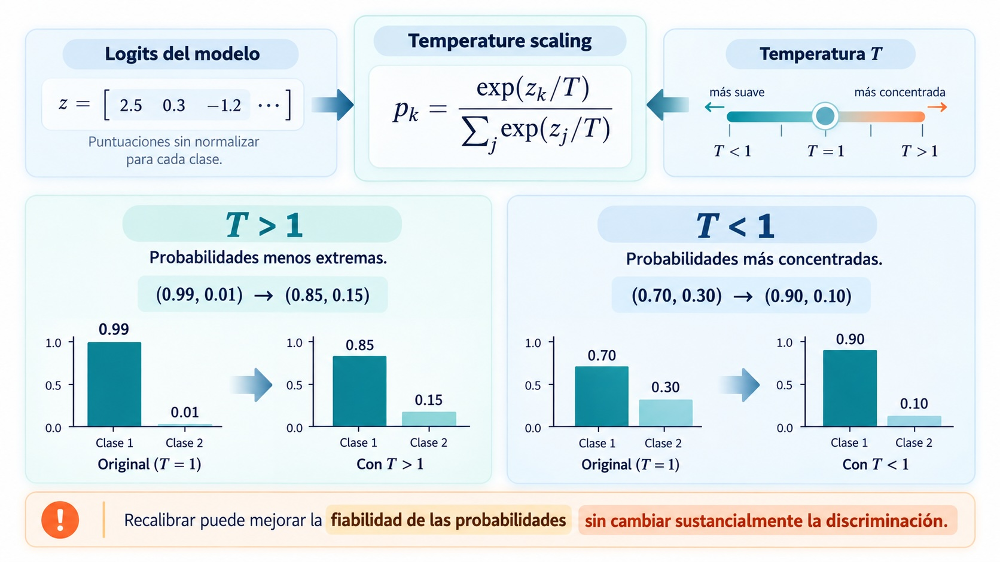{ width=80% .centered}

## Pausa conceptual

::: {.question .centered}
Si un modelo está bien calibrado en promedio…


¿sabemos cuándo una *predicción individual* es poco confiable?
:::

. . .

::: {.key-idea .centered}
Esto ya no es solo calibración. Es **incertidumbre**.
:::

## Dos fuentes de incertidumbre

```{mermaid}
%%| echo: false

flowchart TB
    U["Incertidumbre"]
    A["Aleatoria / aleatoric"]
    E["Epistémica / epistemic"]
    A1["Ambigüedad inherente\nde la observación"]
    E1["Conocimiento limitado\ndel modelo"]

    U --> A
    U --> E
    A --> A1
    E --> E1

    classDef root fill:#E8F0FE,stroke:#1F3A5F,color:#0F172A,stroke-width:2px;
    classDef type fill:#E0F2FE,stroke:#0369A1,color:#0F172A,stroke-width:1.5px;
    classDef leaf fill:#DCFCE7,stroke:#15803D,color:#0F172A,stroke-width:1.5px;

    class U root;
    class A,E type;
    class A1,E1 leaf;
```

## Incertidumbre aleatoria

Asociada a variabilidad o ambigüedad del dato:

- ruido de adquisición
- bajo contraste
- movimiento y artefactos
- lesión intrínsecamente ambigua
- variabilidad biológica

::: {.key-idea .centered}
**Idea:** aun con muchos datos de entrenamiento, la observación puede seguir siendo ambigua.
:::

## Incertidumbre epistémica

Asociada a aquello que el modelo **no conoce suficientemente**:

- pocos ejemplos relevantes
- regiones poco representadas del espacio de datos
- nueva población
- nuevo equipo o protocolo
- patologías raras

::: {.example .centered}
Puede reducirse incorporando datos pertinentes y representativos.
:::

## Dos casos clínicos distintos

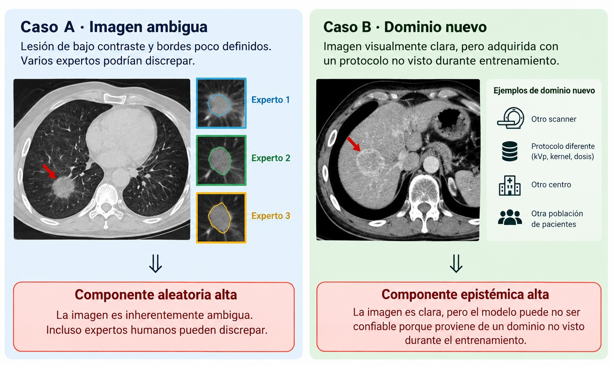{ width=80% .centered}

## Dataset shift: cuando cambia el mundo

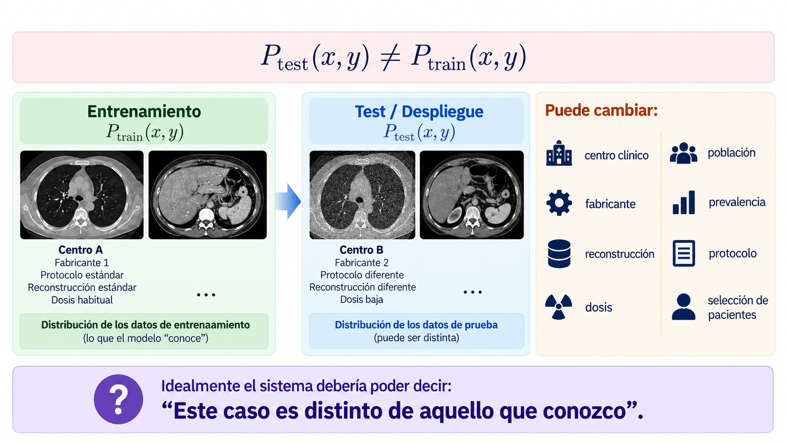{ width=80% .centered}

## Monte Carlo Dropout

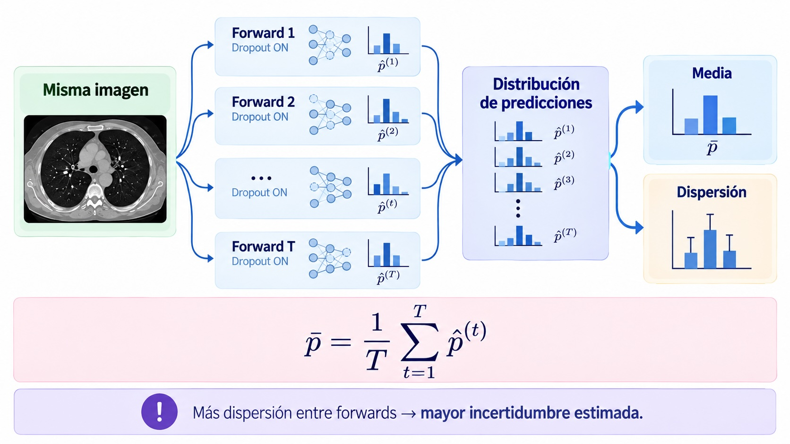{ width=80% .centered}

## Deep ensembles

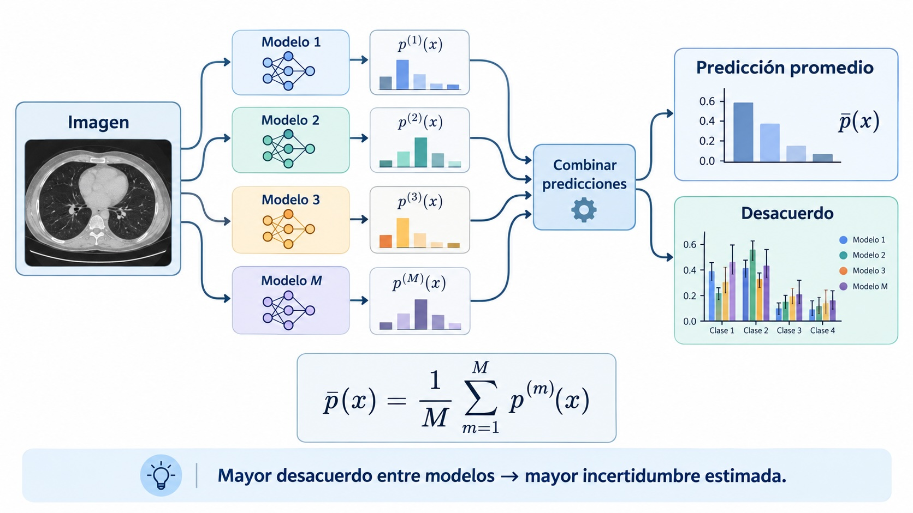{ width=80% .centered}

## MC Dropout vs ensembles

| | MC Dropout | Deep ensembles |
|---|---|---|
| Idea | múltiples forwards de una red | múltiples redes independientes |
| Costo de entrenamiento | bajo/adicional mínimo | alto |
| Costo de inferencia | múltiples forwards | múltiples modelos |
| Señal de incertidumbre | variación entre máscaras | desacuerdo entre modelos |
| Uso práctico | sencillo de incorporar | muy competitivo, pero costoso |

::: {.callout-warning .compact}
Ninguno de los dos métodos garantiza detectar todos los casos OOD ni produce una “incertidumbre perfecta”.
:::

## Incertidumbre como herramienta de seguridad

```{mermaid}
flowchart LR
    A["Imagen"] --> B["Modelo"]
    B --> C["Predicción"]
    B --> D["Incertidumbre"]
    D --> E{"¿u ≥ τ?"}
    E -->|"No"| F["Aceptar / automatizar"]
    E -->|"Sí"| G["Revisión por experto"]
```

::: {.key-idea .centered}
La incertidumbre es útil cuando modifica el **workflow**, no cuando solo agrega otro número a la pantalla.
:::

## Cobertura versus riesgo

```{python}
#| label: fig-risk-coverage
#| fig-width: 8
#| fig-height: 5.1
#| fig-align: center
#| echo: false

import numpy as np
import matplotlib.pyplot as plt

coverage = np.linspace(0.15, 1.0, 18)
risk = 0.035 + 0.20*(coverage**2.2)

fig, ax = plt.subplots(figsize=(8, 5.1))
ax.plot(coverage, risk, marker="o", linewidth=2.2)
ax.set_xlabel("Cobertura: fracción de casos aceptados automáticamente")
ax.set_ylabel("Riesgo / error en los casos aceptados")
ax.set_xlim(0.1, 1.02)
ax.set_ylim(0, max(risk)*1.08)
ax.grid(alpha=0.2)
plt.tight_layout()
plt.show()
```

::: {.visual-note .centered .muted}
Ser más selectivo puede reducir el riesgo, pero también reduce la automatización.
:::

## Tres preguntas distintas

{ width=80% .centered}

## De la confianza a la explicación

Supongamos ahora:

$$
P(\text{maligno})=0.92
$$

y además estimamos una incertidumbre baja.

::: {.question .centered}
¿Qué información de la imagen utilizó el modelo para producir esa predicción?
:::

## Interpretabilidad y explicabilidad

::: {.columns}
::: {.column width="48%"}
### Modelo interpretable

Su mecanismo puede inspeccionarse directamente.

$$
y=w_1x_1+w_2x_2+b
$$

Ejemplo: regresión lineal/logística.
:::

::: {.column width="48%"}
### Modelo explicable

El modelo es complejo y aplicamos herramientas adicionales para analizar su comportamiento.

Ejemplo: CNN + Grad-CAM.
:::
:::

## Métodos post-hoc

```{mermaid}
flowchart LR
    A["Imagen"] --> B["Modelo entrenado"]
    B --> C["Predicción"]
    A --> D["Método post-hoc"]
    B --> D
    D --> E["Mapa / explicación"]
```

::: {.callout-warning .centered}
El método de explicación analiza un modelo ya entrenado; no necesariamente cambia cómo el modelo toma decisiones.
:::

## Mapas de saliencia

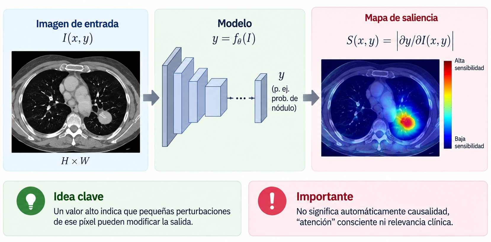{ width=80% .centered}

## Grad-CAM: idea general

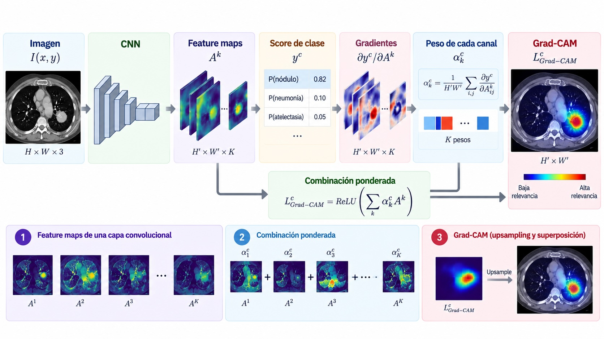{ width=80% .centered}

## Explicabilidad como herramienta de validación

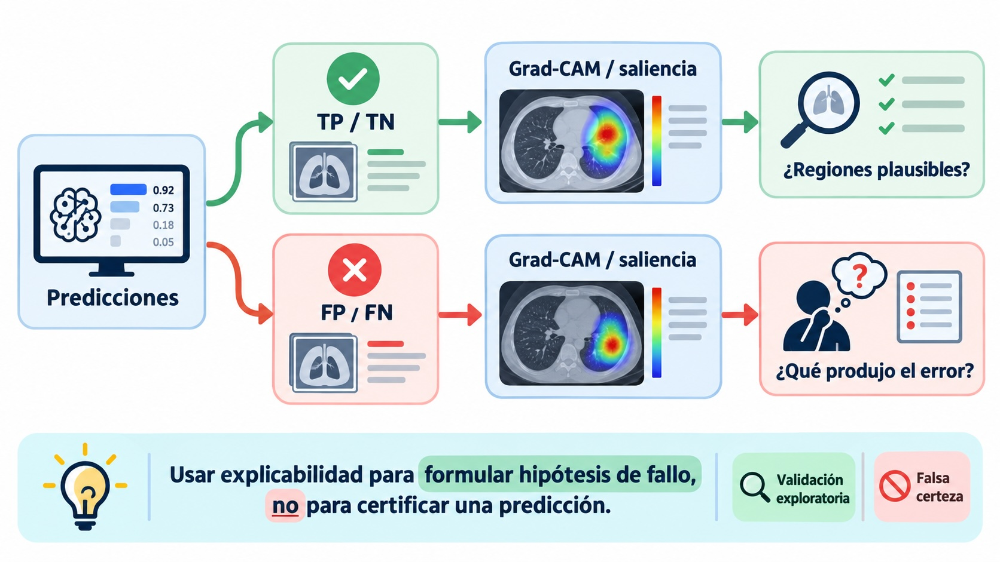{ width=80% .centered}

## Grad-CAM no equivale a causalidad

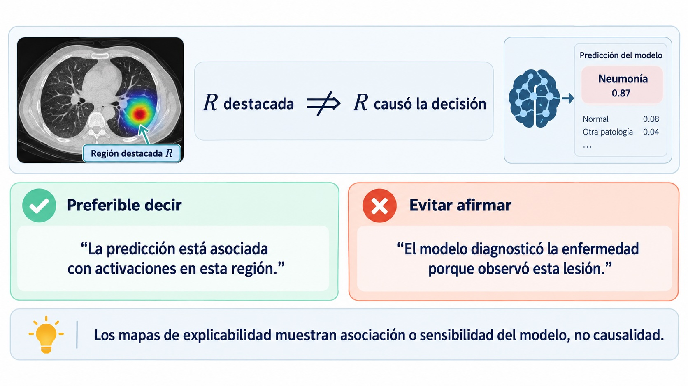{ width=80% .centered}

## Occlusion sensitivity

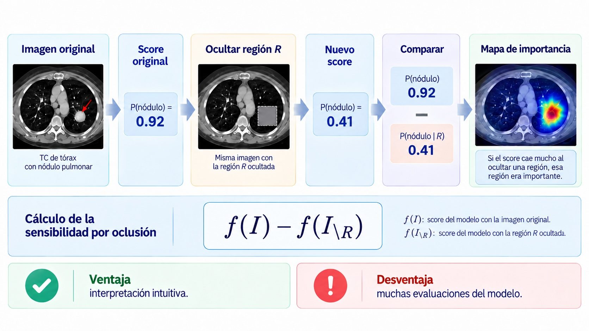{ width=80% .centered}

## Sanity checks

{ width=80% .centered}

## Comparación rápida de métodos

| Método | Pregunta aproximada | Ventaja | Limitación |
|---|---|---|---|
| **Saliency** | ¿Dónde es sensible localmente la salida? | Simple | Puede ser ruidoso |
| **Grad-CAM** | ¿Qué regiones de feature maps apoyan una clase? | Intuitivo | Baja resolución |
| **Occlusion** | ¿Qué pasa si retiro esta región? | Fácil de razonar | Costoso |

::: {.key-idea .centered}
La elección depende de la **pregunta**, no solo de la disponibilidad del método.
:::

## Explicabilidad ≠ confianza

::: {.question .centered}
“El Grad-CAM parece clínicamente razonable.

Entonces podemos confiar en la predicción.”
:::

. . .

::: {.takeaway .centered}
**Conclusión incorrecta.**
:::

$$
\text{explicabilidad}\neq\text{incertidumbre}\neq\text{validación}
$$

## Las tres preguntas de la unidad

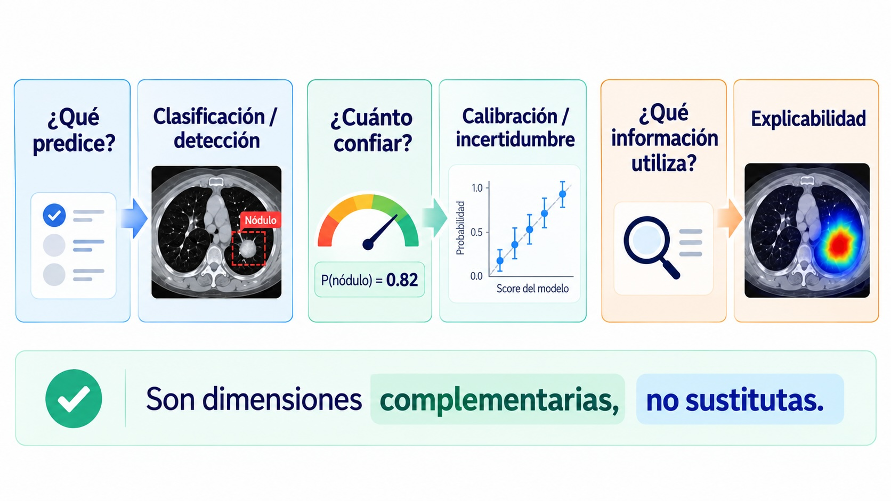{ width=80% .centered}

## Un modelo todavía no es un sistema clínico

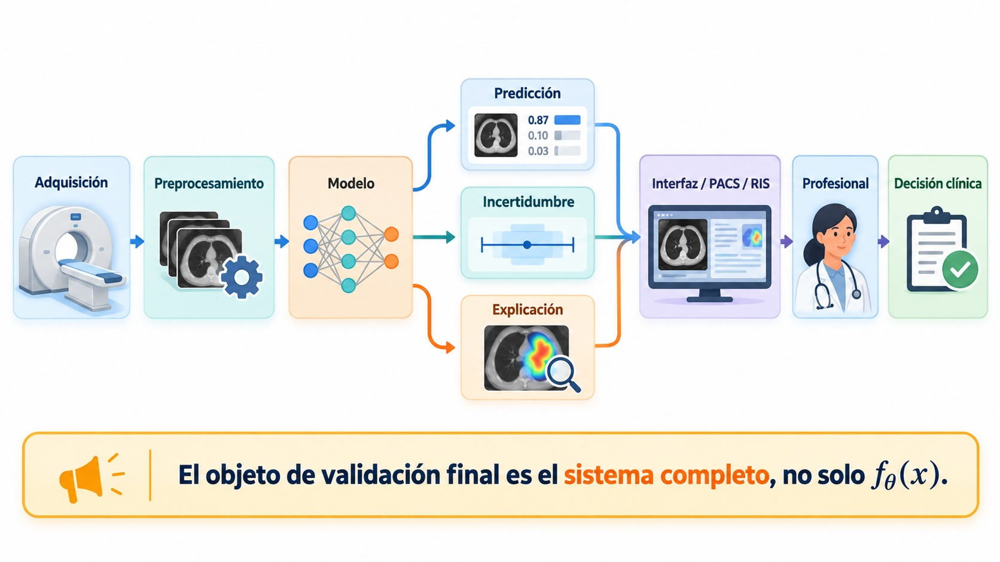{ width=80% .centered}

## Cierre

::: {.definition}
**1.** Un score alto no equivale a certeza.


**2.** Discriminación, calibración e incertidumbre responden preguntas diferentes.


**3.** MC Dropout y ensembles permiten aproximar incertidumbre, pero no resuelven universalmente OOD.


**4.** Grad-CAM y saliency sirven para auditar comportamiento, no para demostrar causalidad.


**5.** La utilidad clínica aparece cuando estas herramientas modifican el workflow y reducen riesgo.
:::

## Próximo paso

::: {.question .centered}
¿Cómo pasamos de un modelo aislado

a un sistema de diagnóstico asistido por computadora?
:::

. . .

::: {.key-idea .centered}
**CAD · integración · validación clínica**
:::
